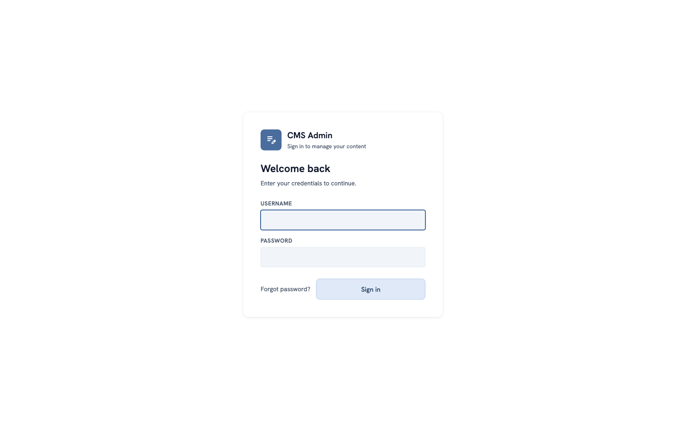
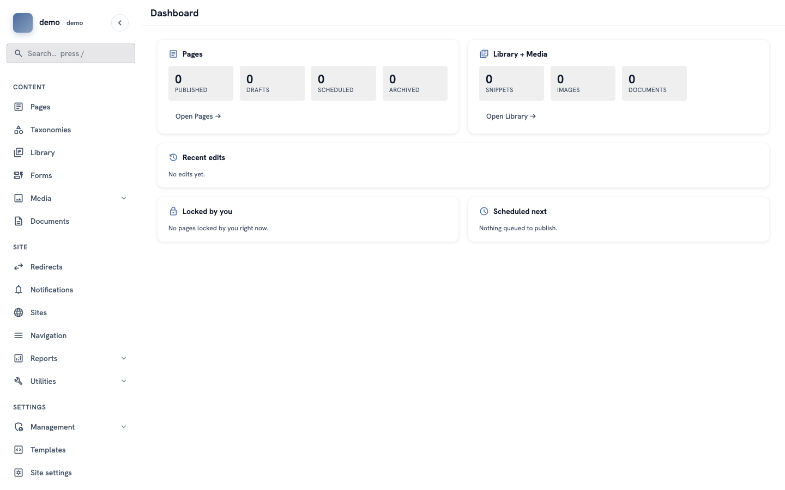
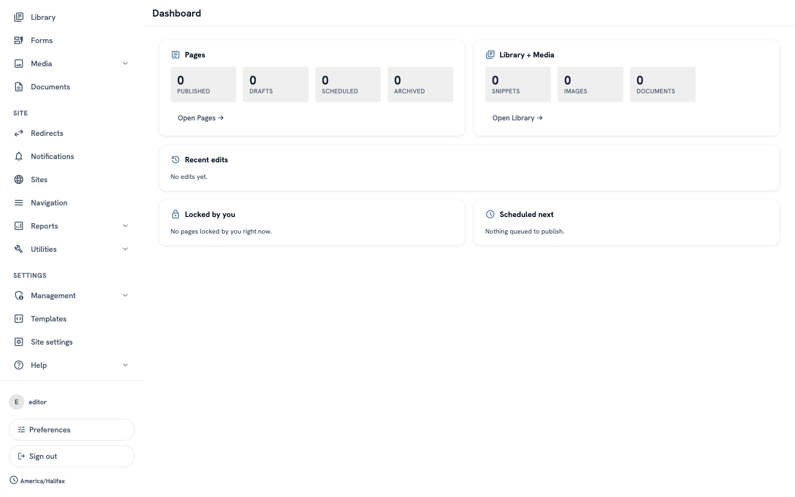
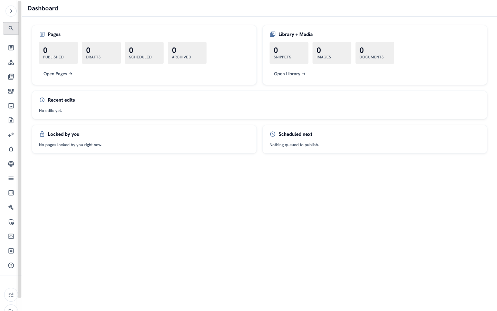

# How to find your way around the admin

**Goal:** know where things are in the admin, so you can find what you need.

**Who this is for:** editors. You do not need any technical knowledge.

**Time:** about 5 minutes.

## Before you start

You need:

- the address of your admin. It usually ends with `/login`, for example `https://www.example.com/login`.
- a username and a password. Ask the person who manages your site if you do not have them.

## Words you will see

| Word | What it means |
|---|---|
| **Admin** | The private part of the site. You change your website here. Visitors cannot see it. |
| **Page** | One page of your website, for example "About us" or "Contact". |
| **Publish** | Make a page visible to visitors. |
| **Draft** | A page that is not published yet. Only people in the admin can see it. |

## Steps

### 1. Sign in

Open the address of your admin in your web browser. Type your **username** and your **password**. Click **Sign in**.

### 2. Look at the dashboard

After you sign in, you see the **Dashboard**. It is the start page of the admin.

The dashboard shows:

- **Pages** — how many pages are published, how many are drafts, and more. Click **Open Pages** to see them.
- **Library + Media** — how many images, documents and snippets you have.
- **Recent edits** — the pages that people changed last.
- **Locked by you** — pages that you are editing now.
- **Scheduled next** — pages that will be published later, on a date you chose.

On a new site, all the numbers are 0. That is normal.

### 3. Use the menu on the left

The menu on the left is always there. It has three groups:

- **Content** — the things you write: **Pages**, **Library**, **Forms**, **Media** (images) and **Documents** (files like PDFs).
- **Site** — settings for the whole website, for example **Navigation** (the menus on your site) and **Redirects** (old addresses that send visitors to new ones).
- **Settings** — settings for the admin and for users.

Some items have a small arrow **⌄**. Click the item to open more choices.

To find something fast, use the **Search** box at the top of the menu. You can also press the **/** key on your keyboard to go to the search box.

### 4. Find your account

Scroll to the bottom of the menu. There you see your username.

- Click **Preferences** to change your language, the colours of the admin, or your password.
- Click **Sign out** when you finish. This is important on a shared computer.

### 5. Make the menu smaller (optional)

Do you want more space on the screen? Click the small arrow **‹** at the top of the menu. Now the menu shows only icons.

To make the menu big again, click the arrow **›** at the top.

## Check it worked

- You can see the **Dashboard**.
- You can open **Pages** from the menu on the left.
- You can find **Sign out** at the bottom of the menu.

## If something goes wrong

- **"Invalid credentials"** — the username or the password is wrong. Check the spelling. In a password, big and small letters are different: `A` is not the same as `a`. If you forgot your password, click **Forgot password?** on the sign-in page.
- **You cannot see an item in the menu** — your account may not have permission for it. Ask the person who manages your site.
- **You see "No access"** — your account cannot open this part of the admin. Ask the person who manages your site.

## Next

[How to create and publish your first page](admin-first-page.md)
