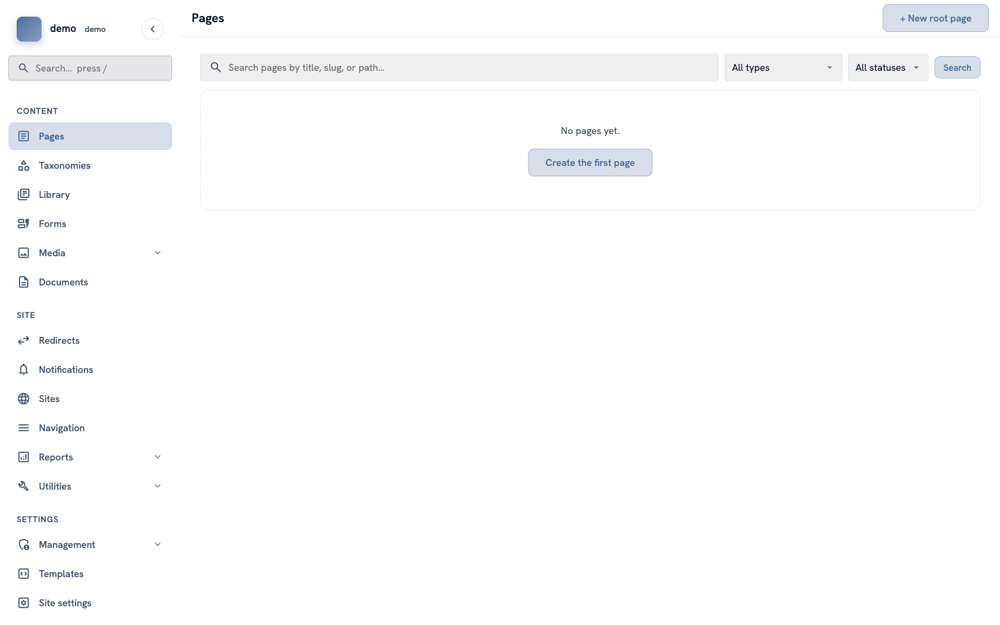
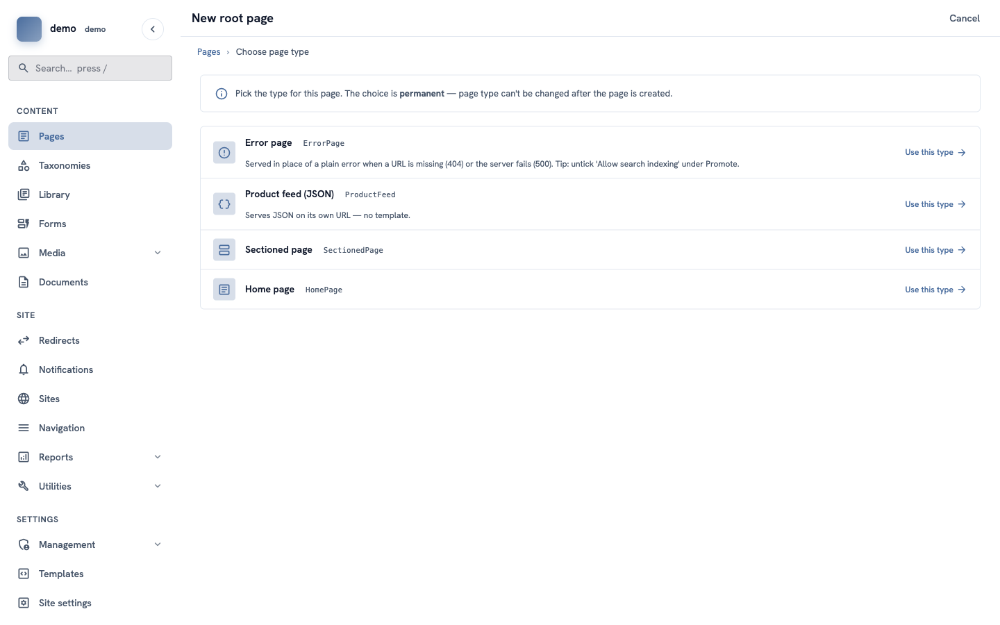
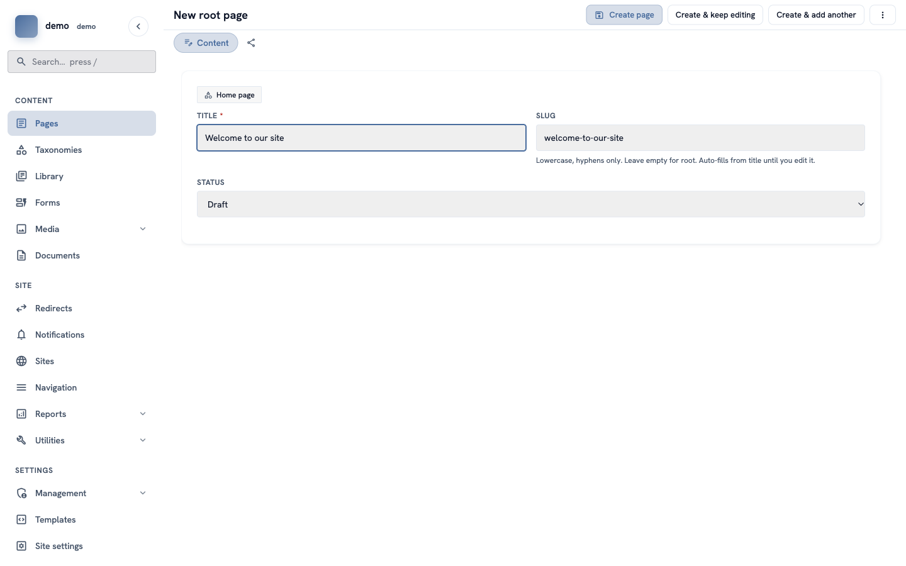
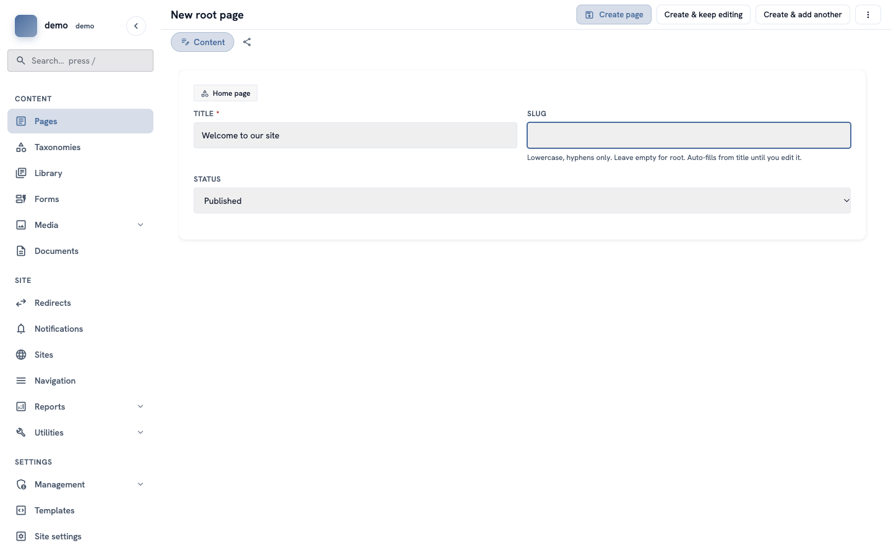
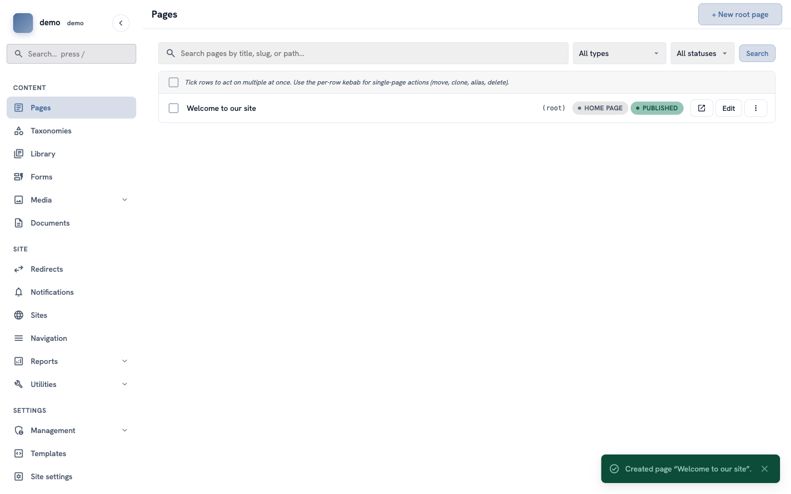
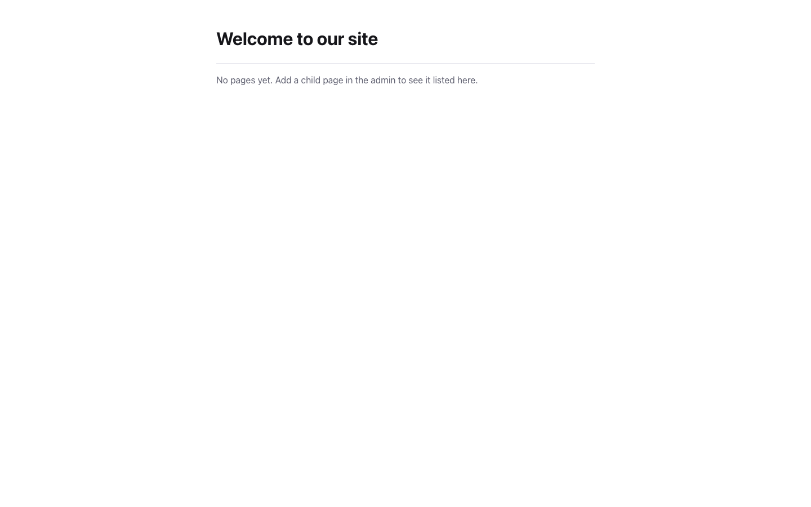

# How to create and publish your first page

**Goal:** make a home page and show it to visitors.

**Who this is for:** editors. You do not need any technical knowledge.

**Time:** about 5 minutes.

## Before you start

- You can sign in to the admin. See [How to find your way around the admin](admin-find-your-way.md).
- Your account can create pages. If you cannot see **Pages** in the menu, ask the person who manages your site.

## Words you will see

| Word | What it means |
|---|---|
| **Page type** | The kind of page, for example "Home page" or "Article". Each type has its own boxes to fill in. |
| **Title** | The name of the page. Visitors see it at the top of the page. |
| **Slug** | The last part of the page address. For the page `www.example.com/about-us`, the slug is `about-us`. |
| **Root page** | A page at the top of your site, not inside another page. |
| **Status** | Tells if visitors can see the page. **Draft** = only you can see it. **Published** = everybody can see it. |

## Steps

### 1. Open the list of pages

In the menu on the left, click **Pages**. On a new site, the list is empty.

Click **+ New root page** at the top right.

### 2. Choose the page type

You see a list of page types. For your first page, find **Home page** and click **Use this type**.

> **Important:** you cannot change the page type later. If you choose the wrong type, delete the page and make a new one.

The types on your site can be different. Choose the one that is best for your page. If you are not sure, ask the person who manages your site.

### 3. Type the title

Click in the **Title** box and type the name of the page, for example `Welcome to our site`.

The **Slug** box fills in by itself while you type.

### 4. Make it the front page and publish it

This page is your home page, so it must open at the main address of your site (for example `www.example.com`, with nothing after it).

1. Click in the **Slug** box and delete all the text in it. The box must be empty.
2. Open the **Status** list and choose **Published**.

> **Tip:** for all other pages, keep the slug. Only the home page has an empty slug.
>
> **Not ready yet?** Keep the status **Draft**. You can publish the page later.

### 5. Save the page

Click **Create page** at the top of the screen.

You go back to the list of pages. A green message at the bottom says **Created page "Welcome to our site"**. Your page is in the list, with **(root)** and a green **PUBLISHED** label.

### 6. Look at your page

In the row of your page, click the small square button with an arrow (next to **Edit**). Your page opens in a new tab, the way visitors see it.

This button is only there for published pages.

## Check it worked

- The page is in the **Pages** list with a green **PUBLISHED** label.
- When you open the main address of your site, you see your page.

## If something goes wrong

- **The address of the page is `/welcome-to-our-site`, not the main address.** The slug box was not empty when you saved. Click **Edit**, delete all the text in the **Slug** box, and click **Save**. The old address still works: it sends visitors to the new one.
- **You already have a home page.** Only one root page can have an empty slug. If you make a second one, it gets a slug from its title.
- **Visitors see "Page not found".** Check the status. A **Draft** page is not visible to visitors. Click **Edit**, choose **Published**, and click **Save**.
- **You cannot find Home page in the list of types.** Your site may use other names. Ask the person who manages your site which type to use.

## Next

[How to use the live preview](admin-live-preview.md)
