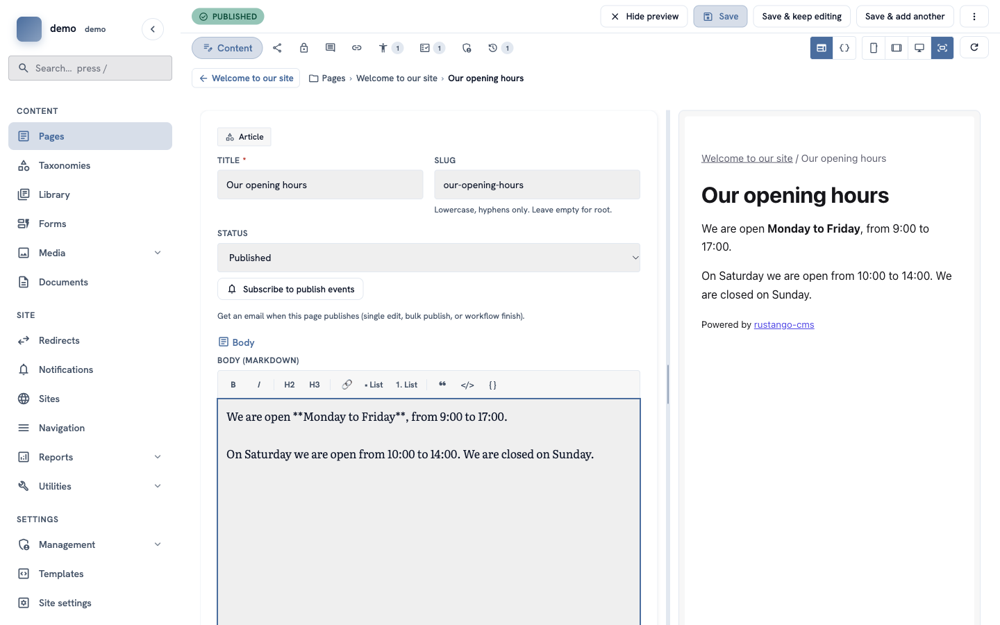
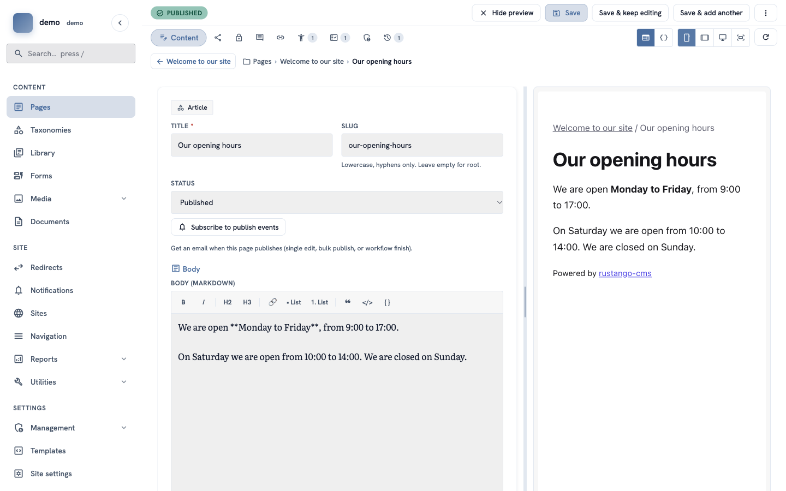
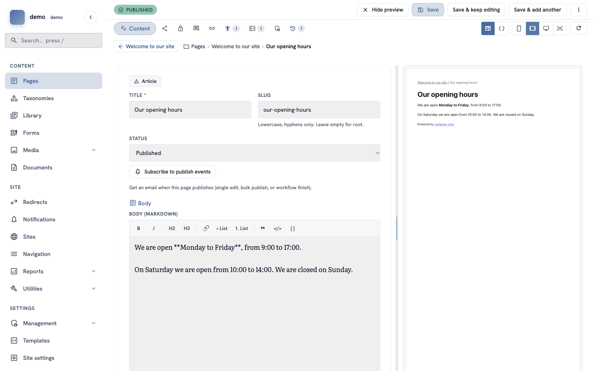
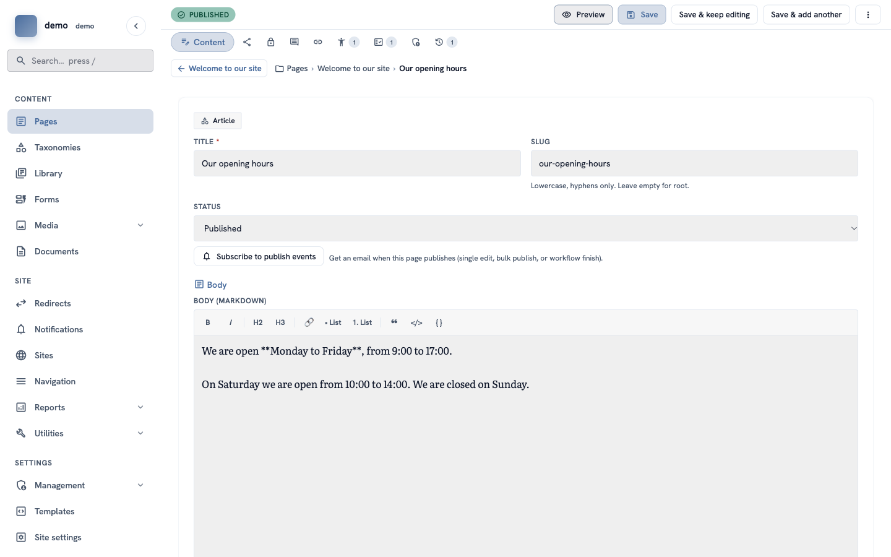

# How to use the live preview

**Goal:** see how your page looks while you write it — on a computer, a tablet and a phone.

**Who this is for:** editors. You do not need any technical knowledge.

**Time:** about 5 minutes.

## Before you start

- You have a page to edit. See [How to create and publish your first page](admin-first-page.md).

## Words you will see

| Word | What it means |
|---|---|
| **Preview** | A picture of your page as visitors will see it. It is not public. |
| **Save** | Keep your changes. The preview does not save anything. |

## Steps

### 1. Open a page in the editor

In the menu on the left, click **Pages**. Find your page and click **Edit**.

The editor opens. On the left you write. On the right you see the **preview**.

### 2. Change something and watch the preview

Type in a box, for example in **Title** or **Body**. After a second, the preview on the right changes too. You do not need to save to see it.

> **Important:** the preview does **not** save your work. When you are happy, click **Save**.

### 3. See the page on a phone

At the top right there are four small buttons with pictures of screens. Click the first one, the **phone**. The preview now shows your page as it looks on a phone.

### 4. See the page on a tablet

Click the second button, the **tablet**. The preview shows your page at tablet size. The page looks small, because it must fit in the space on your screen.

The third button shows a **computer** screen. The fourth button makes the preview use all the free space again.

### 5. Hide the preview

Do you need more space to write? Click **Hide preview** at the top. The form now uses the whole screen.

To see the preview again, click **Preview**.

### 6. Save your changes

Click **Save** at the top of the screen. You go back to the list of pages, and a green message says **Saved "…"** with the name of your page. Now visitors can see your changes (if the page is published).

> **Tip:** click **Save & keep editing** if you want to stay in the editor.

## Check it worked

- When you type in the form, the preview changes after a second.
- The phone button makes the page narrow.
- After you click **Save**, a green message **Saved "…"** appears.

## If something goes wrong

- **The preview does not change.** Click the round arrow button at the top right to load it again.
- **Visitors cannot see your changes.** You did not save, or the page is a **Draft**. Click **Save**, and check that the status is **Published**.

## Next

Back to [How to find your way around the admin](admin-find-your-way.md).
