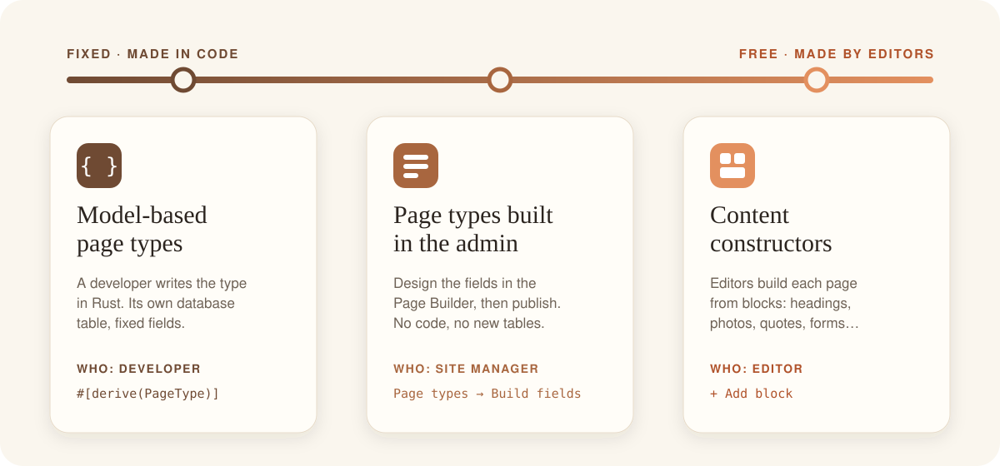
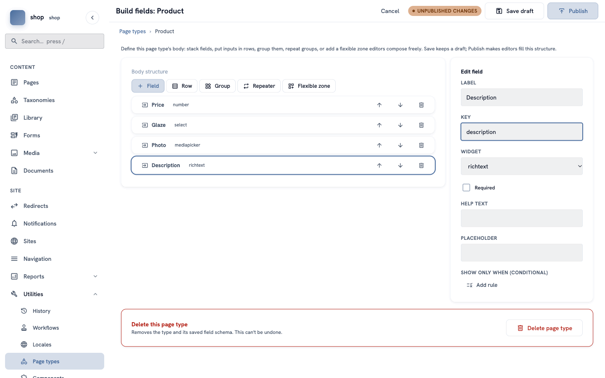
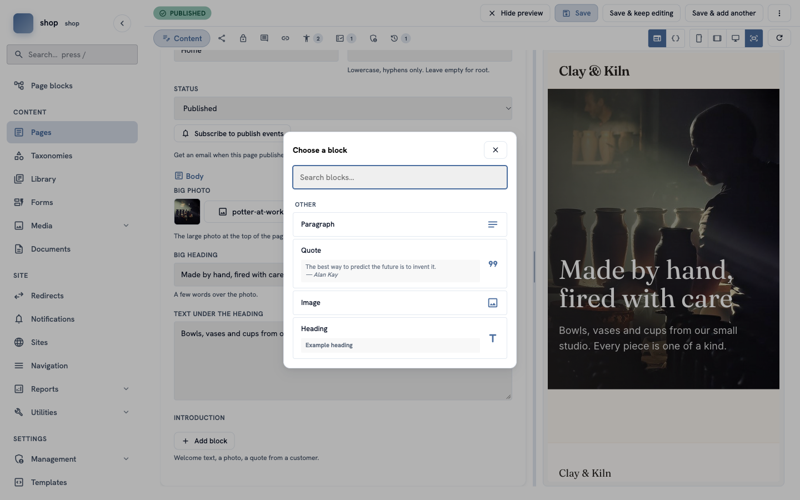

# What is Rustango-CMS?

**Goal:** understand what Rustango-CMS is, the three ways it gives you to make pages — from fixed pages made in code to free pages that editors build themselves — and the two ways to show them: drawn by the CMS, or by your own frontend.

**Who this is for:** everybody — editors, site managers and developers. Read this page first.

**Time:** about 10 minutes.

## A CMS in a few words

A **CMS** (content management system) is the admin behind a website. Editors sign in, write pages, upload photos and publish — without code and without a developer.

Rustango-CMS is a CMS written in Rust, on top of the [rustango](https://github.com/ujeenet/rustango) web framework. The site is a **tree of pages**, and every page has a **page type**.

| Word | What it means |
|---|---|
| **Page** | One page of the site, with its own address, for example `/shop/moon-jar`. |
| **Page tree** | Pages inside pages. The shop page is inside the home page; the products are inside the shop page. |
| **Page type** | The kind of page: which boxes the editor fills in, and how the page looks. "Home page", "Product" and "Article" are page types. |
| **Template** | The file that turns a page's content into HTML — the design. |
| **Block** | One piece of content that an editor adds to a page: a heading, a paragraph, a photo, a quote, a form… |

Next to pages, the admin also has media (photos and documents), menus, categories, reusable content (the Library), forms, translations, workflows and more. The [ceramics shop tutorial](shop-overview.md) shows many of them.

## Three ways to make pages

Every page is made from a page type. The question is: **who decides the shape of the page, and how much freedom do the editors get?** Rustango-CMS gives you three answers. You can use all three on one site — even on one page.



### 1. Model-based page types — made in code

A developer writes the page type in Rust. It gets its own table in the database, with one column for each box. Editors fill in exactly these boxes — nothing more, nothing less.

The shop's **Workshop** type (a pottery class) is made this way (shortened):

```rust
#[derive(rustango::Model, rustango_cms::PageType, Default, Debug, Clone, Serialize, Deserialize)]
#[rustango(table = "shop_workshop", app = "shop")]
#[page_type(type_name = "Workshop", verbose_name = "Workshop", template = "workshop.html", icon = "event")]
pub struct Workshop {
    #[rustango(primary_key)]
    pub id: Auto<i64>,
    #[rustango(fk = "cms_page", on = "id", unique)]
    pub page_id: i64,
    #[field(widget = Date, label = "Date")]
    pub date: Option<String>,
    #[field(widget = Integer, label = "Seats", help = "How many people can join.")]
    pub seats: Option<i64>,
}
```

- **Good for:** pages your code depends on — the home page, a listing page with its own logic, pages you search, sort or filter by a field. The data is typed and checked, fast to query, and easy to use from Rust.
- **Extra powers:** only code-made types can change their behaviour — for example which children the page lists, or extra data for the template (see [The helper traits](shop-dev-helper-traits.md)).
- **The cost:** every change is a code change: a new field needs a developer, a migration and a new deploy.

### 2. Page types built in the admin — the Page Builder

A site manager (or a developer) designs the page type in the admin: **Utilities → Page types → + New page type**, then **Build fields**. There is no code and no new database table — the values of all pages of the type are saved together as JSON.

The builder has more than simple fields:

| Piece | What it does |
|---|---|
| **Field** | One box: text, number, date, a list to choose from, a photo, rich text and about 20 more. |
| **Row** | Two or more fields side by side. |
| **Group** | Fields that belong together, with a title — for example "Dimensions". |
| **Repeater** | A group that editors can add many times — for example "Questions and answers". |
| **Flexible zone** | A place where editors add blocks freely (see flavour 3). |
| **Component** | A group you design once (**Utilities → Components**) and reuse in many page types. |



Changes are a **draft** until you click **Publish**, and every published version is kept. The shop's **Product** type is made this way — see [Make a "Product" page type](shop-product-type.md).

- **Good for:** many pages with the same shape that may change over time — products, events, team members, job offers. The shape can grow without a developer.
- **The cost:** no Rust logic of its own, and the values are JSON, not table columns. A code-made parent page can still read them — the shop page shows every product's price and photo that way.

### 3. Content constructors — editors build the page

Here the page type only decides **which blocks are allowed**. Each editor then builds each page from blocks, in any order: click **+ Add block**, choose a block, fill it in, move it up or down.



The building parts:

| Part | What it is |
|---|---|
| **Stream field** | A box in a page type that holds a list of blocks. A developer says which blocks it allows. |
| **Built-in blocks** | Heading, paragraph, rich text, image, quote, embed (video), table, code, page link, document, snippet, form and more. |
| **Flexible zone** | The same idea inside a page type built in the admin: the site manager says which blocks and components are allowed. |
| **Components and custom blocks** | Blocks you design yourself — in the admin (components) or in code (`register_block!`). |
| **Library elements** | Content written once and shown on many pages, for example "Shipping information". Editors place it with the **Snippet** block. |

- **Good for:** pages that are all different — landing pages, "About us", articles, campaign pages.
- **The cost:** less structure. Two pages of the same type can look very different, and the data is harder to use in other places (search filters, lists, the API).

## Side by side

| | 1. Model-based | 2. Built in the admin | 3. Content constructors |
|---|---|---|---|
| **Who decides the shape** | a developer | a site manager | each editor, page by page |
| **How to change it** | code, migration, deploy | the Page Builder, then **Publish** | add, move or remove blocks |
| **Where the data lives** | its own table | one JSON store for all types | a list of blocks (JSON) in the page |
| **Best for** | pages the code depends on | many similar pages | pages that are all different |
| **In the shop** | Home page, Shop page, Workshop | Product | the home page's introduction |

## Mix them

The three ways are not a choice for the whole site. They work together:

- a **model-based** type can have a **Stream field** — the shop's Home page has fixed boxes for the big photo and heading, and a free "Introduction" made of blocks;
- a type **built in the admin** can have a **flexible zone** — fixed fields for the price, a free zone below;
- any page can show **Library elements**, so shared text is written only once.

## Two ways to show the pages

The three ways above decide **how a page is made**. A separate question is **who draws it** for visitors:

| | The CMS draws it | Your own frontend draws it ("headless") |
|---|---|---|
| **The HTML comes from** | templates in the Rust project | a separate website or app — in JavaScript, a mobile app, anything that reads JSON |
| **The content comes from** | the same database | the CMS's JSON API (`/api/v2/`) |
| **Editors work in** | the admin | the same admin |
| **Preview of a draft** | the editor's live preview | the editor shows the real frontend, with a short-lived preview link |

Every page type works both ways — made in code, built in the admin, or full of blocks. The API is always there next to the normal pages, so one site can let the CMS draw most pages and send some content to an app.

- **Developers:** [A headless storefront](shop-dev-headless.md) shows the ceramics shop on a second website in plain JavaScript, and [Preview drafts on your own frontend](shop-dev-headless-preview.md) adds the draft preview.
- **Editors:** nothing changes, except the extra preview buttons — see [When your site has its own frontend](admin-live-preview.md#when-your-site-has-its-own-frontend).

## How to choose

1. **Does code need the data** (searching, sorting, special logic)? → model-based.
2. **Will there be many pages with the same shape**, and should non-developers be able to change that shape? → build the type in the admin.
3. **Is every page different**? → give the type a Stream field or a flexible zone, and let editors build.
4. **Is the site drawn by another program** — an app, or a website in another language? → keep any of the three, and read the content from the API.

When you are not sure, start with a type built in the admin. You can move a type to code later, when you need its extra powers.

## Next

- **Editors:** [How to find your way around the admin](admin-find-your-way.md).
- **Everybody:** build a whole shop with all three ways — [Build a ceramics shop, step by step](shop-overview.md).
- **Developers:** [Getting started](getting-started.md) — a new Rustango-CMS project from an empty folder.
