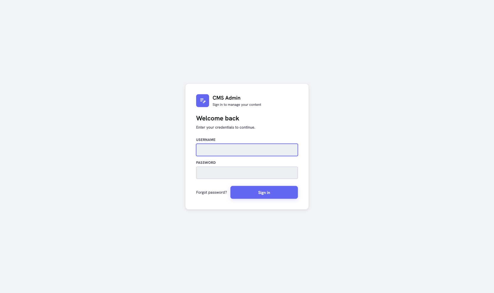
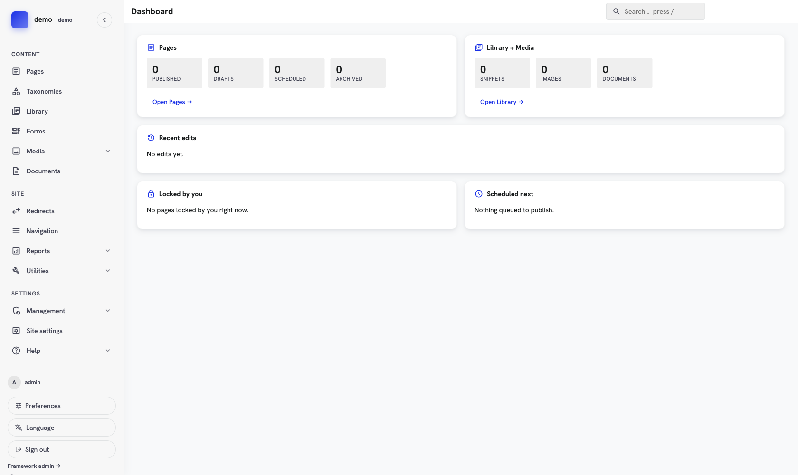
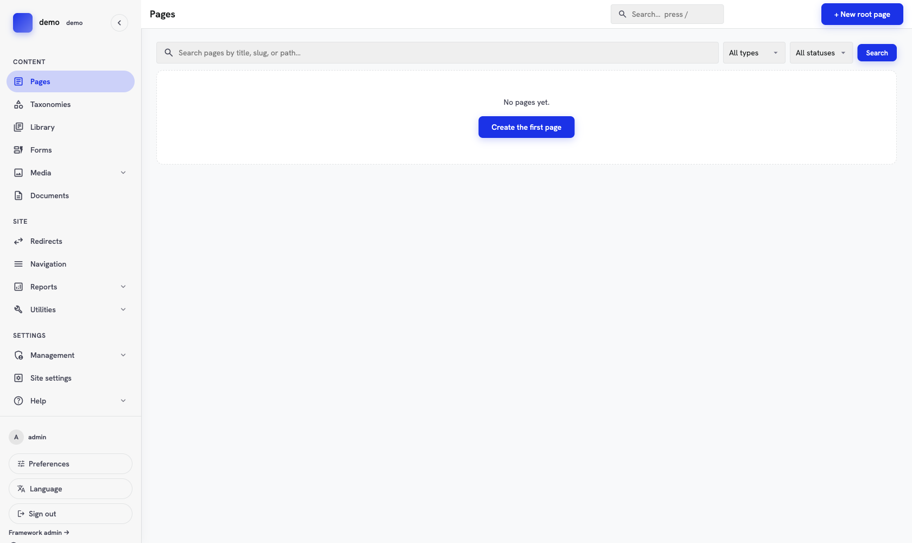
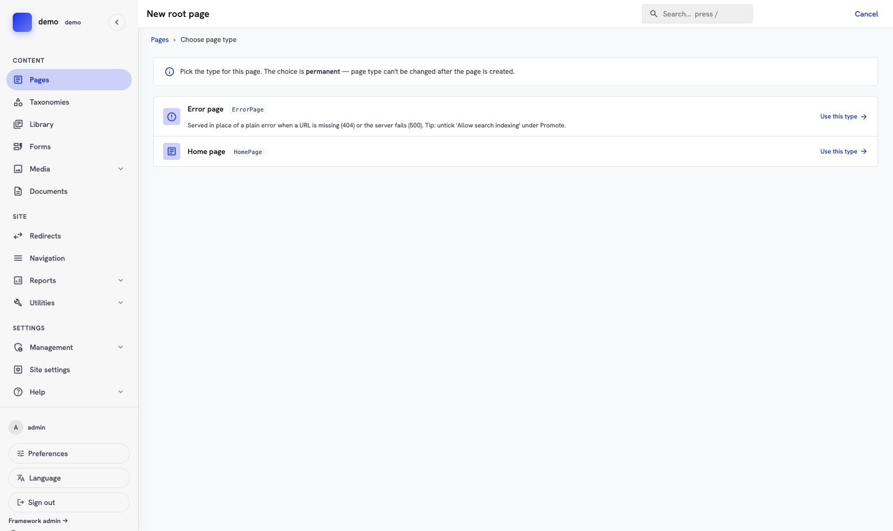
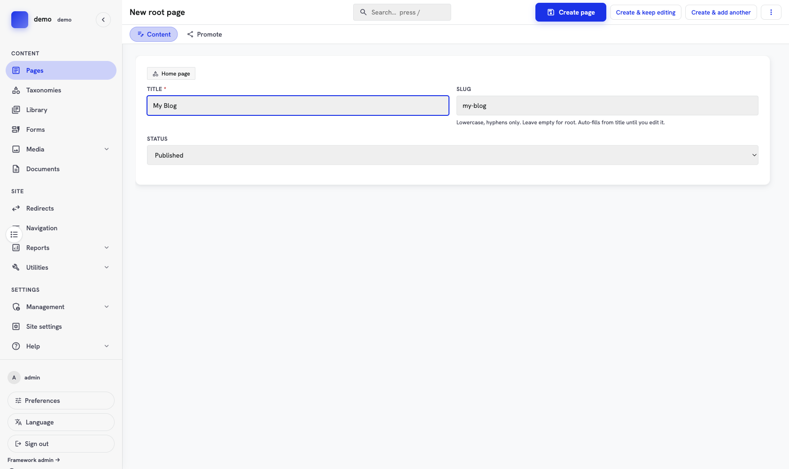
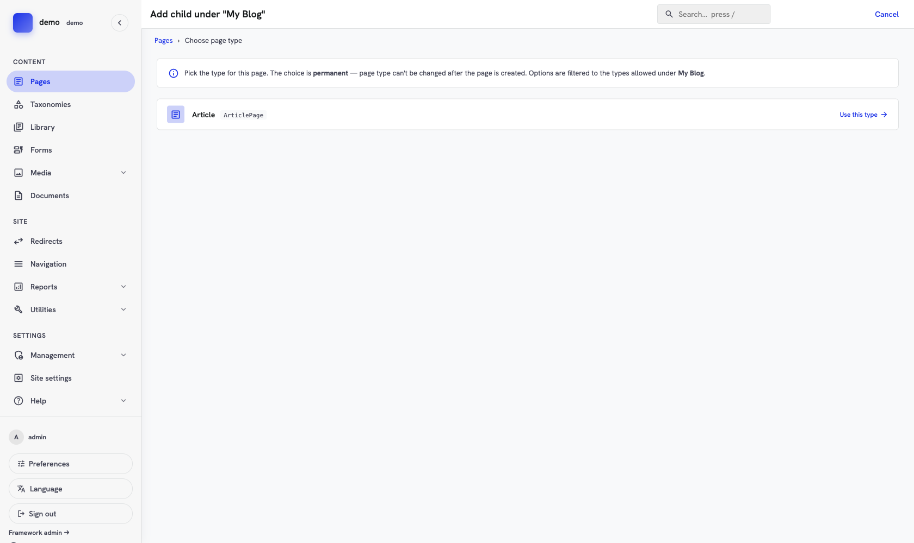
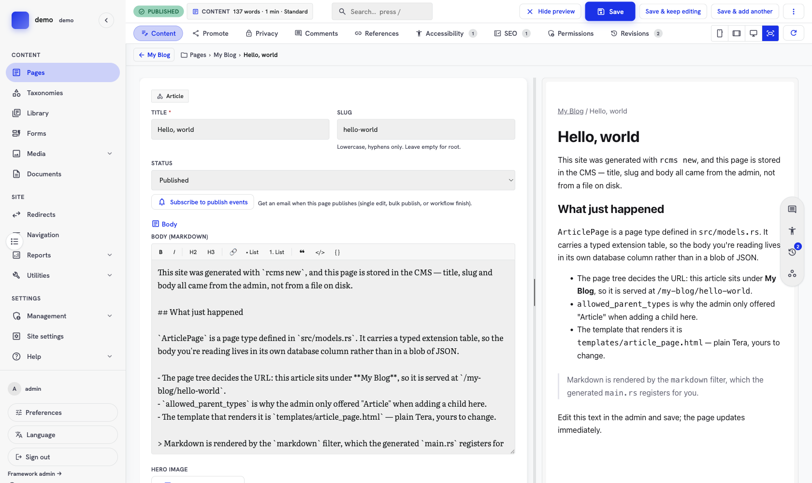
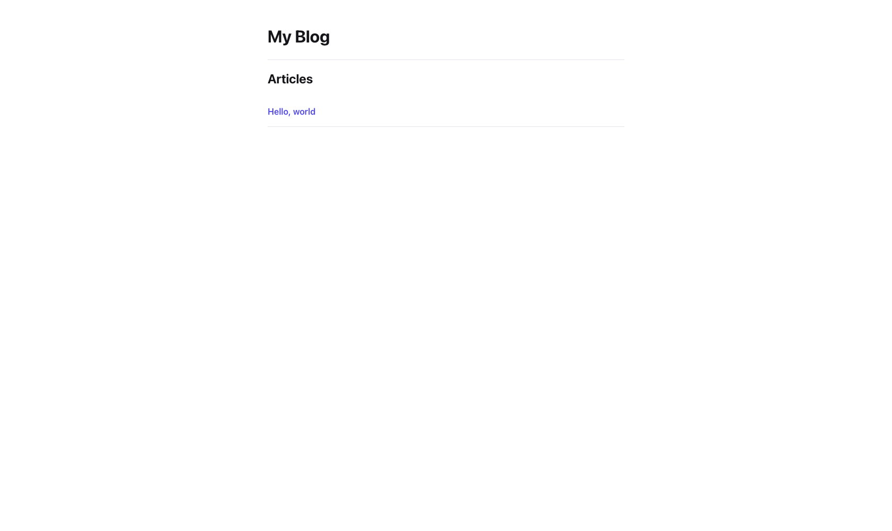
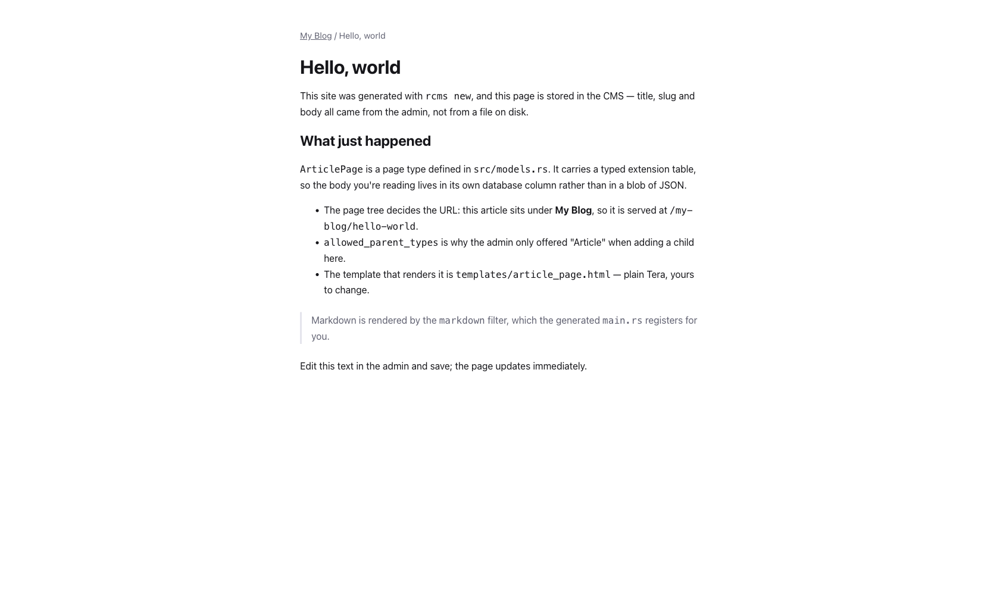

# Getting started: build a blog with rustango-cms

This walkthrough takes you from an empty directory to a working blog with an editor's admin: a page tree, two page types, a Markdown body stored in its own database table, and public pages served from templates you own. No database server to install — everything here runs on SQLite.

> **Time:** about 20 minutes, most of it waiting for the first compile.
>
> **Runnable version:** every step below produces the project in [`examples/cms_demo`](../examples/cms_demo). If something looks off, diff against it.

---

## What you need first

| Tool | Why | Install |
|---|---|---|
| Rust 1.88+ | Compiler | <https://rustup.rs> |
| A checkout of `rustango-cms` | The scaffolder and the CMS itself | `git clone https://github.com/ujeenet/rustango-cms` |

rustango-cms isn't on crates.io yet, so a generated project points at your checkout of it; the scaffolder writes that path for you. The `rustango` framework comes from crates.io.

Check what you have:

```bash
rustc --version    # should print 1.88 or newer
```

---

## Step 1: Generate the project

The scaffolder is `rcms`: it generates a new site project. Run it straight from the repo:

```bash
cd ~/projects/rustango-cms
cargo run -p rcms-scaffold -- new myblog --dir ~/projects --template blog
```

`--template blog` gives you a home page plus an article type with a real Markdown body. (The other option, `--template minimal`, gives you the same two page types with no typed fields — useful when you want to design your own from scratch.)

It prints exactly what to run next:

```
Created rustango-cms project `myblog` (blog template) at /Users/you/projects/myblog

Next — SQLite, no database server needed:
  cd /Users/you/projects/myblog
  export DATABASE_URL="sqlite:./var/registry.db?mode=rwc"
  cargo run --no-default-features --features sqlite -- migrate-registry
  cargo run --no-default-features --features sqlite -- create-tenant demo \
      --mode database \
      --database-url "sqlite:./var/demo.db?mode=rwc" \
      --host-pattern demo.localhost
  cargo run --no-default-features --features sqlite -- create-superuser demo admin
  cargo run --no-default-features --features sqlite -- makemigrations   # emits cms_article_page
  cargo run --no-default-features --features sqlite -- migrate-tenants
  cargo run --no-default-features --features sqlite -- runserver
```

Here's what it wrote:

```
myblog/
├── Cargo.toml              # path deps on rustango-cms + rustango
├── .env.example
├── .gitignore
├── README.md               # the same commands, kept for later
├── migrations/             # the CMS baseline — don't hand-edit these
├── src/
│   ├── main.rs             # wires the admin + public router together
│   └── models.rs           # your page types
└── templates/
    ├── _site.css.html      # starter styles, included by both templates
    ├── home_page.html
    └── article_page.html
```

Two files are yours to change; the rest you can mostly ignore at first. `src/models.rs` defines what kinds of page exist, and `templates/` decides how they look.

---

## Step 2: Set up the database

Everything from here runs inside the project:

```bash
cd ~/projects/myblog
export DATABASE_URL="sqlite:./var/registry.db?mode=rwc"
export RUSTANGO_SECRET_KEY="change-me-to-a-long-random-string"
```

`RUSTANGO_SECRET_KEY` encrypts the secrets the site stores, such as notification tokens. Without it, forms can't send email notifications. Use a long random value and keep it the same between restarts.

The first build takes a few minutes. Later commands reuse it.

### Create the registry

rustango-cms is multi-tenant: one **registry** database knows about your sites, and each site gets its own storage. Even a single-site blog goes through this, so you can add a second site later without restructuring anything.

```bash
cargo run --no-default-features --features sqlite -- migrate-registry
```

```
registry: applied 1 migration(s)
  + 0001_create_rustango_audit_log_and_rustango_content_types_and_rustango_operators_etc
```

### Create the site

SQLite has no schemas, so each site lives in its own file. That's what `--mode database` means; `--host-pattern` is the hostname that routes to it.

```bash
cargo run --no-default-features --features sqlite -- create-tenant demo \
    --mode database \
    --database-url "sqlite:./var/demo.db?mode=rwc" \
    --host-pattern demo.localhost
```

```
created tenant `demo` (id 1, mode database)
  applying tenant migrations…
  applied 4 migration(s)
    + 0002_create_rustango_admin_users_and_rustango_api_keys_and_rustango_audit_log_etc
    + 0001_cms_initial
    + 0002_page_builder
    + 0003_framework_snapshot_sync
```

`create-tenant` applies the site's migrations for you, so there's no separate step on a fresh install.

### Create a user

Without this you'll reach a login page you can't get past.

```bash
cargo run --no-default-features --features sqlite -- create-superuser demo admin
```

It prompts for a password. Anything you'll remember is fine locally.

```
created user `admin` in tenant `demo` (id 1, superuser=true)
```

### Generate your own migration

The two page types in `src/models.rs` are yours, not the CMS's — so their tables aren't in the shipped migrations. `ArticlePage` stores its body in a table called `cms_article_page`, and this is what creates it:

```bash
cargo run --no-default-features --features sqlite -- makemigrations
cargo run --no-default-features --features sqlite -- migrate-tenants
```

```
no changes for registry scope
wrote migrations/0004_create_cms_article_page.json (tenant scope)
    + CreateTable("cms_article_page")
    + CreateIndex { name: "cms_article_page_page_id_idx", ... }

ran tenant migrations against 1 tenant(s); 0 failure(s)
  ✓ demo: 1 migration(s)
```

Never write those JSON files by hand — `makemigrations` compares your models against the last snapshot and writes the difference. Run it again any time you change a model.

---

## Step 3: Start the server

```bash
cargo run --no-default-features --features sqlite -- runserver
```

Leave it running and open <http://demo.localhost:8080/login>. The hostname matters: it's the `--host-pattern` from earlier, and that's how the server knows which site you're asking for. `demo.localhost` resolves to your own machine without any `/etc/hosts` editing.



Sign in as `admin` with the password you chose. You land on the dashboard:



Everything is empty, which is right — you haven't made anything yet.

---

## Step 4: Create the home page

Click **Pages** in the sidebar.



Choose **Create the first page**. The CMS asks which type of page you want:



Only two types are offered, and "Article" isn't one of them. That's `src/models.rs` talking:

```rust
#[async_trait]
impl PageTypeHandler for ArticlePage {
    fn allowed_parent_types(&self) -> &'static [&'static str] {
        &["HomePage"]
    }
    // …
}
```

An article can only live under a home page, so the CMS won't offer it at the top of the tree. You get to state rules like that once and have the admin enforce them everywhere.

Pick **Home page**, title it `My Blog`, and set **Status** to `Published`. The slug fills itself in from the title.



Click **Create page**.

> The slug is what appears in the URL, so this page will be served at `/my-blog`. Clear the slug entirely if you want a page at the site root instead — the help text under the field says so, but the auto-fill will have put something there already.

---

## Step 5: Write an article

Open **My Blog**, then **Add the first child**. This time the type picker looks different:



Only **Article** is offered — the same rule as before, seen from the other side. The banner spells out why: options are filtered by both the parent's `allowed_child_types` and the candidate's `allowed_parent_types`.

Pick **Article**, title it `Hello, world`, set **Status** to `Published`, and this time use **Create & keep editing** so you stay on the page.

Now the editor shows something the home page didn't: a **Body (Markdown)** field with a formatting toolbar, and a **Hero image** picker. Those come from `ArticlePage`'s typed extension table — they're real columns, declared in `src/models.rs`:

```rust
#[derive(Model, Debug, Clone, Serialize, Deserialize)]
#[rustango(table = "cms_article_page", app = "site")]
pub struct ArticleBody {
    #[rustango(primary_key)]
    pub id: Auto<i64>,
    #[rustango(fk = "cms_page", on = "id", index, unique)]
    pub page_id: i64,
    #[rustango(max_length = 16000)]
    pub body_markdown: String,
    #[rustango(fk = "cms_media", on = "id")]
    pub hero_media_id: Option<i64>,
}
```

Type some Markdown into the body and press **Save & keep editing**. The preview pane on the right updates:



> Extension fields only appear once the page exists — there's no page to attach them to before you've created it. That's why this step used **Create & keep editing**: create the page, then fill in the body.

---

## Step 6: Look at the site

Open <http://demo.localhost:8080/my-blog>:



The article is listed because `templates/home_page.html` loops over `children`, which the CMS puts in the context for every page:

```html

    <li><a href="{{ url_prefix }}/{{ child.slug }}">{{ child.title }}</a></li>

```

Follow the link:



That's `templates/article_page.html`, and it's short enough to read in full:

```html
<article>
    <h1>{{ page.title }}</h1>
    
        
    
    {{ extension.body_markdown | markdown | safe }}
</article>
```

`extension` is the typed row you saw in the editor. `| markdown` turns it into HTML; `| safe` is required after it, because the filter has already sanitized its output and Tera would otherwise escape the tags and show them as text.

---

## How it fits together

Three ideas carry most of the CMS:

**The page tree is the site.** Every page has a parent, and the URL is built from the slugs along the path. Moving a page in the admin moves its URL, and the children come with it.

**A page type is a Rust struct plus a handler.** The handler says what the type is called, which template renders it, and where in the tree it's allowed to sit. The CMS reads those answers and builds the admin around them — the type picker, the field list, the validation.

**Typed fields live in their own table.** Shared things — title, slug, status, publication dates — are columns on `cms_page`. Fields specific to one type go in a table you own, joined by `page_id`. Your article bodies are queryable columns, not JSON in a blob.

Everything an editor sees is generated from those three. You didn't write a form, a list view, or a URL route to get here.

---

## Where to go next

- Change `templates/_site.css.html` — it's plain CSS inlined into both page templates, with nothing else depending on it.
- Add a third page type: copy the `HomePage` block in `src/models.rs`, add a force-link line in `src/main.rs`, and run `makemigrations` if it has typed fields.
- Switch to PostgreSQL when you're ready to deploy. The generated `README.md` has the same sequence without the SQLite-specific flags.
