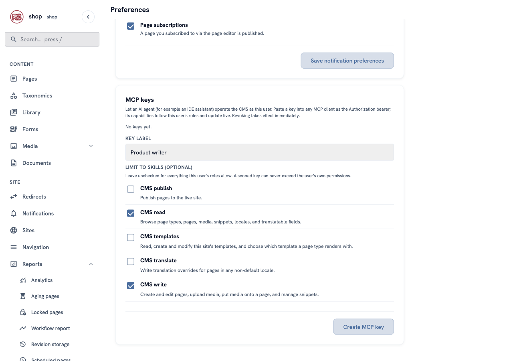
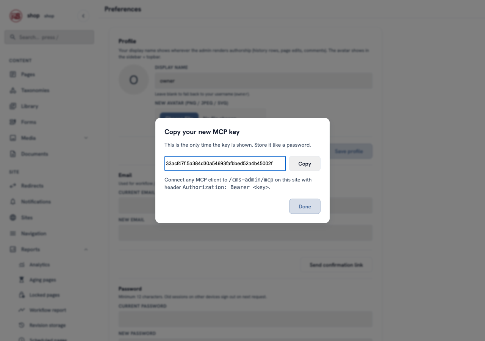
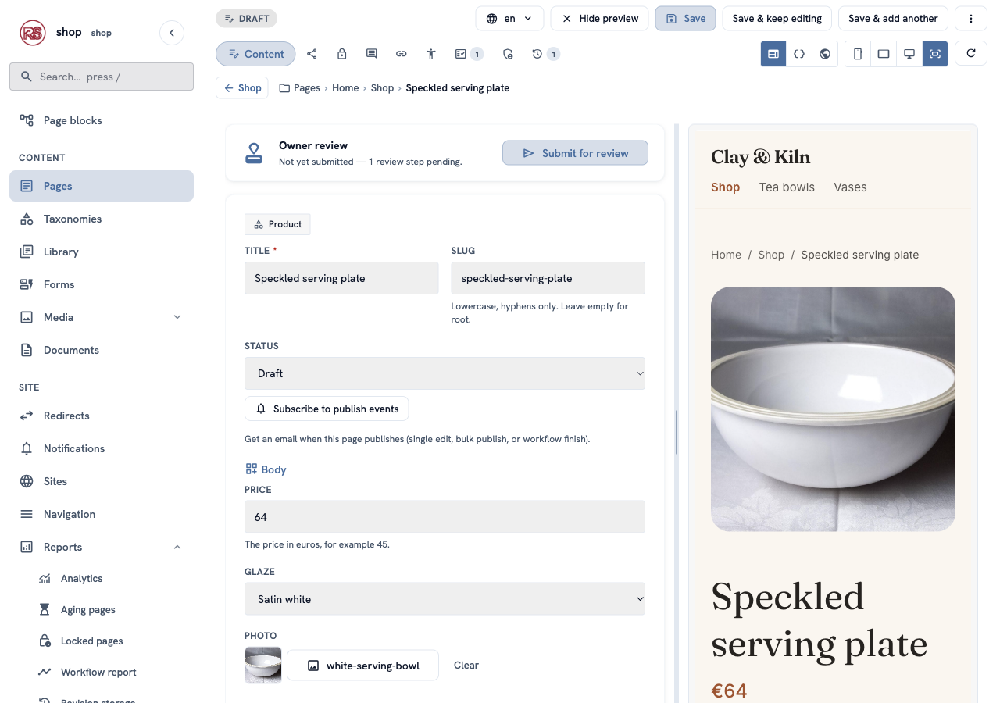
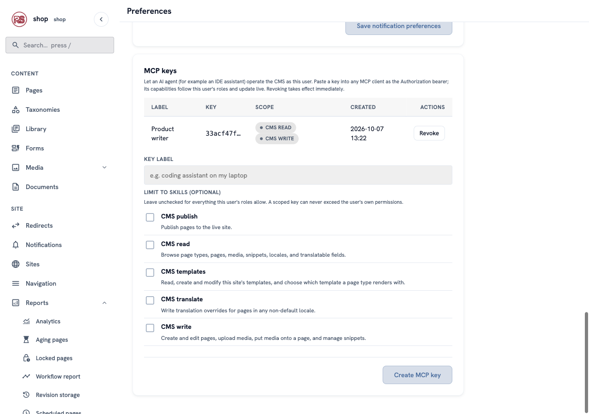

# Let an AI agent help

**Goal:** give an AI assistant its own key, so it can write new product pages for you as drafts. You read them and publish them yourself.

**Who this is for:** shop owners and editors. One part is for the person who sets up the assistant on a computer.

**Time:** about 15 minutes.

This is chapter 16 of [Build a ceramics shop, step by step](shop-overview.md).

## How it works

Many AI assistants — in a code editor, on the desktop, or in a terminal — can use tools over **MCP** (Model Context Protocol). Rustango-CMS has an MCP server built in. With a key, an assistant can:

- read your page types, pages, photos and Library items,
- create and change pages (always as **drafts**, unless you allow publishing),
- upload photos and put them on pages,
- write translations and change templates — if you allow it.

The assistant works **as you**: the CMS checks the same permissions as in the admin, and every change appears in the page's history under your name. A key can do **less** than you, never more.

## Words you will see

| Word | What it means |
|---|---|
| **MCP key** | A secret text that lets one assistant work in the CMS as you. Like a password, but you can make many and stop each one. |
| **Skill** | A group of things the assistant may do: read, write, publish, templates, translate. |
| **Revoke** | Stop a key. It stops working at once. |

## Steps

### 1. Make a key that can only write drafts

In the menu on the left, near your name at the bottom, click **Preferences**. Scroll down to **MCP keys**.

In **Key label**, type **Product writer**. Under **Limit to skills**, tick only **CMS read** and **CMS write**. Leave **CMS publish** empty: the assistant can write, but only you can make a page live.



Click **Create MCP key**.

> **Why limit it?** With no boxes ticked, the key can do everything you can do — publish, delete, change templates. A key for one job should only do that job.

### 2. Copy the key

A window shows the key. **This is the only time you see it.** Click **Copy** and keep it somewhere safe, like a password.



The window also says where the assistant connects: `/cms-admin/mcp` on your site.

### 3. Connect the assistant

*This part is for the person who sets up the assistant.*

Every MCP client has a settings file or a settings screen for servers. Add one server with:

- the address `https://your-site.example/cms-admin/mcp` (for the example shop: `http://shop.localhost:8080/cms-admin/mcp`),
- the header `Authorization: Bearer <your key>`.

Many clients read a JSON file in this shape:

```json
{
  "mcpServers": {
    "clay-and-kiln": {
      "type": "http",
      "url": "http://shop.localhost:8080/cms-admin/mcp",
      "headers": { "Authorization": "Bearer 33acf47f.5a38…" }
    }
  }
}
```

The server speaks MCP over HTTP (JSON-RPC requests, with an event stream for clients that open one). A client that can only start local programs can reach it through an HTTP-to-stdio bridge such as `mcp-remote`:

```sh
npx mcp-remote http://shop.localhost:8080/cms-admin/mcp --header "Authorization: Bearer $RCMS_KEY"
```

When it works, the assistant lists the tools it got. With the **Product writer** key that is 13 tools — `list_page_types`, `search_pages`, `get_page`, `create_page`, `update_page`, `upload_media`, `attach_media` and the other read tools — and **no** `publish_page`.

### 4. Ask for a product

Now talk to the assistant as you would to a helper. For example:

> Add a new product under Shop: "Speckled serving plate", €64, satin white glaze, use the white serving bowl photo. Write two short sentences about it. Keep it a draft.

The assistant first reads your page types, so it knows that a **Product** has a price, a glaze, a photo and a description and can only live under **Shop**. Then it creates the page. In the protocol, that is one `create_page` call:

```json
{
  "name": "create_page",
  "arguments": {
    "page_type": "product",
    "parent_id": 2,
    "title": "Speckled serving plate",
    "builder": {
      "price": 64,
      "glaze": "Satin white",
      "photo": 14,
      "description": "<p>A wide, flat plate for bread, cheese or fruit. The glaze has small dark speckles from iron in the clay.</p>"
    }
  }
}
```

The answer says the page is `"status": "draft"`.

### 5. Check the draft and publish it

In the admin, open **Pages → Shop**. **Speckled serving plate** is there, as a **Draft**. Open it: the price, glaze, photo and text are filled in, and the preview shows the page in your design.



Change what you don't like. When it is right, publish it as in [chapter 7](shop-products.md) — or send it for review, if your shop uses the workflow from [chapter 14](shop-team.md).

If you ask this assistant to publish, it cannot: the CMS answers that `publish_page` is not allowed for this key.

### 6. Stop a key

Back in **Preferences → MCP keys**, each key has a row with its label, the start of the key and its skills. Click **Revoke** to stop it. The next request with that key gets "invalid token" — at once, no waiting.



> **For administrators:** under **Users**, open a person and you find the same **MCP keys** card. You can make or revoke keys for that person there — for example, when somebody leaves the team.

## What each skill allows

| Skill | Tools | Needs the permission |
|---|---|---|
| **CMS read** | `list_page_types`, `search_pages`, `get_page`, `list_locales`, `list_media`, `list_collections`, `list_snippets`, `list_translatable_fields` | view pages |
| **CMS write** | `create_page`, `update_page`, `upload_media`, `attach_media`, `upsert_snippet` | add or change pages |
| **CMS publish** | `publish_page` | publish pages |
| **CMS templates** | `list_templates`, `read_template`, `write_template`, `validate_template`, `set_page_type_template` | edit templates |
| **CMS translate** | `upsert_translations` | change pages |

A skill only works when the key's owner has its permission. So a key made by an **Editor** without the publish permission cannot publish, even with **CMS publish** ticked. If you take a permission away from a person, their keys lose it on the next request.

## Check it worked

- The key's row in **MCP keys** shows **CMS read** and **CMS write**.
- The assistant lists 13 tools, without `publish_page`.
- The new product is in **Pages** as a **Draft**, and its history shows your name.
- After **Revoke**, the assistant gets "invalid token".

## If something goes wrong

| Problem | What to do |
|---|---|
| The assistant says "missing or invalid agent token". | The key is wrong, revoked, or has no `Bearer ` before it. Make a new key. |
| The assistant has fewer tools than expected. | The key is limited to some skills, or you lack a permission (see the table). |
| "tool … is not authorized for this agent". | The key has no skill with that tool. That is the point — make another key if the job needs it. |
| Every request fails with a CSRF error. | The host app must exempt `/cms-admin/mcp` from CSRF (`CsrfConfig::exempt_prefix(rustango_cms::mcp::MCP_PREFIX)`) — the example shop does. |
| The page lands in the wrong place, or is refused. | The page type's parent rules apply to the assistant too. A **Product** can only be under **Shop**. |

## Next

Back to [the list of chapters](shop-overview.md).
