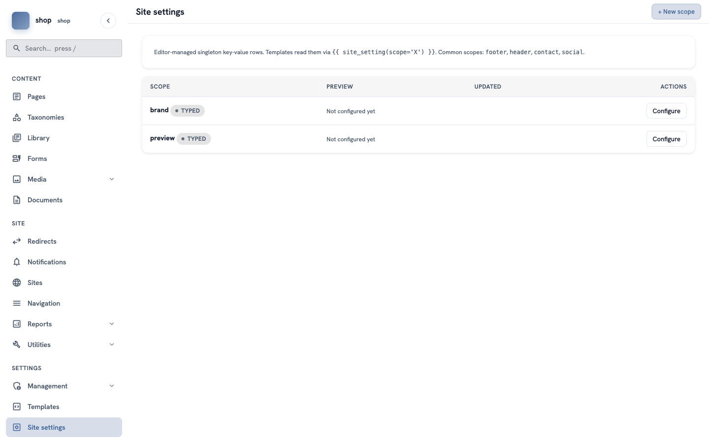
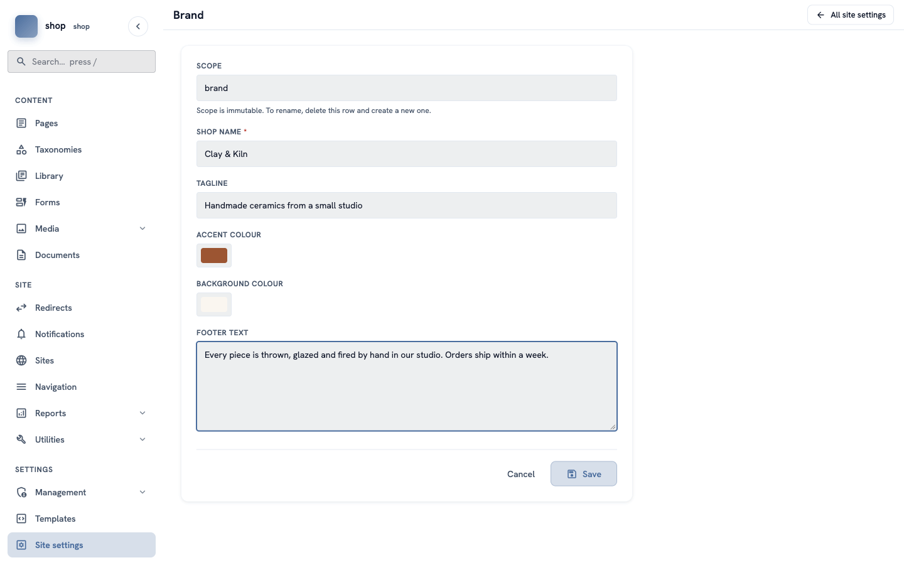
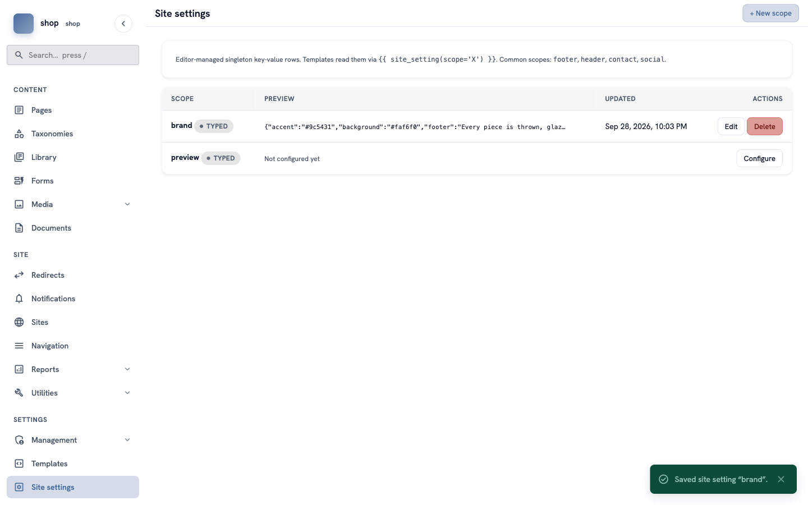

# Your shop's name and colours

**Goal:** type your shop's name, tagline, colours and footer text in one place. Every page of the shop uses them.

**Who this is for:** shop owners and editors. You do not need any technical knowledge.

**Time:** about 5 minutes.

This is chapter 1 of [Build a ceramics shop, step by step](shop-overview.md).

## Before you start

- You can sign in to the admin. See [How to find your way around the admin](admin-find-your-way.md).
- You can see **Site settings** at the bottom of the menu on the left. If you cannot see it, ask the person who manages your site.

## Words you will see

| Word | What it means |
|---|---|
| **Site setting** | Information that is the same on every page, for example the shop name or the footer text. You type it once. |
| **Scope** | The name of one group of settings. The shop's group is called `brand`. |
| **Accent colour** | The colour for prices, links and buttons. |

## Steps

### 1. Open the site settings

In the menu on the left, click **Site settings** (at the bottom).

You see a list with the row **brand**. It says **Not configured yet**.

In the **brand** row, click **Configure**.

> **Where does "brand" come from?** A developer prepared this group and chose its boxes. You only fill them in. You do not need **+ New scope**.

### 2. Fill in the boxes

Type your shop's information. For the example shop:

| Box | What to type |
|---|---|
| **Shop name** | `Clay & Kiln` |
| **Tagline** | `Handmade ceramics from a small studio` |
| **Accent colour** | Click the colour square and choose a warm brown, for example `#9c5431`. |
| **Background colour** | Click the colour square and choose a soft cream, for example `#faf6f0`. |
| **Footer text** | `Every piece is thrown, glazed and fired by hand in our studio. Orders ship within a week.` |

The **Scope** box is grey. You cannot change it.

> **Tip:** only **Shop name** is required (it has a red star). You can leave the other boxes empty and fill them in later.

### 3. Save

Click **Save** at the bottom.

You go back to the list. A green message says **Saved site setting "brand"**. The **brand** row now shows your values and the date.

## Check it worked

Your shop has no pages yet, so you cannot see the name on the site now. You will see it in the next chapters: the name is at the top left of every page, and the footer text is at the bottom.

To change something later, click **Edit** in the **brand** row. The change is on every page at once.

## If something goes wrong

| Problem | What to do |
|---|---|
| There is no **brand** row. | Your site does not have this group yet. Ask a developer. The developer part of this guide explains it: [The helper traits](shop-dev-helper-traits.md). |
| **Save** does not work, or you see "These required fields are empty". | The shop name is empty. Type a name and save again. |
| You clicked **Delete** by mistake. | The values are gone, but the **brand** row comes back with **Configure**. Fill in the boxes again. |

## Next

[Chapter 2 — Add your photos](shop-photos.md)
