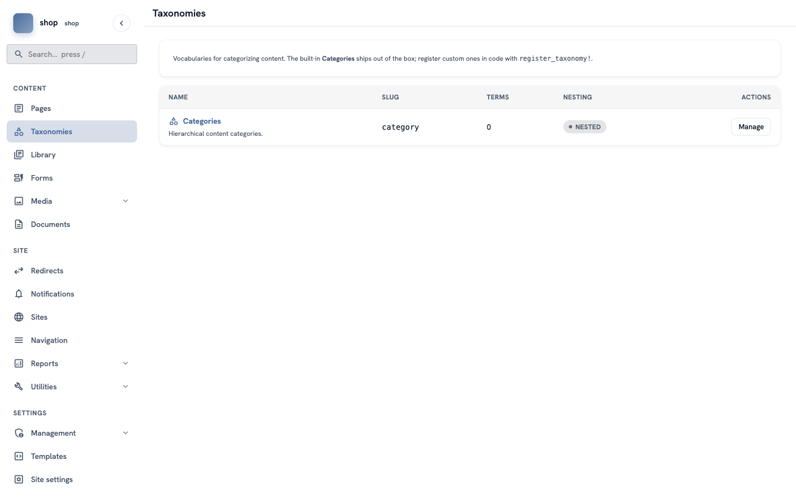
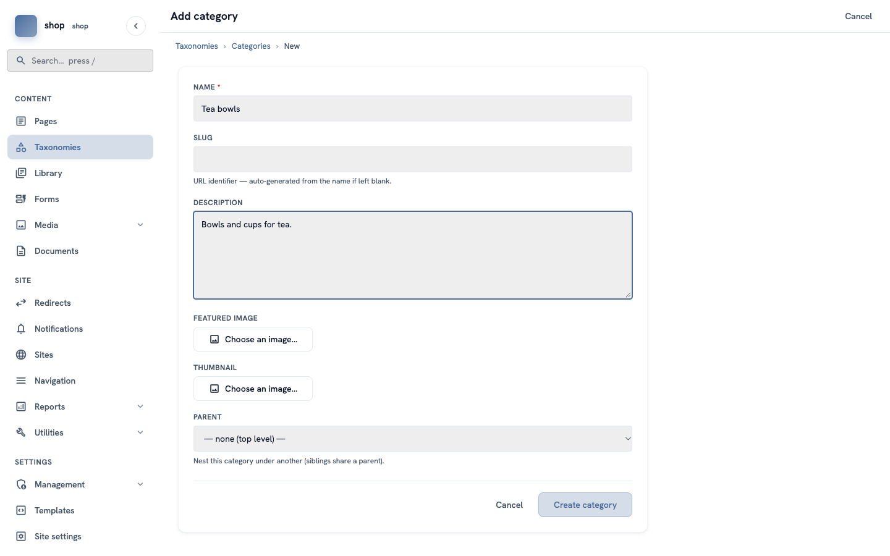
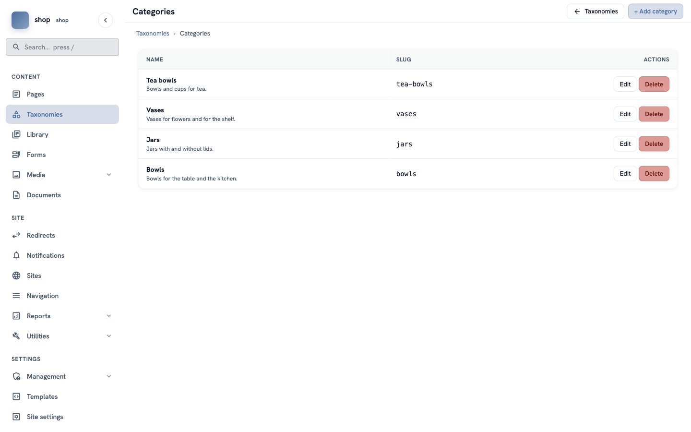

# Groups of products: categories

**Goal:** make four groups — Tea bowls, Vases, Jars and Bowls — so visitors can find products by group.

**Who this is for:** shop owners and editors. You do not need any technical knowledge.

**Time:** about 5 minutes.

This is chapter 5 of [Build a ceramics shop, step by step](shop-overview.md).

## Before you start

- You did chapters [1](shop-brand.md) to [4](shop-product-type.md).

## Words you will see

| Word | What it means |
|---|---|
| **Taxonomy** | A list of words to sort your pages. The site always has one taxonomy called **Categories**. |
| **Category** | One word in that list, for example **Vases**. A page can be in one or more categories. |
| **Parent** | A category can be inside another category, for example **Small vases** inside **Vases**. |

## Steps

### 1. Open the categories

In the menu on the left, click **Taxonomies**. You see the **Categories** row with **0** terms.

In the **Categories** row, click **Manage**. Then click **+ Add category** at the top right.

### 2. Add the first category

Fill in the form:

| Box | What to type |
|---|---|
| **Name** | `Tea bowls` |
| **Slug** | leave empty — it is made from the name (`tea-bowls`) |
| **Description** | `Bowls and cups for tea.` |
| **Featured image** and **Thumbnail** | optional, you can leave them empty |
| **Parent** | keep **— none (top level) —** |

Click **Create category**.

### 3. Add the other categories

Click **+ Add category** again and add:

| Name | Description |
|---|---|
| `Vases` | `Vases for flowers and for the shelf.` |
| `Jars` | `Jars with and without lids.` |
| `Bowls` | `Bowls for the table and the kitchen.` |

## Check it worked

The **Categories** list shows four rows, each with its slug.

> **Remember the slugs.** In chapter 8 you use them to link from the menu to one group, for example `tea-bowls`.

In [chapter 7](shop-products.md) you put each product in a category. The shop page then shows the products in groups.

## If something goes wrong

| Problem | What to do |
|---|---|
| You made a spelling mistake. | Click **Edit** in the row, fix the name and save. Check the slug too. |
| You made a category twice. | Click **Delete** in one of the rows. |

## Next

[Chapter 6 — The shop page](shop-shop-page.md)
