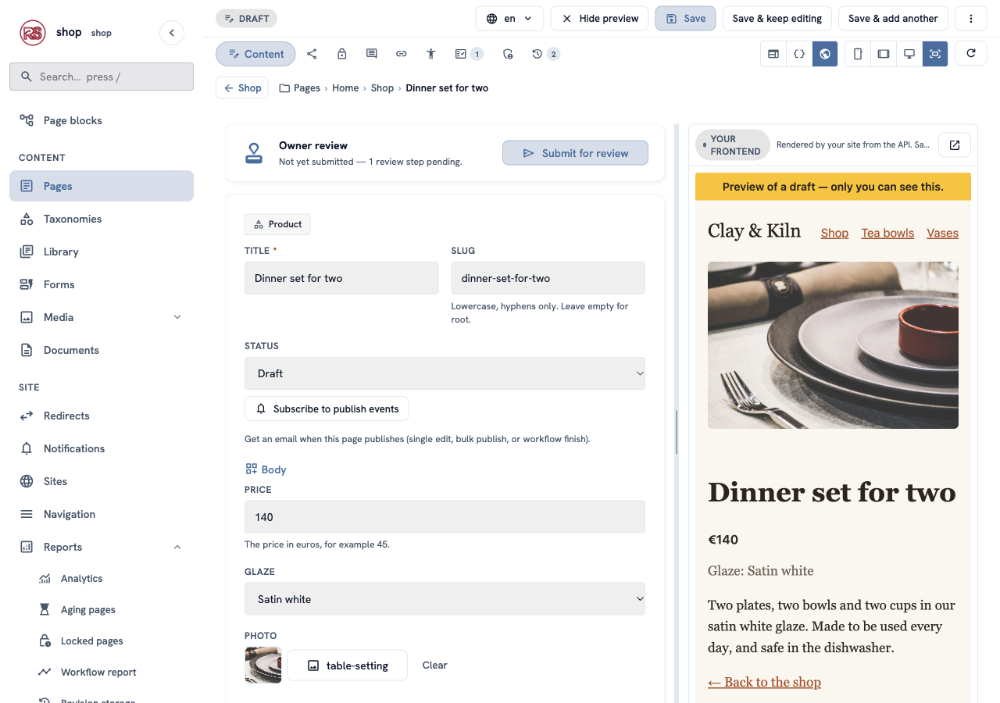
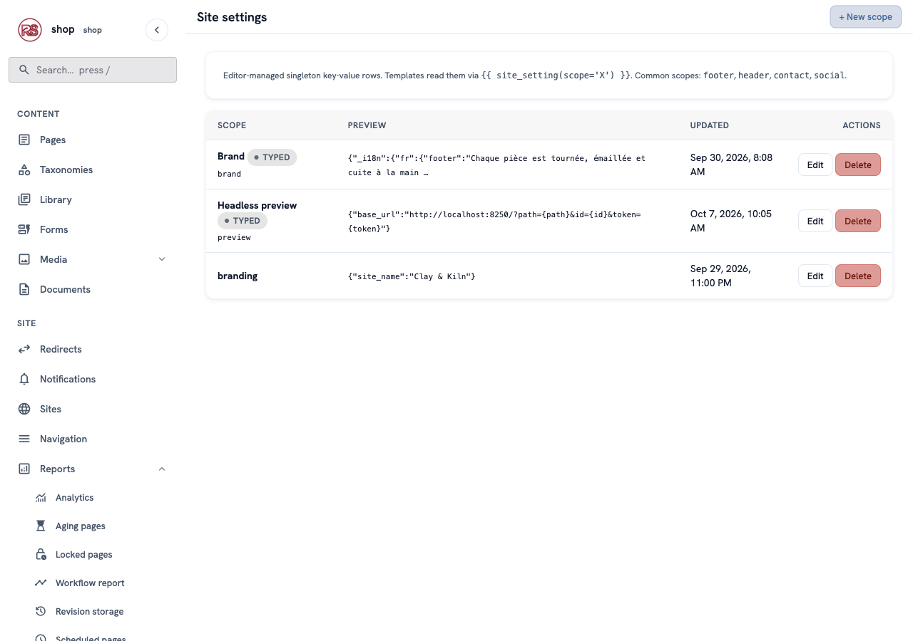
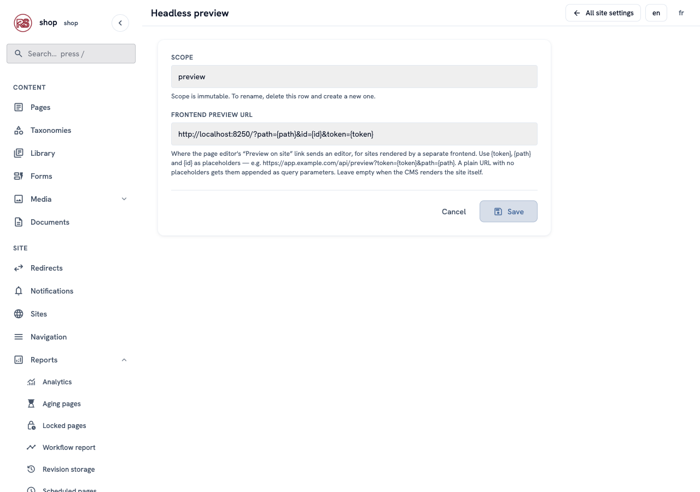
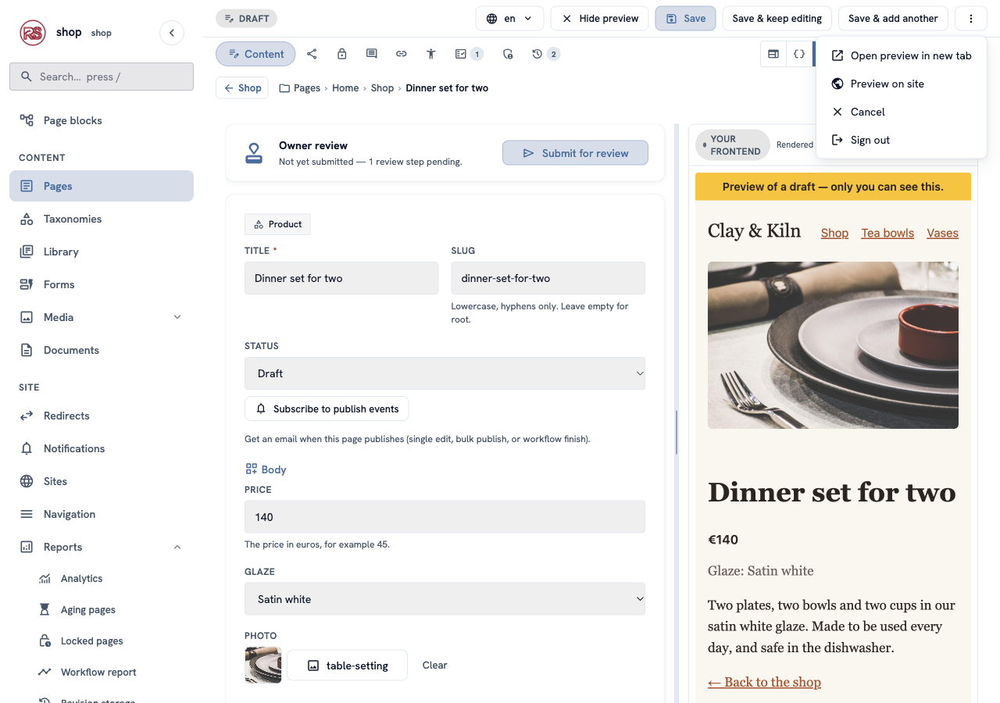
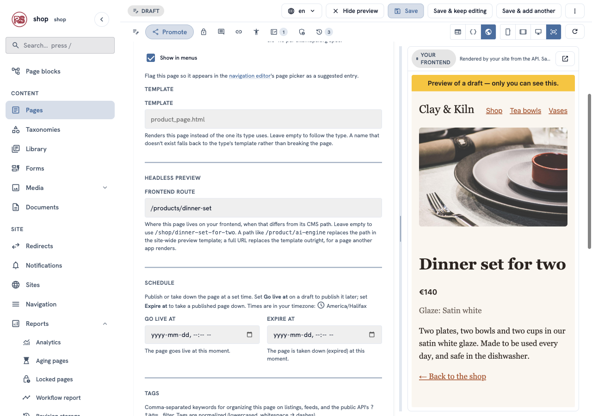

# Preview drafts on your own frontend

**Goal:** let editors see a draft in the headless storefront — inside the page editor and in a new tab — before anybody else can.

**Who this is for:** developers who did [A headless storefront](shop-dev-headless.md). The last part is for editors too.

**Time:** about 15 minutes.

This is a developer chapter of [Build a ceramics shop, step by step](shop-overview.md). The code is in `examples/ceramics_shop/headless/app.js`.



## The problem

The storefront asks the API for pages, and the API shows only what a visitor may see. A draft is not there: `/api/v2/pages/22/` answers `404`. That is right for visitors, but an editor wants to check a new product **in the real design** before publishing it.

The answer is a **preview token**: a short signed text that unlocks one draft page for one hour. The admin makes the token; the storefront sends it back to the API.

The CMS signs tokens with `RCMS_SECRET_KEY`. Without it, it makes a key once and keeps it in `./var/.rustango_cms_signing.key`, so preview works with no setup. In production, set `RCMS_SECRET_KEY` (or share that file between servers), so every server signs alike.

## Before you start

- The storefront from the last chapter runs on <http://localhost:8250>.
- There is a draft to look at. This chapter uses a new product, **Dinner set for two**, saved as a **Draft** under **Shop** with a price, a glaze and a photo — the way you added products in [chapter 7](shop-products.md).

## 1. Tell the CMS where your frontend lives

In the menu on the left, click **Site settings**. Find the row **Headless preview** and click **Configure** (or **Edit**, if somebody set it before).



In **Frontend preview URL**, type the address of a page in your frontend, with three placeholders:

```text
http://localhost:8250/?path={path}&id={id}&token={token}
```

| Placeholder | Becomes |
|---|---|
| `{path}` | the page's address, for example `/shop/dinner-set-for-two` |
| `{id}` | the page's number, for example `22` |
| `{token}` | the preview token |

Click **Save**.



The CMS percent-encodes what it puts in. `{path}` keeps its `/`, so it also works in the path part of a URL: `https://shop.example.com/preview{path}?token={token}`. A plain address with no placeholders works too — the CMS adds the three as query parameters.

## 2. Read the token in the storefront

When the address has `id` and `token`, the storefront asks for that page directly and sends the token:

```js
const previewId = params.get("id");
const previewToken = params.get("token");

function loadPage() {
  if (previewId && previewToken) {
    const token = encodeURIComponent(previewToken);
    return api(`/api/v2/pages/${previewId}/?preview_token=${token}`);
  }
  return api(`/api/v2/pages/find/?html_path=${encodeURIComponent(path)}`);
}
```

It also shows a yellow bar, so nobody mistakes a draft for the live page:

```js
document.getElementById("preview-bar").hidden = !previewToken;
```

That is all. The token is the whole permission: no login, no cookie, no extra CORS setting.

## 3. Preview a draft

Open the draft in the editor. Two new things are there now.

**Preview on site.** Click the **⋮** button at the top right, then **Preview on site**. The storefront opens in a new tab, with the draft.



**Your frontend, next to the form.** Above the preview there are three buttons: the CMS's own preview, the JSON from the API, and a globe — **Your frontend**. Click the globe. The preview now shows the storefront, with the draft — the picture at the top of this chapter. The phone, tablet and computer buttons work here too.

> **Save, then reload.** The CMS can change its own preview while you type, but not a page that comes from another address. Click **Save & keep editing**, then the round arrow button above the preview.

## 4. When a page lives at another address

`{path}` is the page's address **in the CMS**. Maybe your frontend uses other addresses — for example `/products/dinner-set` instead of `/shop/dinner-set-for-two`. Then open the page's **Promote** tab and fill in **Frontend route** under **Headless preview**:



| Frontend route | What happens |
|---|---|
| empty | `{path}` is the CMS address — the common case |
| `/products/dinner-set` | replaces `{path}`; the address and the token still come from the site setting |
| `https://other.example.com/x?t={token}` | replaces the whole address, for a page that another app shows — works even with no site setting |

A copy of the page does not get the frontend route: it has its own address.

## How safe is the token?

- It unlocks **one** page. A token made for page 22 does not open page 20.
- It stops working after **one hour**. The editor makes a new one each time it loads.
- If one letter is changed, the API answers `404`, the same as for a page that does not exist.
- Private pages stay private: a token lets you read a **draft**, not a page you are not allowed to see.

## Check it worked

- `/api/v2/pages/22/` without a token answers `404`.
- **⋮ → Preview on site** opens the storefront with the draft and the yellow bar.
- The globe button shows the draft inside the editor.
- Change the price, click **Save & keep editing**, then the round arrow: the new price is in the storefront.

## If something goes wrong

| Problem | What to do |
|---|---|
| There is no **Preview on site** and no globe button. | The **Headless preview** setting is empty and the page has no **Frontend route** — do step 1. |
| The storefront says "Page not found" in preview. | The token is older than one hour — open the editor again for a fresh one. Or the storefront does not read `id` and `token` (step 2). Or you run several servers with different keys — set the same `RCMS_SECRET_KEY` on all. |
| The globe preview stays white. | Your frontend refuses to be shown in a frame (`X-Frame-Options` or CSP `frame-ancestors`). Allow the admin's address, or use **Preview on site**. |
| The preview shows the old version. | Save first, then click the round arrow above the preview. |

## Next

- Back to [the list of chapters](shop-overview.md).
- Every detail of the API: [Headless JSON API](api.md).
