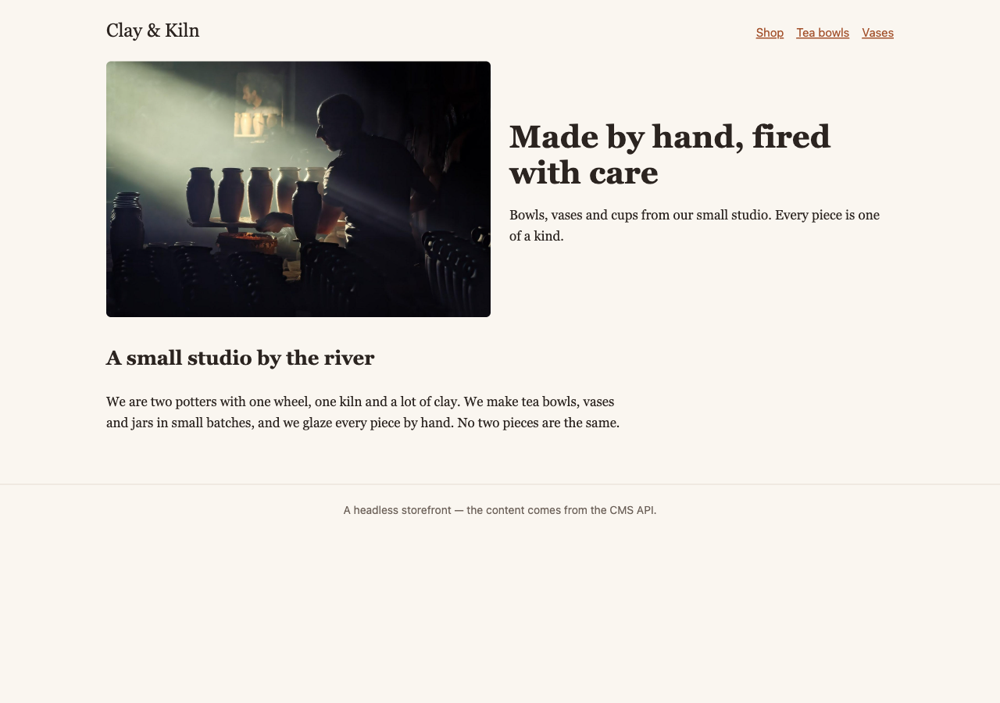
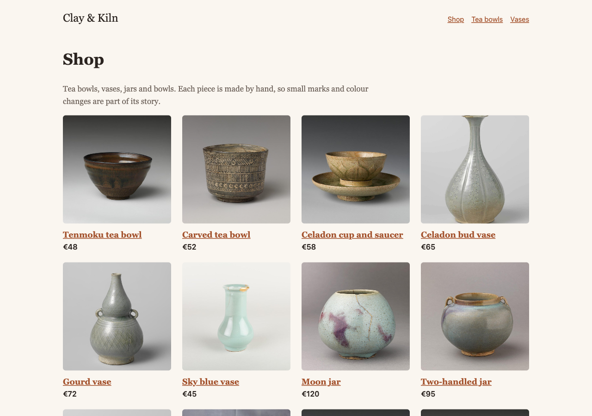
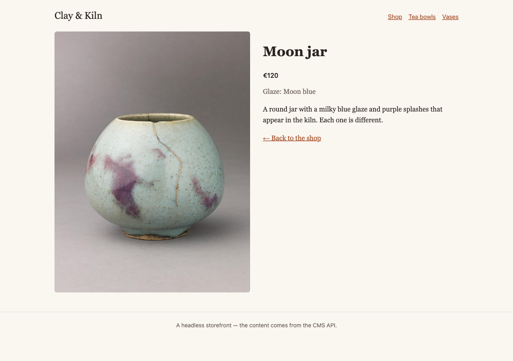

# A headless storefront

**Goal:** show the Clay & Kiln shop on a second website that you write yourself. The CMS keeps the content; your site only asks for it and decides how it looks.

**Who this is for:** developers who build a site in JavaScript (or any language that can read JSON) instead of Tera templates.

**Time:** about 20 minutes.

This is a developer chapter of [Build a ceramics shop, step by step](shop-overview.md). All code is from the example storefront in `examples/ceramics_shop/headless/`: one HTML file, one JavaScript file and one CSS file. No build step, no libraries.



## Headless — what it means

Until now, the CMS did two jobs: it kept the content, and it **drew** the pages with its templates. "Headless" means you keep only the first job. The CMS gives the content as JSON, and another program — a single-page app, a mobile app, a static site generator — draws it.

| | The CMS draws the pages | Headless |
|---|---|---|
| Who makes the HTML | Tera templates in your Rust project | your own frontend |
| How the frontend gets content | — | the JSON API under `/api/v2/` |
| What editors use | the admin | the same admin |
| Live preview in the editor | the CMS's own preview | your frontend, with a preview token — see [Preview drafts on your own frontend](shop-dev-headless-preview.md) |

You don't have to choose for the whole site. The API is always there next to the normal pages, so a site can draw most pages itself and send a few to an app. The page types don't change: a type made in code, a type built in the admin and Stream fields all come out of the API.

## Before you start

- The example shop runs on <http://shop.localhost:8080>. How to start it is written at the top of `examples/ceramics_shop/main.rs`.
- Python 3, only to serve three static files. Any static file server works.

## 1. Allow your frontend's address

The storefront runs on another address (`http://localhost:8250`), so the browser asks the CMS first whether that address may read the API. This is called CORS, and it is **off** until you turn it on. Start the shop with:

```sh
RCMS_API_CORS_ORIGINS=http://localhost:8250
```

Use a comma between several addresses. Without this line every request from the storefront fails, and the browser console says the request was "blocked by CORS policy".

> **Only the API needs this.** Photos are plain `` tags, and a browser shows an image from another address without asking.

## 2. Start the storefront

```sh
cd examples/ceramics_shop/headless
python3 -m http.server 8250
```

Open <http://localhost:8250>. You see the home page from the picture at the top. Every word and photo comes from the CMS.

At the top of `app.js` is the one line that ties the two together:

```js
const CMS = "http://shop.localhost:8080";
```

If your shop runs on another port, change it here.

## 3. Find the page for an address

The storefront keeps the page's address in its own URL: `?path=/shop/moon-jar`. The API turns a CMS address into the page's JSON in one step:

```js
function loadPage() {
  // …the preview case comes in the next chapter…
  return api(`/api/v2/pages/find/?html_path=${encodeURIComponent(path)}`);
}
```

`find/` answers with a redirect to the page's own JSON, like `/api/v2/pages/9/`, and `fetch` follows it. A draft, a private page and an address with no page all give `404`.

A product comes back like this (shortened):

```json
{
  "id": 9,
  "title": "Moon jar",
  "url": "/shop/moon-jar",
  "seo_title": "Moon jar — handmade blue stoneware jar",
  "meta": { "type": "product", "html_url": "/shop/moon-jar", "parent_id": 2 },
  "builder": {
    "price": 120.0,
    "glaze": "Moon blue",
    "photo": 5,
    "description": "<p>A round jar with a milky blue glaze…</p>"
  },
  "children": []
}
```

## 4. One function for each page type

`meta.type` says which page type the page has. It is the type's identifier — **type name** in the admin. The storefront keeps one function for each type, and a fallback for the rest:

```js
const templates = {
  async HomePage(page) { … },
  async ShopPage(page) { … },
  async product(page) { … },
};

const draw = templates[page.meta.type] || fallback;
box.innerHTML = await draw(page);
```

Where the fields are depends on how the type was made:

| Type made… | Its fields are in | In the shop |
|---|---|---|
| in code, with `#[derive(PageType)]` | `extension` | `HomePage`, `ShopPage`, `ContentPage` |
| in the admin, with the Page Builder | `builder` | `product` |

So the product function reads `page.builder.price`, and the home page reads `page.extension.hero_heading`.

## 5. Photos

A photo field holds the photo's **id**, for example `"photo": 5`. Ask for the photo once to get its sized copies ("renditions"):

```js
async function photo(id, size = "medium") {
  const img = await api(`/api/v2/images/${id}/`);
  return ``;
}
```

`renditions` has `thumbnail` (100 × 100), `medium` (800 wide) and `large` (1600 wide). For any other size, `meta.download_url_template` has a `{filter_spec}` you can fill in, for example `fill-400x400`.

## 6. Blocks

A Stream field — the home page's **Introduction**, the body of **About us** — is a list of blocks. Each block has a `type`, an `id` and a `value`:

```json
"body": [
  { "type": "heading", "id": "1e5e…", "value": { "text": "A small studio by the river", "level": "2" } },
  { "type": "paragraph", "id": "4a5c…", "value": { "body": "We are two potters with one wheel…" } }
]
```

The storefront draws the types the shop uses and skips the rest:

```js
switch (block.type) {
  case "heading":   return `<h2>${escape(v.text)}</h2>`;
  case "paragraph": return markdown(v.body);
  case "image":     return `<figure>${await photo(v.media_id, "large")}</figure>`;
  case "snippet_chooser": {
    const snippet = await api(`/api/v2/snippets/${v.snippet_id}/`);
    return `<aside class="note">…${markdown(snippet.body_markdown)}</aside>`;
  }
  default: return "";
}
```

Paragraph text is Markdown. The storefront has a very small Markdown function; a real site would use a Markdown library. The **About us** page shows the shipping text from the Library (chapter 9) through the `snippet_chooser` block.

> **Rich text is HTML.** A product's **Description** comes as HTML that the CMS has already cleaned, so the storefront puts it in the page as it is.

## 7. The shop page and the menu

The shop page's `children` list has each product's title, URL and `detail_url` — but not its photo or price. The storefront asks for each product, all at the same time:

```js
const products = await Promise.all(page.children.map((c) => api(c.detail_url)));
```



The menu at the top is the editors' **Main menu** from chapter 8:

```js
const data = await api("/api/v2/menus/main/");
```

Each item has a `label` and a `url`. `is_page` tells you whether it points to a page in the tree (the storefront keeps those inside the app) or to your own link.

Click **Moon jar**: the product page uses the `product` function.



## Check it worked

- <http://localhost:8250> shows the home page with the big photo.
- **Shop** shows all products with photos and prices.
- A product page shows its price and glaze.
- The browser console has no red messages.
- Change a product's price in the admin and save. Reload the storefront: the new price is there.

## If something goes wrong

| Problem | What to do |
|---|---|
| "Loading…" stays, and the console says "blocked by CORS policy". | Start the shop with `RCMS_API_CORS_ORIGINS=http://localhost:8250`. The address must match exactly — `http://127.0.0.1:8250` is a different address. |
| "Page not found" for a page you can see in the admin. | It is a draft, private, or scheduled. The API shows only what a visitor may see. |
| Every request answers with an HTML page. | The host app did not mount the API. See [Headless JSON API](api.md). |
| A page type shows only its title. | Add a function for its `meta.type` to `templates`. |

## Next

- [Preview drafts on your own frontend](shop-dev-headless-preview.md) — let editors see a draft in the storefront before it goes live.
- The full list of endpoints and parameters: [Headless JSON API](api.md).
