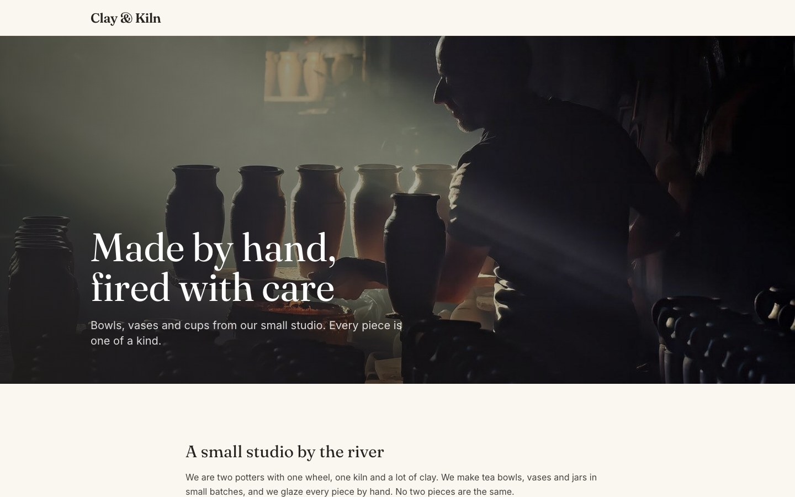
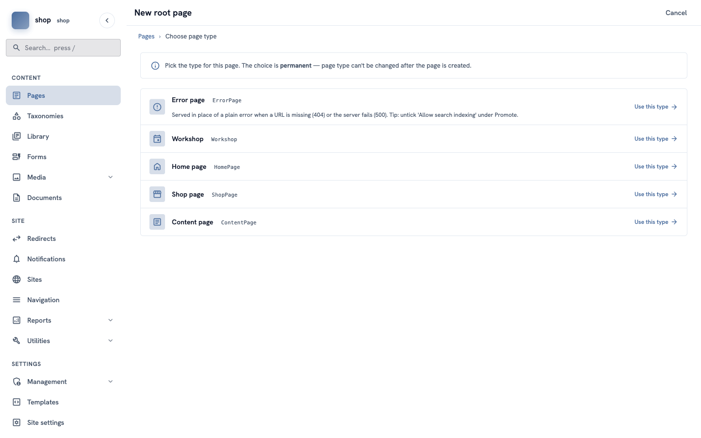
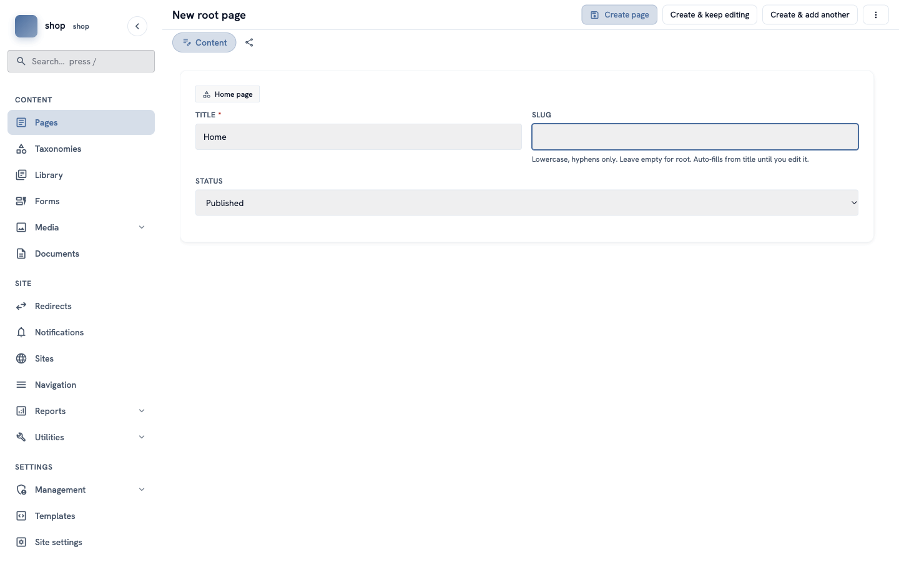
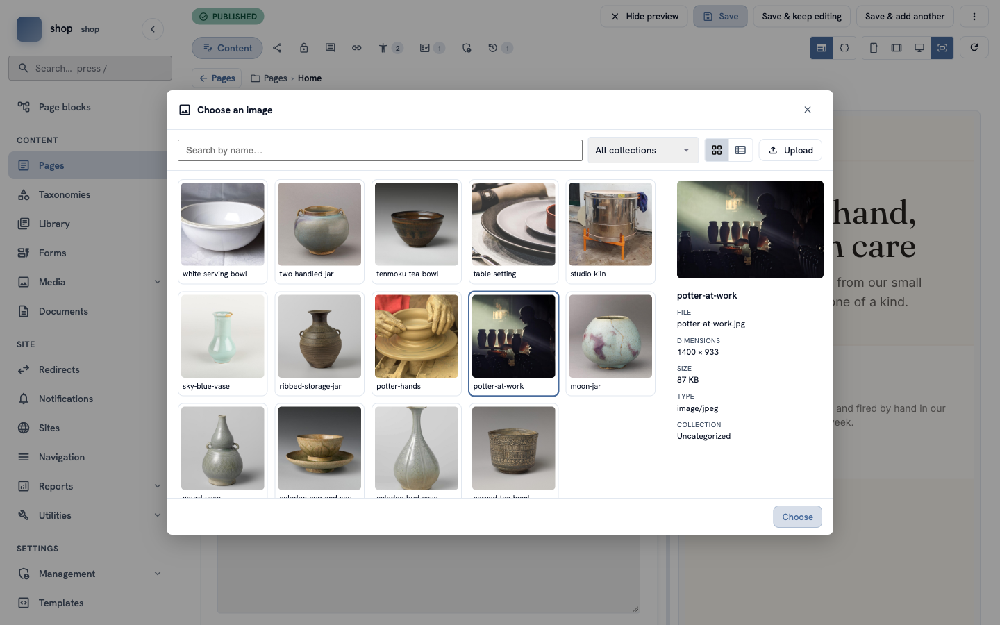
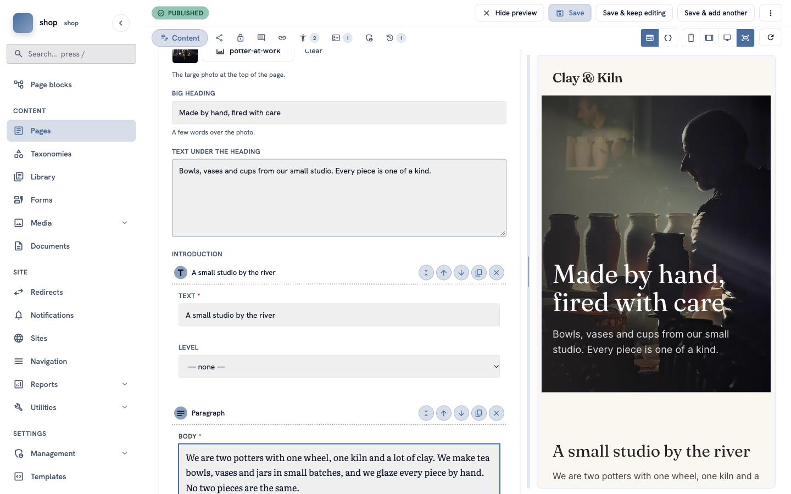

# The home page

**Goal:** make the front page of the shop: a big photo, a heading over it and a short welcome text.

**Who this is for:** shop owners and editors. You do not need any technical knowledge.

**Time:** about 10 minutes.

This is chapter 3 of [Build a ceramics shop, step by step](shop-overview.md).

## Before you start

- You did [chapter 1](shop-brand.md) and [chapter 2](shop-photos.md).
- If this is your first page ever, you can read [How to create and publish your first page](admin-first-page.md) first. It explains the basics more slowly.

## Words you will see

| Word | What it means |
|---|---|
| **Page type** | The kind of page. The **Home page** type has boxes for a big photo and a heading. |
| **Slug** | The last part of the page address. The home page has an **empty** slug, so it opens at the main address of your site. |
| **Block** | One piece of content: a heading, a paragraph, a photo or a quote. You put blocks one under the other. |
| **Preview** | The right side of the editor. It shows the page the way visitors will see it. |

## Steps

### 1. Choose the page type

In the menu on the left, click **Pages**, then **+ New root page**.

Find **Home page** and click **Use this type**.

> **Important:** you cannot change the page type later.

### 2. Title, slug and status

1. In **Title**, type `Home`.
2. Click in **Slug** and delete all the text. The box must be empty.
3. In **Status**, choose **Published**.

Click **Create & keep editing** at the top. The page is saved, and the full editor opens.

### 3. Choose the big photo

The editor has more boxes now. On the right you see the preview.

Under **Big photo**, click **Choose an image…**. A window opens with all your photos.

1. Click the photo you want. For the example shop, click **potter-at-work**. On the right you see its details.
2. Click **Choose** at the bottom.

### 4. The heading and the text

1. In **Big heading**, type `Made by hand, fired with care`.
2. In **Text under the heading**, type `Bowls, vases and cups from our small studio. Every piece is one of a kind.`

The preview on the right shows your photo with the heading and the text on it.

### 5. Add a welcome text with blocks

Scroll down to **Introduction** and click **+ Add block**. A window shows the blocks you can use.

1. Click **Heading**. In **Text**, type `A small studio by the river`. In **Level**, choose **H2**.
2. Click **+ Add block** again and choose **Paragraph**. Type a few sentences about your studio, for example: `We are two potters with one wheel, one kiln and a lot of clay. We make tea bowls, vases and jars in small batches, and we glaze every piece by hand. No two pieces are the same.`

> **Tip:** each block has small round buttons on the right: **up** and **down** change the order, the **copy** button makes a copy, and **×** removes the block.

### 6. Save

Click **Save** at the top.

## Check it worked

Open the main address of your site (for example `www.example.com`). You see:

- the shop name from chapter 1 at the top left,
- the big photo with your heading and text,
- your welcome text under the photo,
- the footer text at the bottom.

## If something goes wrong

| Problem | What to do |
|---|---|
| You do not see the boxes **Big photo** and **Big heading**. | They show after the first save. Click **Create & keep editing**, not **Create page**. If you clicked **Create page**, click the page in the list to edit it. |
| The main address shows "Page not found". | The slug is not empty, or the status is **Draft**. Edit the page: delete the slug text, choose **Published** and save. |
| The heading on the photo is hard to read. | Choose a darker photo, or a photo with a quiet part on the left. |

## Next

[Chapter 4 — Make a "Product" page type](shop-product-type.md)
