# A members area

**Goal:** show a **Trade prices** page only to cafés and shops that buy from you, and let them sign up on the site.

**Who this is for:** shop owners and editors. You do not need any technical knowledge.

**Time:** about 25 minutes.

This is chapter 13 of [Build a ceramics shop, step by step](shop-overview.md).

## Before you start

- You did chapters [1](shop-brand.md) to [8](shop-menu.md).
- You can see **Management → Users** and **Management → Roles** in the menu on the left. If you cannot, ask the person who manages your site.

## Words you will see

| Word | What it means |
|---|---|
| **Member** | A visitor with an account on your site. Members sign in on the site, not in the admin. |
| **Role** | A name for a group of people, for example **Trade customer**. You give roles to people. |
| **Privacy** | Who can see a page: everybody, signed-in people, some roles, or people with a password. |
| **Error page** | The page visitors see when something is wrong — for example, when they may not open a page (error 403). |

## How it works

1. You make a role, **Trade customer**.
2. You make the **Trade prices** page and set its privacy to **Members of specific roles → Trade customer**.
3. A café owner opens the page. The site asks them to sign in, or to create an account.
4. You check the new account and give it the role. From then on, they see the page.

People who sign up get **no** access to the admin. A role gives them access to pages only.

## Steps

### 1. Make the role

1. In the menu on the left, open **Management → Roles** and click **+ New role**.
2. **Name:** `Trade customer`.
3. **Description:** `Cafés and shops that buy for resale. Can see the trade prices page. No access to the admin.`
4. Leave every permission **unticked**. Trade customers only read a page; they do not work in the admin.
5. Click **Create role** at the bottom.

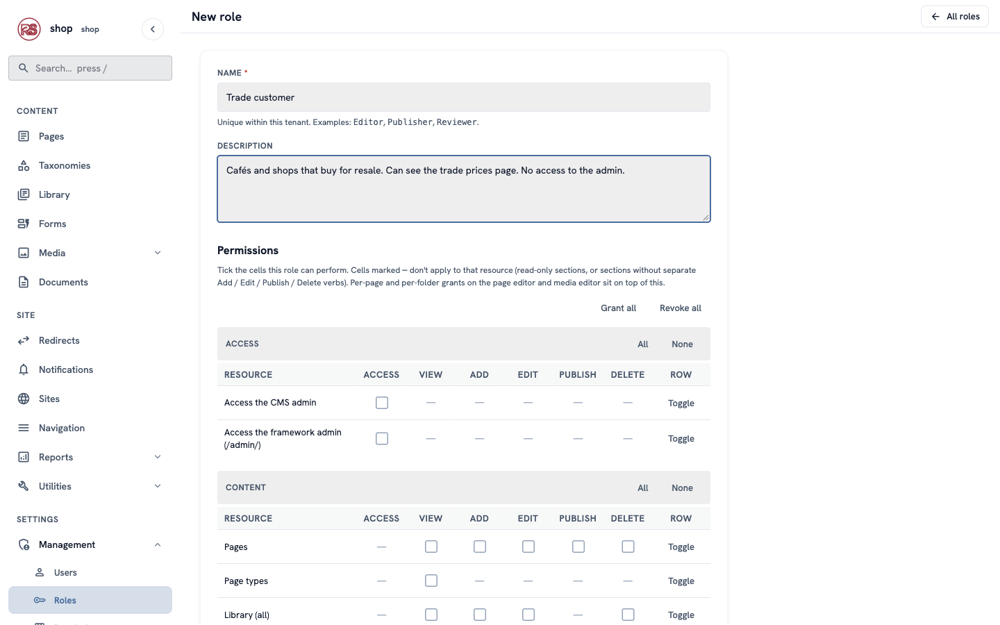

### 2. Make the Trade prices page

1. In the menu on the left, click **Pages**. In the row of **Home**, click **⋮**, then **+ Child page**.
2. Find **Content page** and click **Use this type**. **Title:** `Trade prices`. Click **Create & keep editing**.
3. Under **Body**, add a **Heading** block (`Prices for cafés and shops`) and a **Paragraph** block with your terms, for example:

```text
Trade customers pay **30% less** than the prices in the shop.

- Minimum order: **6 pieces** (any mix).
- Tea bowls and cups from **€28**, vases and jars from **€63**.
- Delivery in **2–3 weeks**; we pack for restaurants and shop shelves.

To order, use the form on any product page and write **TRADE** in the message. We send an invoice with the trade price.
```

4. Set **Status** to **Published** and click **Save & keep editing**.

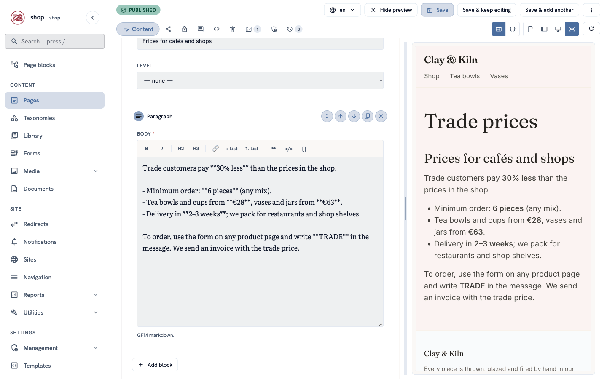

### 3. Make the page private

1. In the editor, click the **Privacy** tab (the lock icon).
2. **Who can see this page:** choose **Members of specific roles**.
3. Under **Allowed roles**, tick **Trade customer**.
4. Click **Save privacy** and then **Confirm**.

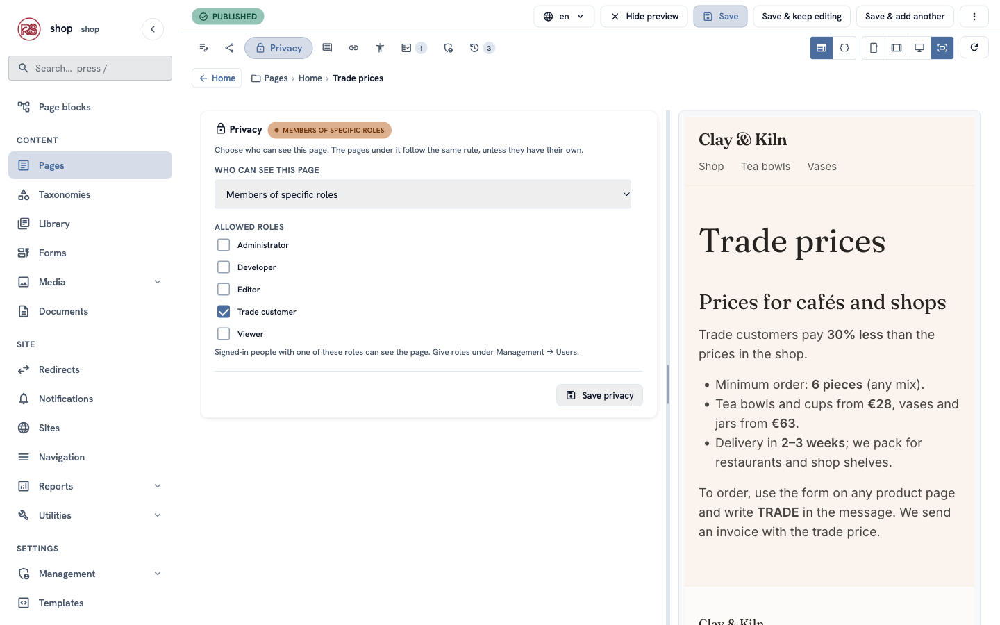

A message says **Only the chosen roles can see this page now.** The lock tag next to **Privacy** shows the rule.

> **The pages under it follow.** If you later add pages under **Trade prices** (a price list per product, for example), they are private too.

### 4. Show your shop's name on the sign-in page

Visitors who open the page are sent to a sign-in page. It shows your site's name:

1. Open **Management → Settings** (the **Settings** link under **Management**).
2. Under **Branding**, type **Site name**: `Clay & Kiln`.
3. Click **Save branding**. You can also upload your logo here.

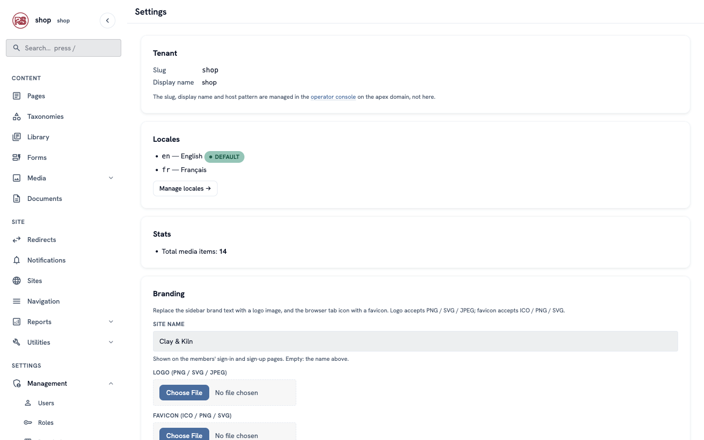

### 5. What a café owner sees

Open the shop in a private browser window (so you are not signed in) and go to `/trade-prices`. The site asks you to sign in:

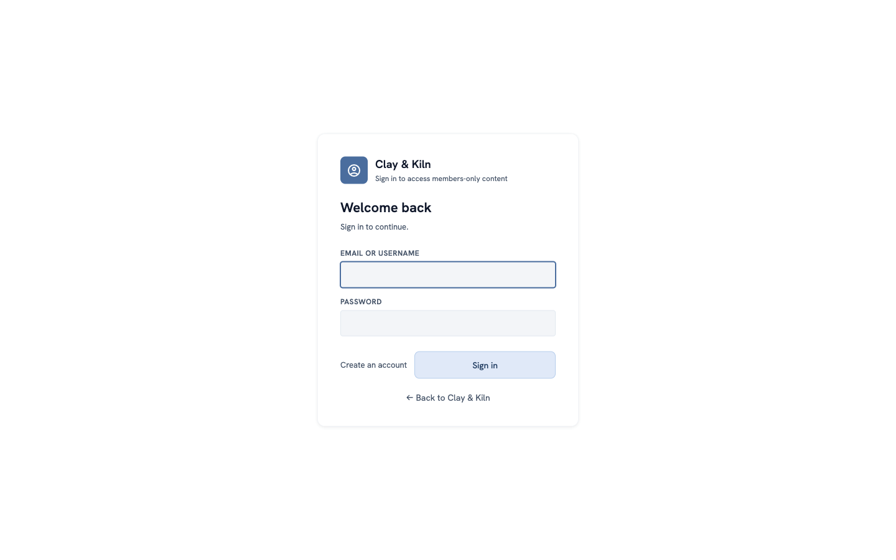

A new trade customer clicks **Create an account**, types their name, email and a password (at least 8 characters), and clicks **Create account**:

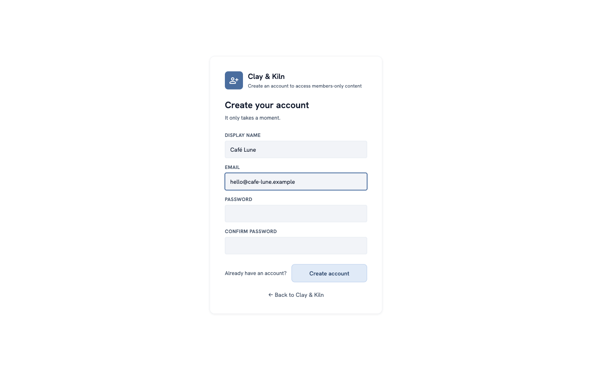

They are signed in at once — but they do not have the **Trade customer** role yet, so the page is still closed to them.

### 6. Write a friendly "not yet" page

Without your own page, they see a plain **403 — Access denied** message. Tell them what happens next instead:

1. Add another child page of **Home** (**⋮ → + Child page**) and choose **Error page**. **Title:** `Trade customers only`. Click **Create & keep editing**.
2. **Status code:** choose **403 — Forbidden**.
3. Under **Body**, add a **Heading** (`This page is for trade customers`) and a **Paragraph**, for example: `Thank you for signing up! We check new trade accounts by hand, usually within one working day. You get an email when your account is ready.`
4. Set **Status** to **Published** and save.

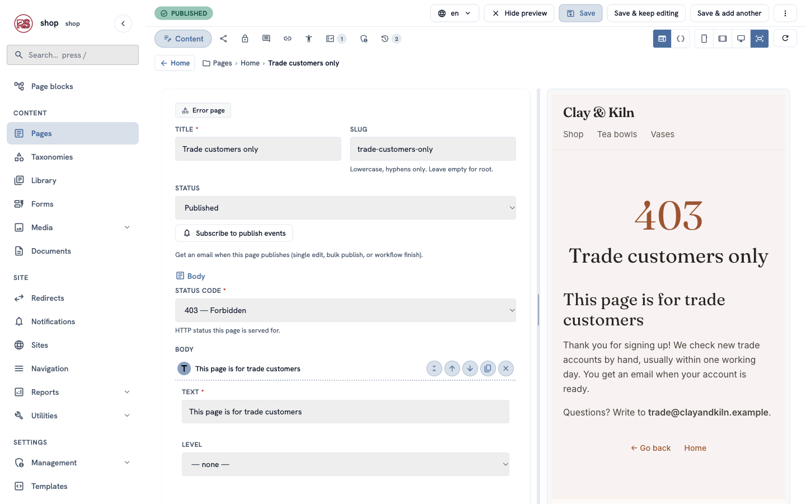

Now a signed-in visitor without the role sees your page, in your shop's design:

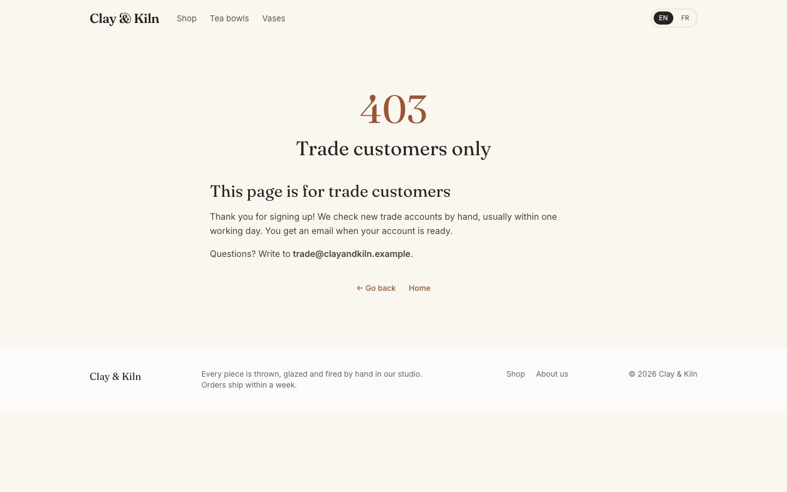

> **One page per status code.** The oldest published error page for 403 is used for every private page that the visitor may not open. Error pages are left out of menus and the sitemap.

### 7. Give the café the role

1. Open **Management → Users**. New members are in the list, with their email and no role.

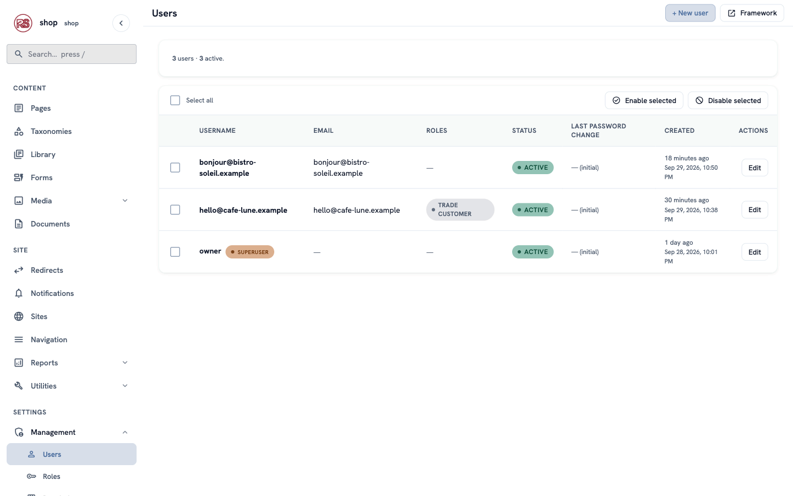

2. Click **Edit** next to the café.
3. Under **Roles**, tick **Trade customer**. Do not tick **Tenant superuser**.
4. Click **Save**.

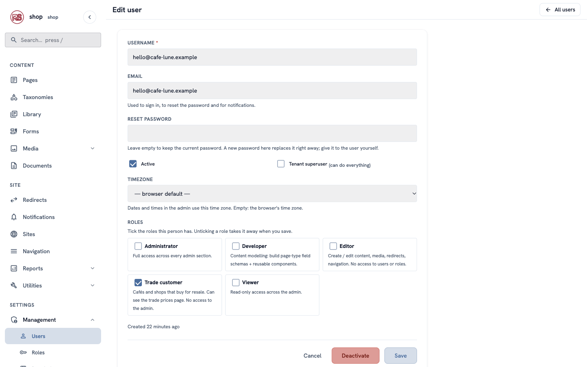

### 8. Add the page to the menu

1. Open **Navigation → Main menu**.
2. On the **Pages** tab, click the **+** next to **Trade prices**.
3. Click **Save menu**.

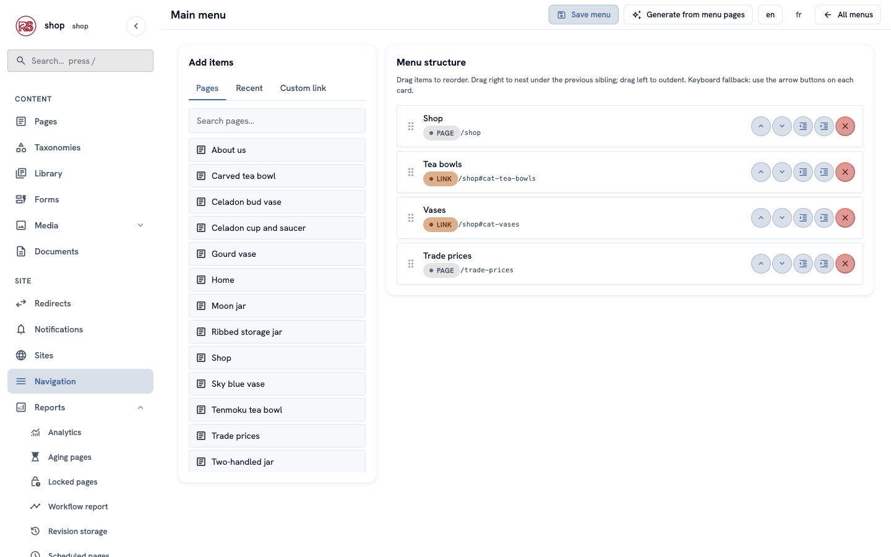

Visitors do not see this menu item: a menu leaves out pages the visitor may not open. Trade customers see it.

## Check it worked

- In a private window, `/trade-prices` asks you to sign in, and the menu shows **Shop**, **Tea bowls** and **Vases** only.
- Signed in as a member **without** the role, you see your **Trade customers only** page.
- Signed in as the café, you see the prices and the **Trade prices** menu item:

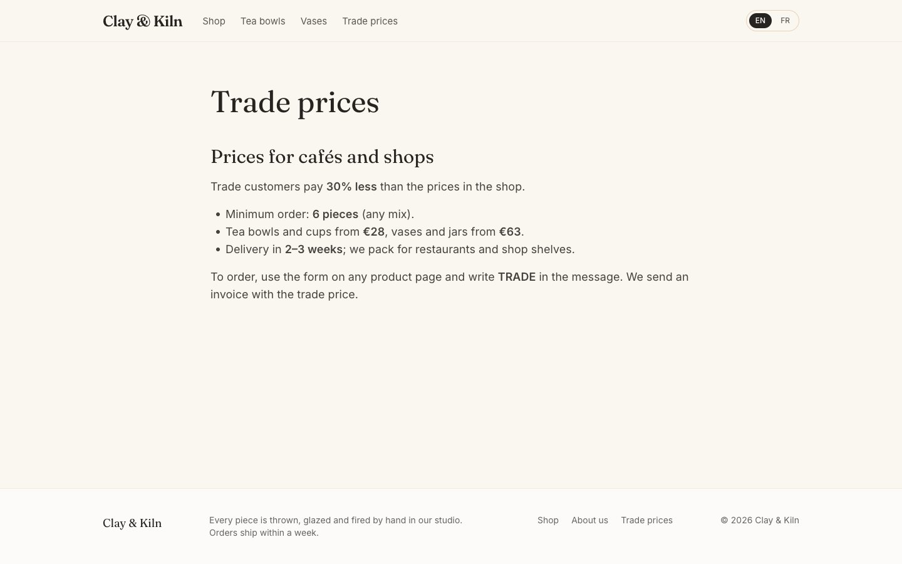

## If something goes wrong

| Problem | What to do |
|---|---|
| The café still sees **Trade customers only**. | Check that **Trade customer** is ticked under **Roles** on their user, and that you clicked **Save**. They may need to reload the page. |
| Everyone can see the page. | Open the **Privacy** tab: it must say **Members of specific roles**, with **Trade customer** ticked. Click **Save privacy** again. |
| The sign-in page shows the wrong name. | Set **Site name** under **Management → Settings → Branding**. |
| A member can open the admin. | Only people with a role that has **Access the CMS admin**, or **Tenant superuser**, can. Remove that role or untick **Tenant superuser**. |
| You want to lock someone out. | Open their user and click **Deactivate**. |

## For developers

- **Sign-in and sign-up** live at `/members/login` and `/members/signup`. A private page sends visitors to `/members/login?next=<page>`, and they come back after signing in. Mount the members' routes as the example shop does in `main.rs` (`member_sso_router`).
- **Private pages in lists.** `menu()` and `auto_menu()` leave out pages the visitor may not open, and so does the sitemap. In your own lists of `children`, filter with `| visible` (the shop page does: ``).
- **Your own error template.** Error pages render with `error_page.html`. The CMS has a plain built-in one; the example shop adds its own (`templates/error_page.html`, extending `_base.html`) so error pages look like the shop. The status is `extension.status_code` and the body `_stream_html['body']`.

## Next

[Work as a team](shop-team.md): add a helper, and check each new product before it goes live.
