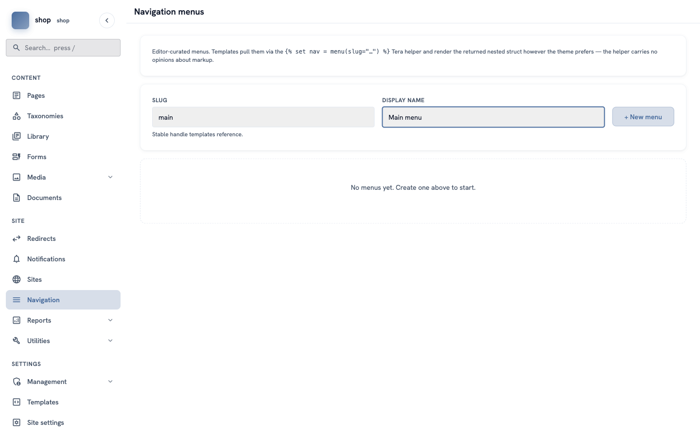
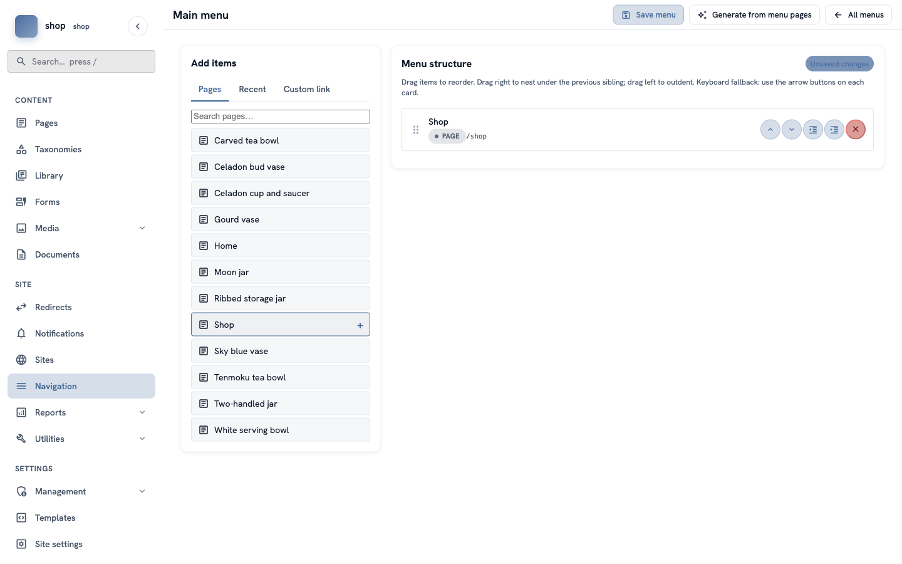
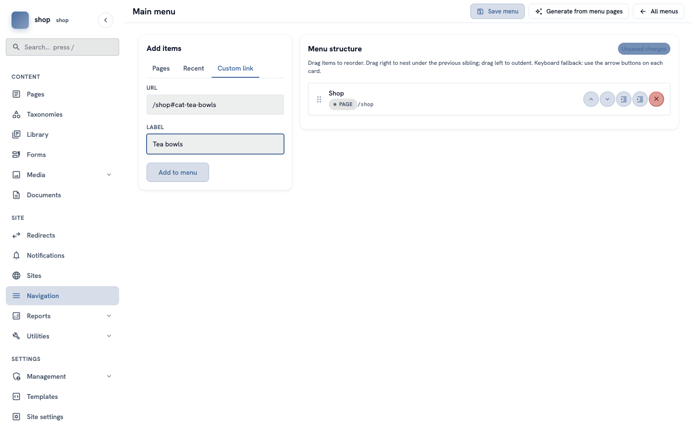
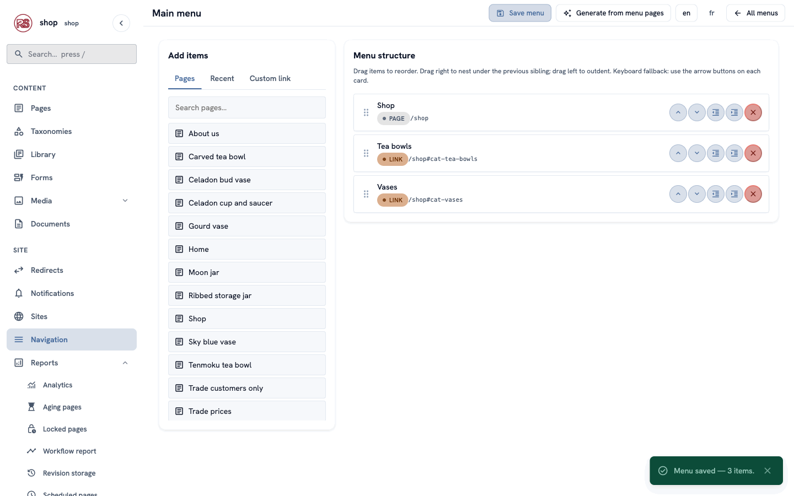

# The main menu

**Goal:** build the menu at the top of every page. You add pages and your own links, change the order, and put items inside other items.

**Who this is for:** shop owners and editors. You do not need any technical knowledge.

**Time:** about 10 minutes.

This is chapter 8 of [Build a ceramics shop, step by step](shop-overview.md).

## Before you start

- You did chapters [1](shop-brand.md) to [7](shop-products.md). You need the shop page and the category slugs.

## Words you will see

| Word | What it means |
|---|---|
| **Menu** | A list of links. A site can have many menus, for example one at the top and one in the footer. |
| **Menu slug** | The inside name of a menu, for example `main`. The site's design looks for a menu by this name. |
| **Page item** | A menu item that links to a page of your site. When you change the page's address, the link changes too. |
| **Custom link** | A menu item with an address you type yourself, for example a link to one group on the shop page, or to another website. |
| **Nest** | Put an item inside another item. Visitors see it as a sub-item. |

## Steps

### 1. Make a new menu

In the menu on the left, click **Navigation**.

1. In **Slug**, type `main`.
2. In **Display name**, type `Main menu`.
3. Click **+ New menu**.

> **Important:** the slug must be `main`. The shop's design shows the menu with this slug at the top of every page. If you are not sure which slug your design uses, ask a developer.

The menu builder opens. On the left you **add items**. On the right you see the **menu structure**.

### 2. Add a page

On the left, the **Pages** tab lists all pages of your site. Type in **Search pages…** to find a page quickly.

Move the mouse over **Shop** and click the **+** button. **Shop** is now on the right, with the label **PAGE** and its address `/shop`.

> **Tip:** the **Recent** tab shows the 20 pages you changed last. It is handy after you publish a new page.

### 3. Add links to one group

Visitors like to jump straight to the tea bowls. Each group on the shop page has its own address: `/shop#cat-` and then the category slug from chapter 5.

1. Click the **Custom link** tab.
2. In **URL**, type `/shop#cat-tea-bowls`.
3. In **Label**, type `Tea bowls`.
4. Click **Add to menu**.

Do the same for the vases: URL `/shop#cat-vases`, label `Vases`.

> Custom links have the orange label **LINK**. You can also use them for other websites, for example `https://instagram.com/your-studio`.

### 4. Change the order, or nest items

Each item on the right has five round buttons:

| Button | What it does |
|---|---|
| **up** / **down** arrows | Move the item up or down. |
| **outdent** (lines with an arrow to the left) | Take the item out of its parent. |
| **indent** (lines with an arrow to the right) | Put the item inside the item above it. |
| red **×** | Remove the item from the menu. The page itself stays. |

You can also drag an item by the dots on its left. Drag it right to put it inside the item above; drag it left to take it out.

For example, to show **Tea bowls** and **Vases** as sub-items of **Shop**, click the indent button on both.

> The example shop keeps all three items on one level. Its simple design shows only the first level. Sub-items need a design that can show them — ask a developer.

### 5. Save the menu

The label **Unsaved changes** tells you that the menu is not saved yet. Click **Save menu** at the top.

A green message says **Menu saved — 3 items.**

## Check it worked

Open any page of your site. The menu is at the top, next to the shop name. Click **Tea bowls** — the shop page opens at the tea bowls.

On the shop page and on product pages, **Shop** is shown in bold and in the accent colour, so visitors know where they are.

## More things you can do

### Make a menu from your pages in one click

Every page has a box **Show in menus** on its **Promote** tab. Click **Generate from menu pages** at the top of the menu builder. The menu is filled with all published pages that have this box ticked, in the same order and nesting as in **Pages**.

> **Careful:** this removes the items that are in the menu now. Use it for a new menu, or when you want to start again.

### Translate a menu

When your site has more than one language, the menu builder shows a button for each language at the top, for example **en** and **fr**. Click a language to type the labels in that language. If you leave a label empty, the site uses the normal label — or, for a page item, the translated page title.

The chapter "A second language" (coming soon) shows this step by step.

### More menus

Go back to **Navigation** (click **All menus**) and make another menu, for example with the slug `footer`. A developer adds it to the design — see [Show menus and settings in templates](shop-dev-templates.md).

## If something goes wrong

| Problem | What to do |
|---|---|
| The menu is not on the site. | Check the slug: it must be `main`. Check that you clicked **Save menu**. |
| A link to a group does not jump to the group. | Check the category slug in **Taxonomies → Categories**. The URL is `/shop#cat-` + the slug, for example `/shop#cat-tea-bowls`. |
| You closed the builder with **Unsaved changes**. | Your last changes are lost. Open the menu again and repeat them. |
| A page is missing from the **Pages** tab. | Type its name in **Search pages…**. |

## Next

[Chapter 9 — Reusable text](shop-reusable-text.md)

**Developers:** see also [Show menus and settings in templates](shop-dev-templates.md).
