# The order form: let customers order a piece

**Goal:** build an order form, put it on a product page, receive an order by email and read it in the admin.

**Who this is for:** shop owners and site managers. You do not need any technical knowledge.

**Time:** about 20 minutes.

This is chapter 10 of [Build a ceramics shop, step by step](shop-overview.md).

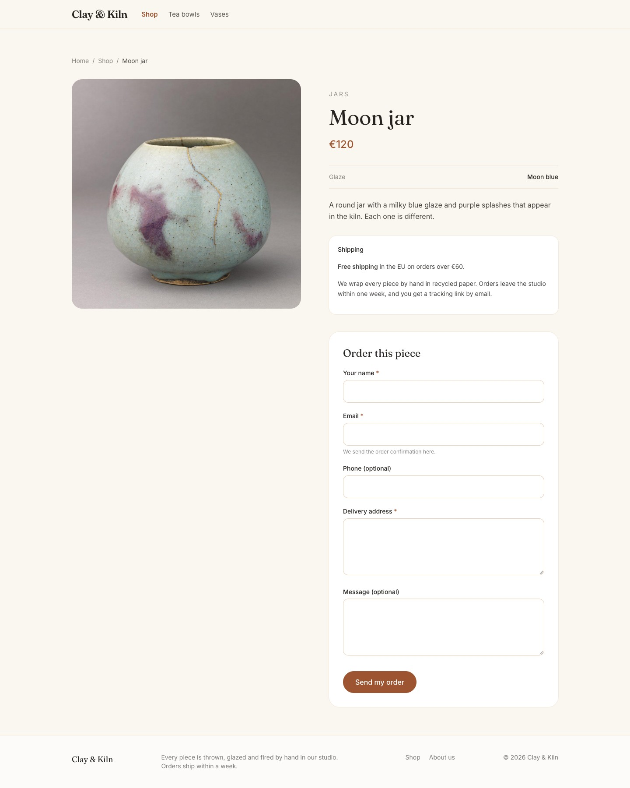

## Before you start

- You did chapters [1](shop-brand.md) to [9](shop-reusable-text.md). You need the **Product** page type (chapter 4) and some products (chapter 7).
- You can see **Forms** in the menu on the left.

## How ordering works

Clay & Kiln sells pieces that are one of a kind, so there is no shopping cart. A customer fills in a short form on the product page. The shop gets an email, checks that the piece is still there, and writes back with the price for shipping and how to pay.

You will:

1. build the form once, in the **Form Builder**;
2. give the Product type a place for it — an **Order** zone;
3. put the form on a product;
4. test it, and read the order in the admin.

## Words you will see

| Word | What it means |
|---|---|
| **Form Builder** | The screen where you make a form: you add fields and decide what happens after sending. |
| **Field** | One box in the form, for example **Email**. |
| **Required** | The customer must fill in this field before they can send the form. |
| **Submission** | One filled-in form that a customer sent. |
| **Flexible zone** | A part of a page type where editors add blocks — here, the form. |

## Steps

### 1. Create the form

In the menu on the left, click **Forms**. On a new site the list is empty.

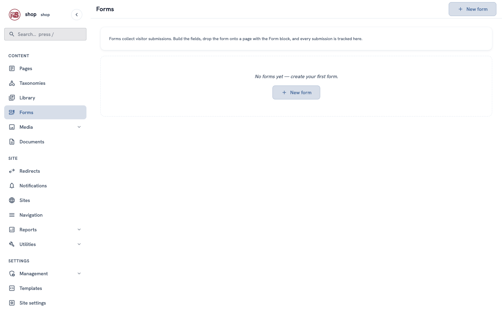

Click **+ New form**, then fill in:

- **Slug:** `order`
- **Title:** `Order a piece`

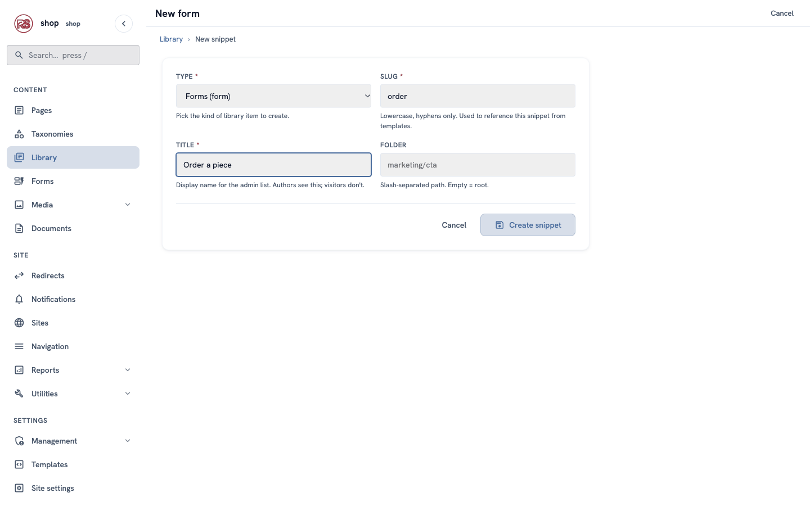

Click **Create snippet**. The Form Builder opens.

> The form is also in the **Forms** list now, with **Build** and **Submissions** buttons. Use **Build** to come back to the builder later.
>
> 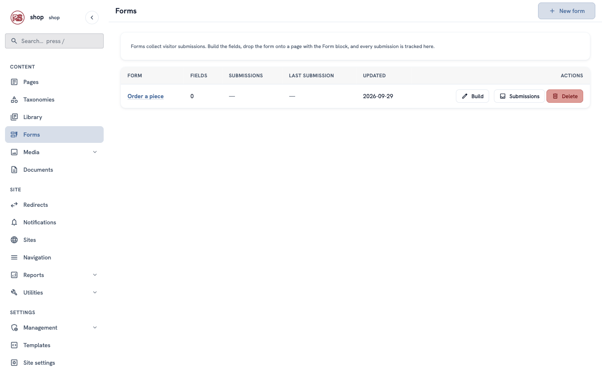

### 2. Add the fields

In the builder, click **+ Add field** and choose the kind of field. On the right, fill in its **Label** (what the customer sees) and **Key** (a short inside name). Tick **Required** for the fields the customer must fill in.

Add these five fields, one after the other:

| Kind | Label | Key | Required |
|---|---|---|---|
| Text | `Your name` | `name` | yes |
| Email | `Email` | `email` | yes — help text: `We send the order confirmation here.` |
| Phone | `Phone (optional)` | `phone` | no |
| Paragraph text | `Delivery address` | `address` | yes |
| Paragraph text | `Message (optional)` | `message` | no |

Click **Save draft**. The preview on the right shows the form the way customers will see it.

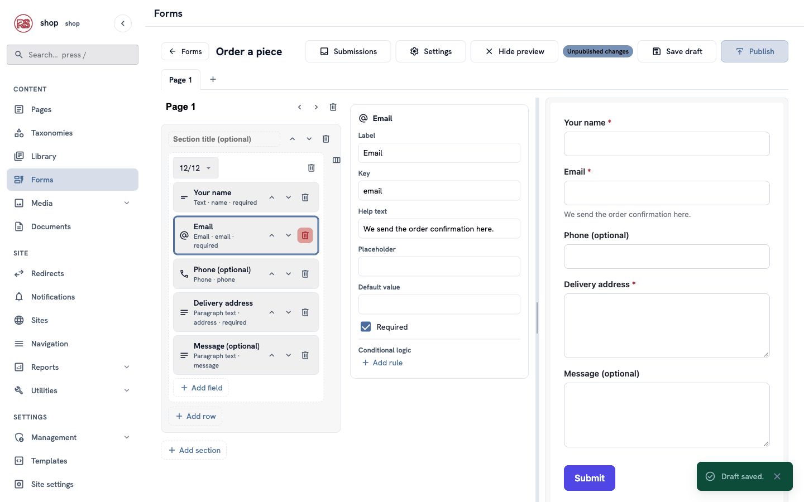

> **Tip:** the arrows move a field up or down; the trash button removes it. **+ Add row** and **+ Add section** make bigger forms, and the **+** next to **Page 1** splits a long form into steps.

### 3. The form settings

Click **Settings** at the top of the builder:

| Box | What to type |
|---|---|
| **Submit button label** | `Send my order` |
| **Success message** | `Thank you! We got your order. We will email you within one day to confirm the price with shipping and how to pay.` |
| **Success redirect URL** | leave empty — the message shows on the same page |
| **Notification emails** | the address that gets each order, for example `orders@clayandkiln.test` |
| **Use built-in form styles** | untick it — the shop's design has its own form style |

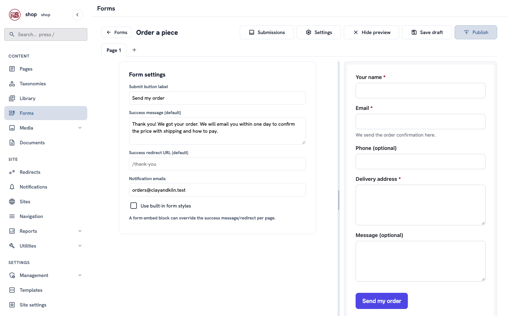

> **Built-in styles or not?** Keep them ticked if your site has no special form design — the form then looks tidy everywhere. The example shop styles its forms itself, so the button matches the shop's colours.

### 4. Publish the form

Click **Publish**. A green message says **Form published — the live form is now up to date.**

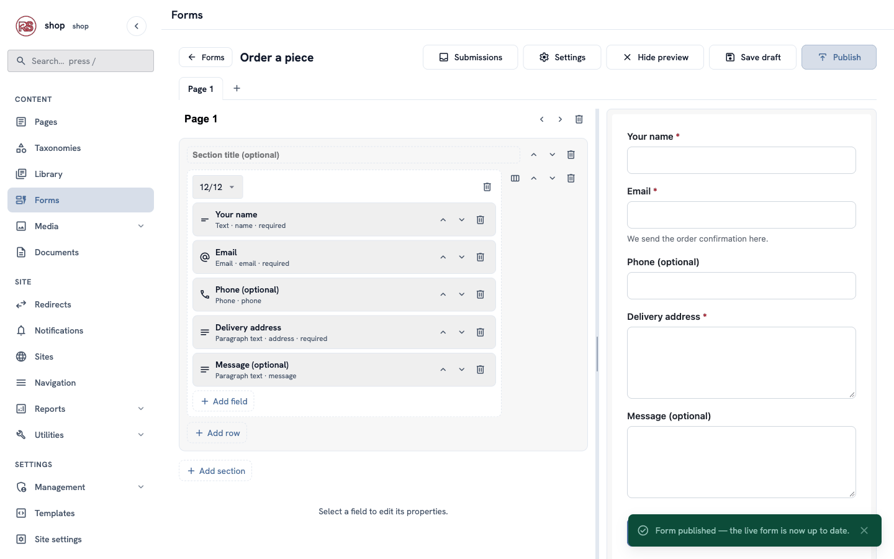

> **Save draft or Publish?** Like page types, a form has a draft. Customers always see the published form, so you can change the draft without breaking the live one.

### 5. Give products a place for the form

The Product type has fixed boxes (price, glaze, photo, description). Now it gets one free part for the form.

1. Go to **Utilities → Page types**. In the **Product** row, click **Build fields**.
2. Click **Flexible zone**. On the right, set **Label** `Order` and **Key** `order`.
3. In **Allowed blocks**, type `form` and press **Enter**. The zone now says **Allowed: form**.
4. Click **Publish**.

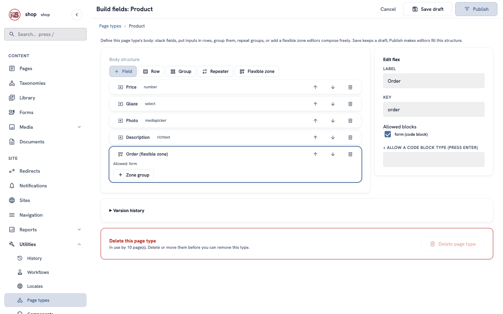

> **Why a flexible zone?** It is a small **content constructor** inside a fixed page type — see [What is Rustango-CMS?](cms-overview.md). Editors decide per product whether it gets a form.

### 6. Put the form on a product

1. Open a product, for example **Moon jar** (**Pages → Home → Shop**, then **Edit**).
2. Scroll down to **Order**. The zone allows only one kind of block, so a **Form** block is ready. If not, click **+ Add block**.
3. Under **Form**, click **Choose a snippet…** and choose **Order a piece**.
4. Leave the two **override** boxes empty — they are for a different message or redirect on this one page.
5. Click **Save**.

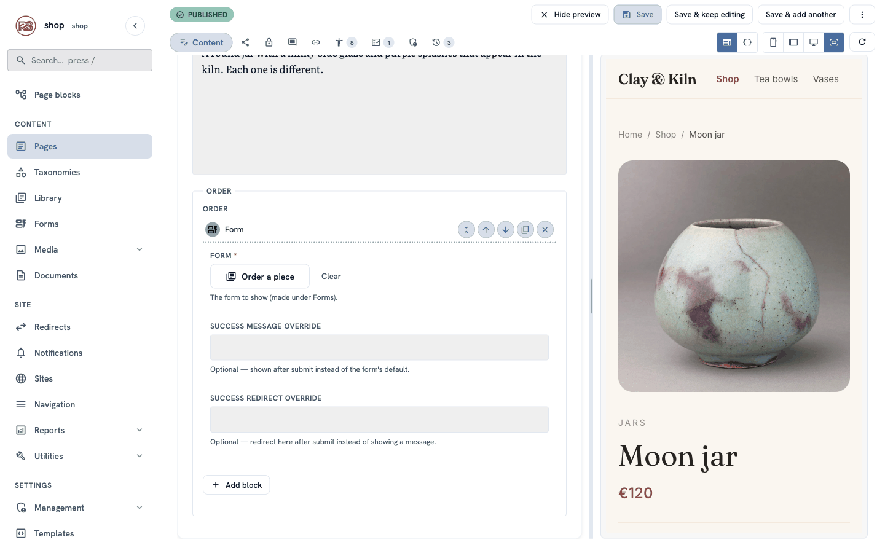

Do the same for every product that you want to sell online.

## Check it worked

### Place a test order

Open the product page on your site, for example `/shop/moon-jar`. The form is under the description, with the title **Order this piece**.

Fill it in with test data and click **Send my order**. The form goes away, and your success message appears.

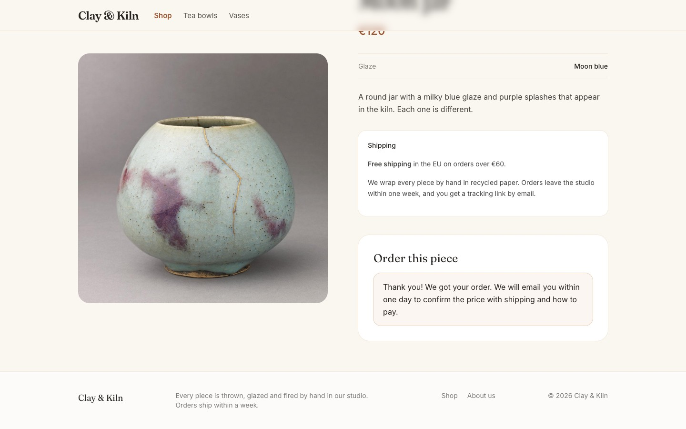

Try it once without an email address, too: the form does not send, and the browser shows which field is missing.

### The email

The notification address gets an email like this:

```text
Subject: New form submission: Order a piece

A visitor submitted "Order a piece".

Your name: Anna Weber
Email: anna@example.com
Delivery address: Lindenstraße 12
10969 Berlin
Germany
Message (optional): It is a present for my mother. Could you add a small card?

http://shop.localhost:8240/shop/moon-jar
```

The last line is the page the customer ordered from — so you know **which piece** they want, without an extra field.

### The orders in the admin

Go to **Forms** and click **Submissions** in the **Order a piece** row. Each order is one row: when it was sent, the **source page** (the product), and every answer.

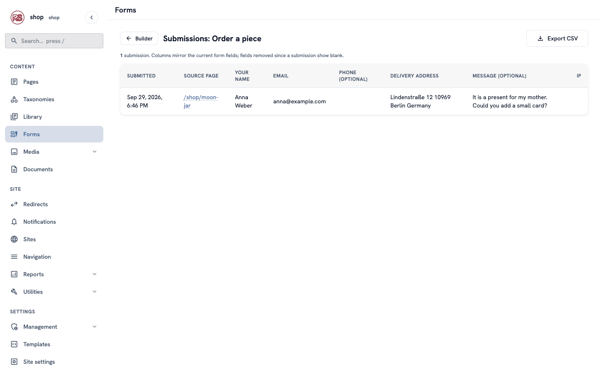

Click **Export CSV** to open all orders in a spreadsheet.

## If something goes wrong

| Problem | What to do |
|---|---|
| The product page has no form. | Check that the Product type has the **Order** zone and is published (step 5), and that the product has a Form block with a chosen form (step 6). |
| The page says "Form … not found". | The chosen form was deleted. Choose a form again in the product's Form block. |
| No email arrives. | Check **Notification emails** in the form settings. The site also needs a working email setup and a `RUSTANGO_SECRET_KEY`; when the key is missing, **Save draft** shows the warning "Email notifications are off". Ask your developer. |
| The form looks unstyled. | Tick **Use built-in form styles** in the settings and publish again. |
| You changed the form, but the site shows the old one. | You clicked **Save draft**, not **Publish**. |

## Next

[Chapter 11 — Be found on Google](shop-seo.md)
