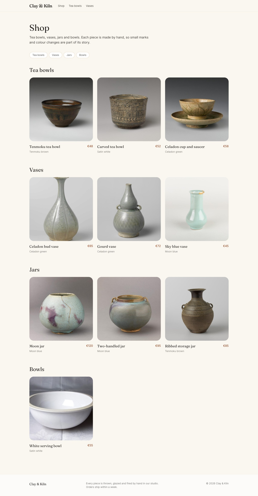

# Build a ceramics shop, step by step

**Goal:** see what you will build in this guide, and in what order.

**Who this is for:** shop owners and editors. You do not need any technical knowledge. There is one short part for developers at the end.

**Time:** about 5 minutes to read.

## The story

**Clay & Kiln** is a small pottery studio. Two potters make tea bowls, vases, jars and bowls by hand. They want a website where people can:

- see every piece with a photo, a price and a short text,
- find pieces by group (tea bowls, vases…),
- order a piece with a simple form.

In this guide you build that website yourself, in the admin, one step at a time. Every step has a picture, so you can check that your screen looks the same.

## What you need

- An admin account on a rustango-cms site that can create pages, page types, menus and settings. If you are not sure, ask the person who manages your site.
- The 14 example photos. You can download them from the [example shop folder](https://github.com/ujeenet/rustango-cms/tree/main/examples/ceramics_shop/photos). You can also use your own photos.

> **For developers:** the example site is in `examples/ceramics_shop`. How to start it is written at the top of its `main.rs` file.

## The chapters

Do the chapters in this order. Each one uses what you made in the chapter before it.

### Part 1 — The shop window

| # | Chapter | What you do |
|---|---|---|
| 1 | [Your shop's name and colours](shop-brand.md) | Type the shop name, the tagline, the colours and the footer text once. Every page uses them. |
| 2 | [Add your photos](shop-photos.md) | Upload all photos to the media library in one go. |
| 3 | [The home page](shop-home-page.md) | Make the front page with a big photo, a heading and a welcome text. |

### Part 2 — The products

| # | Chapter | What you do |
|---|---|---|
| 4 | [Make a "Product" page type](shop-product-type.md) | Decide which boxes every product has: price, glaze, photo, description. No code. |
| 5 | [Groups of products: categories](shop-categories.md) | Make the groups Tea bowls, Vases, Jars and Bowls. |
| 6 | [The shop page](shop-shop-page.md) | Make the page that shows all products. |
| 7 | [Add your products](shop-products.md) | Add ten products and put each one in a group. |

### Part 3 — Help people find things

| # | Chapter | What you do |
|---|---|---|
| 8 | [The main menu](shop-menu.md) | Build the menu at the top of every page: add pages and your own links, change the order, put items inside other items. |

### Part 4 — Content everywhere, and orders

| # | Chapter | What you do |
|---|---|---|
| 9 | [Reusable text](shop-reusable-text.md) | Write the shipping information once in the Library, show it on an "About us" page and on every product, and change it in one place. |
| 10 | [The order form](shop-order-form.md) | Build an order form, put it on the product pages, get each order by email and read the orders in the admin. |

### Part 5 — Grow

| # | Chapter | What you do |
|---|---|---|
| 11 | [Be found on Google](shop-seo.md) | Write SEO titles and descriptions, check the sitemap, rename a page without breaking links, and add your own redirects. |
| 12 | [A second language](shop-second-language.md) | Add French, then translate the pages, the menu, the shipping text and the order form. |
| 13 | [A members area](shop-members-area.md) | Show trade prices only to cafés and shops: a role, a private page, sign-up, a friendly "not yet" page and a menu item only members see. |
| 14 | [Work as a team](shop-team.md) | Add a helper, check each new product before it goes live, send it back with a note, and review changes to live products. |
| 15 | [A sale](shop-sale.md) | Prepare a sale page now; the site publishes it at a set time and takes it down again a week later. |

### For developers

| Chapter | What you learn |
|---|---|
| [Show menus and settings in templates](shop-dev-templates.md) | The template helpers `menu()`, `auto_menu()` and `site_setting()`, as the shop uses them. |
| [The helper traits](shop-dev-helper-traits.md) | How the shop's code-made parts work: `#[derive(PageType)]`, `PageTypeOverrides`, `LibraryTypeHandler`, `TaxonomyHandler` and `register_site_setting!`. |

## Next

Start with chapter 1: [Your shop's name and colours](shop-brand.md).
