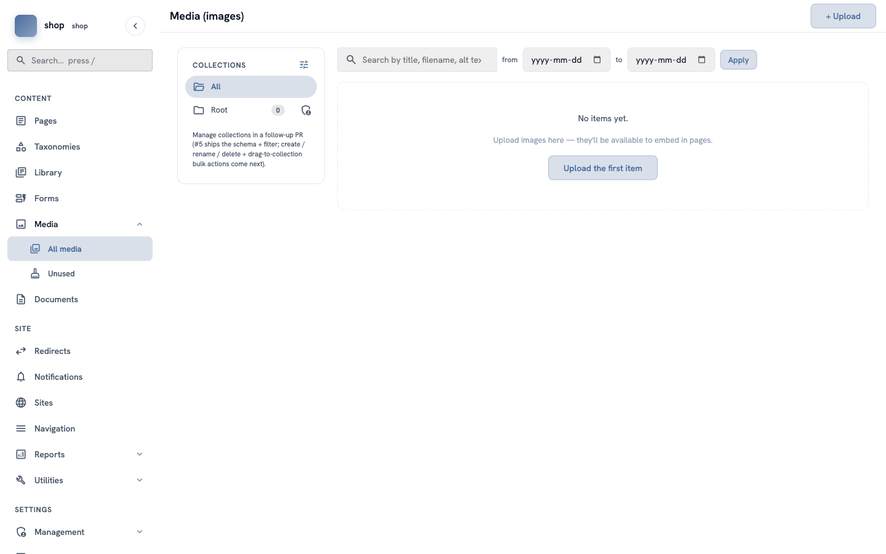
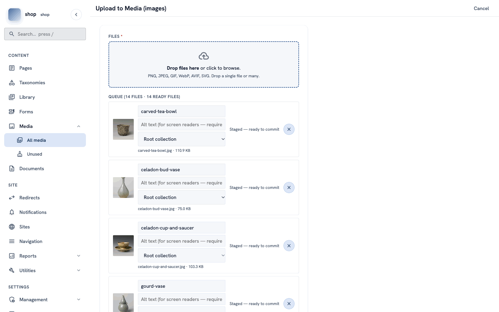
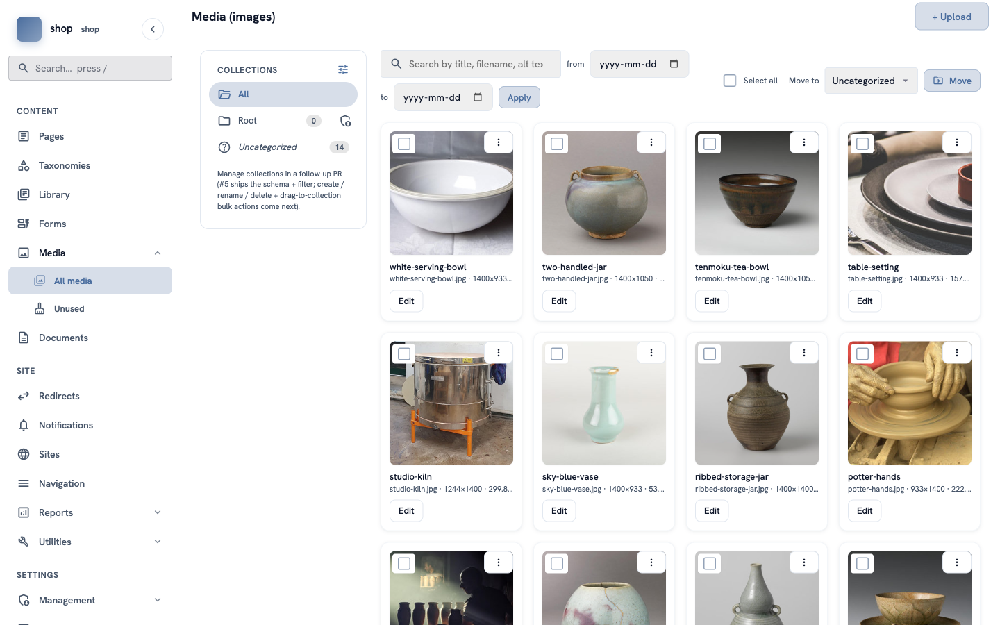

# Add your photos

**Goal:** upload all your photos to the media library in one go, so you can use them on any page.

**Who this is for:** shop owners and editors. You do not need any technical knowledge.

**Time:** about 5 minutes.

This is chapter 2 of [Build a ceramics shop, step by step](shop-overview.md).

## Before you start

- You did [chapter 1](shop-brand.md).
- You have the photos on your computer. For the example shop, download the 14 photos from the [example shop folder](https://github.com/ujeenet/rustango-cms/tree/main/examples/ceramics_shop/photos).

## Words you will see

| Word | What it means |
|---|---|
| **Media library** | The place in the admin where all your photos are. You upload a photo once and use it on many pages. |
| **Alt text** | A short text that says what is in the photo, for example "A brown tea bowl". People who cannot see the photo hear this text. |
| **Collection** | A folder in the media library. It is optional. |

## Steps

### 1. Open the media library

In the menu on the left, click **Media**, then **All media**. On a new site, the library is empty.

Click **+ Upload** at the top right (or **Upload the first item**).

### 2. Choose the photos

Drag the photos from your computer into the box with the dashed line. Or click the box and choose the photos. You can choose many photos at the same time.

Each photo gets a row in the **Queue**, with:

- a **title** — the file name at first. You can change it.
- an **Alt text** box — describe the photo in a few words.
- a **collection** — keep **Root collection**.

> **Tip:** write a good alt text, for example `Brown tea bowl with a dark glaze`. It helps people who use a screen reader, and it helps Google too.
>
> **Wrong photo?** Click the round **×** button at the end of its row. The photo leaves the queue.

### 3. Upload all

Scroll down and click **Upload all**.

You go back to the library. Now you see all your photos as cards, with the title, the file name and the size.

## Check it worked

- The library shows all your photos.
- On the left, **Uncategorized** shows the number of photos, for example **14**.

To change a title or an alt text later, click **Edit** on the photo card.

## About the example photos

The example photos come from Wikimedia Commons. Their licences allow you to use them. Some licences (CC BY and CC BY-SA) ask you to name the author when you use the photo. The list of authors and licences is in [CREDITS.md](https://github.com/ujeenet/rustango-cms/blob/main/examples/ceramics_shop/photos/CREDITS.md).

When you use your own photos, make sure that you are allowed to use them.

## If something goes wrong

| Problem | What to do |
|---|---|
| A photo does not upload. | Check the file type: PNG, JPEG, GIF, WebP, AVIF or SVG. Check that the file is not very large (the limit is 50 MB). |
| You uploaded a photo twice. | Click the **⋮** button on one of the cards and delete it. |
| You cannot see **+ Upload**. | Your account cannot upload photos. Ask the person who manages your site. |

## Next

[Chapter 3 — The home page](shop-home-page.md)
