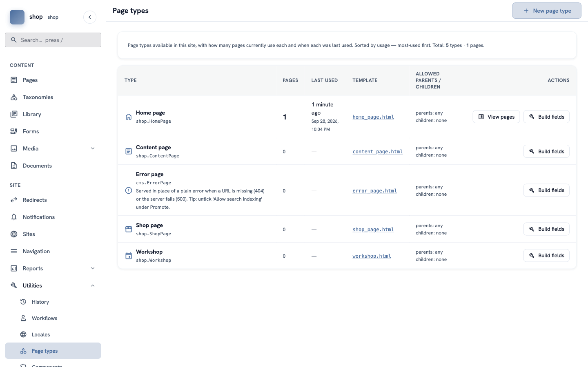
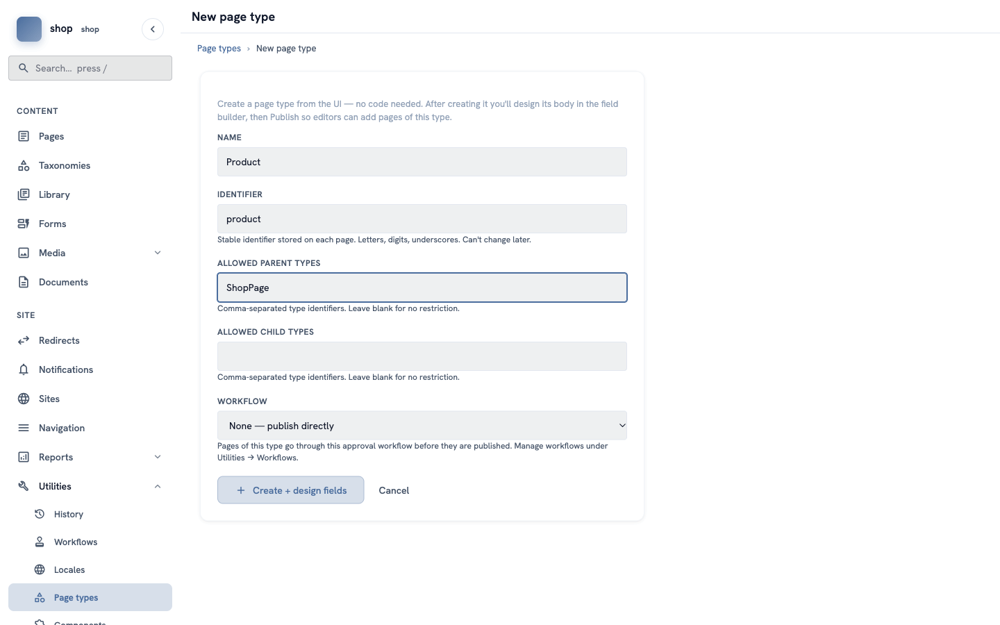
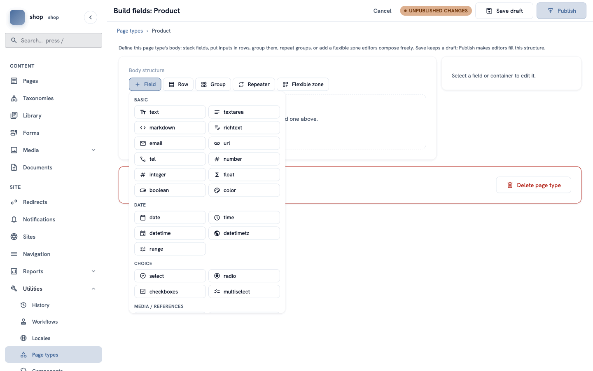
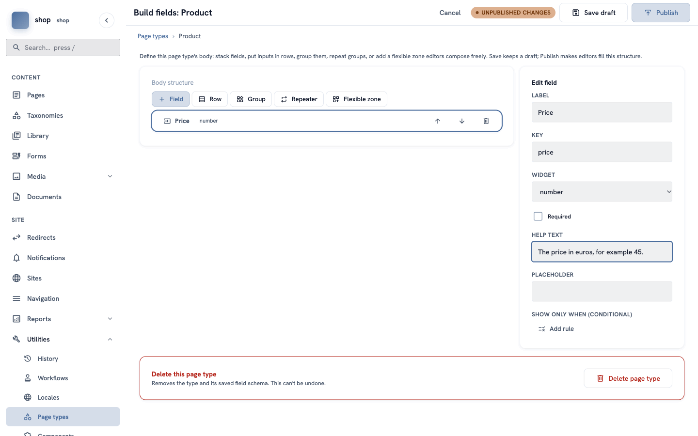
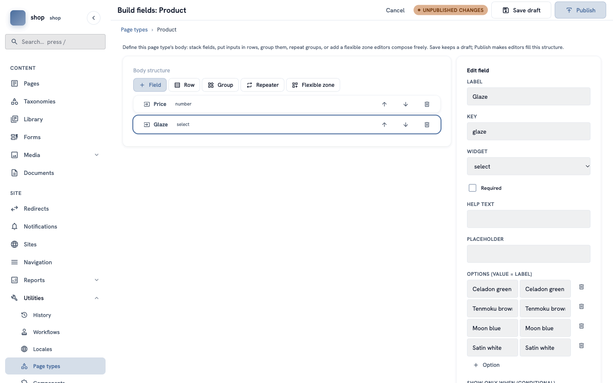
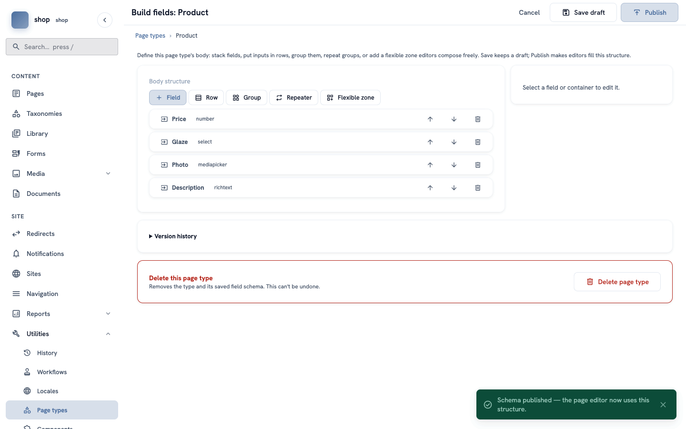
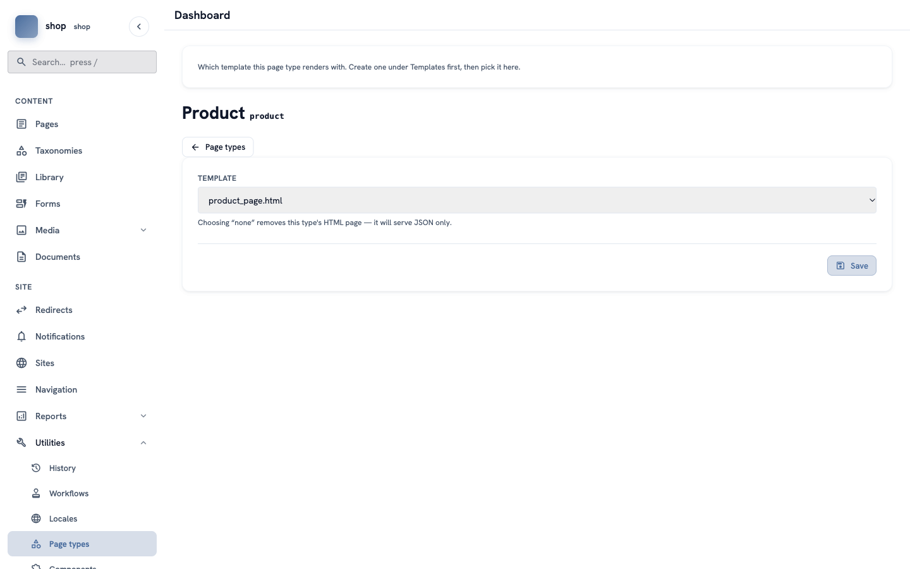

# Make a "Product" page type

**Goal:** decide which boxes every product has — a price, a glaze, a photo and a description. You do this in the admin, without code.

**Who this is for:** shop owners and site managers. You do not need any technical knowledge.

**Time:** about 15 minutes.

This is chapter 4 of [Build a ceramics shop, step by step](shop-overview.md).

## Before you start

- You did chapters [1](shop-brand.md) to [3](shop-home-page.md).
- You can see **Utilities → Page types** in the menu. If you cannot see it, ask the person who manages your site.

## Why a new page type?

A page type is like a paper form. The form decides which boxes an editor fills in. The shop already has page types for the home page and the shop page. For products you make your own type, with exactly the boxes a product needs. Later, every product page has the same boxes, and every product looks the same on the site.

## Words you will see

| Word | What it means |
|---|---|
| **Page type** | The kind of page and its boxes. |
| **Field** | One box on the form, for example **Price**. |
| **Widget** | The kind of box: a number, a list to choose from, a photo, a text with formatting… |
| **Key** | The inside name of a field, for example `price`. Visitors never see it. Only small letters, numbers and `_`. |
| **Allowed parent types** | Where pages of this type can go. Products can only go under the shop page. |
| **Publish** (a page type) | Makes the new boxes ready for editors. Before that, your changes are only a draft. |

## Steps

### 1. Open the page types

In the menu on the left, click **Utilities**, then **Page types**. You see the types your site already has.

Click **+ New page type** at the top right.

### 2. Name the new type

Fill in the form:

| Box | What to type |
|---|---|
| **Name** | `Product` |
| **Identifier** | `product` (letters, numbers and `_` only, no spaces) |
| **Allowed parent types** | `ShopPage` |
| **Allowed child types** | leave empty |
| **Workflow** | keep **None — publish directly** |

> **Important:** you cannot change the **Identifier** later.
>
> **What is `ShopPage`?** It is the identifier of the **Shop page** type. You can see all identifiers in the Page types list, under each name (for example `shop.ShopPage` — use the part after the dot).

Click **+ Create + design fields**. The field builder opens.

### 3. Add the price

Click **+ Field**. A list of widgets opens. Click **number**.

A new field is in the list. On the right, fill in **Edit field**:

- **Label**: `Price`
- **Key**: `price`
- **Help text**: `The price in euros, for example 45.`

> **Tip:** the help text shows under the box when an editor adds a product. Short help saves many questions.

### 4. Add the glaze

Click **+ Field** and choose **select** (a list to choose from).

- **Label**: `Glaze`
- **Key**: `glaze`

Under **Options**, click **+ Option** for each glaze. Each option has two boxes: the value (saved inside) and the label (what people see). For the example shop, type the same words in both boxes:

- `Celadon green`
- `Tenmoku brown`
- `Moon blue`
- `Satin white`

### 5. Add the photo and the description

1. Click **+ Field** and choose **mediapicker** (it is in the group **Media / References** at the bottom of the list). Label: `Photo`, key: `photo`.
2. Click **+ Field** and choose **richtext** (text with bold, lists and links). Label: `Description`, key: `description`.

> **Wrong order?** Use the up and down arrows in each row. The trash button removes a field.

### 6. Publish the type

Click **Publish** at the top right.

A green message says **Schema published — the page editor now uses this structure.** The orange **Unpublished changes** label is gone.

> **Save draft or Publish?** **Save draft** keeps your work, but editors do not see it yet. **Publish** gives the new boxes to editors. You can change the fields later and publish again. Under **Version history** you can see the older versions.

### 7. Choose how product pages look

A template decides how a page looks on the site. Go back to **Page types**. In the **Product** row, click the name in the **Template** column.

Choose the template for products and click **Save**. In the example shop, it is **product_page.html**.

> **No special template?** Keep the one that is selected. It shows all the product's fields in a simple layout. A developer can make a nicer template later — see [Show menus and settings in templates](shop-dev-templates.md).

## Check it worked

- In **Page types**, there is a new row **Product**, with `parents: ShopPage`.
- In the next chapters, when you add a page under the shop page, **Product** is in the list of types.

## If something goes wrong

| Problem | What to do |
|---|---|
| **Product** is not in the list of types when you add a page. | The type is not published, or the page is not under the shop page. Open **Build fields** for Product and click **Publish**. |
| A field key shows an error. | Use only small letters, numbers and `_`, and start with a letter. Each key must be different. |
| You want to delete the type. | Open **Build fields** and click **Delete page type** at the bottom. This cannot be undone. |

## Next

[Chapter 5 — Groups of products: categories](shop-categories.md)
