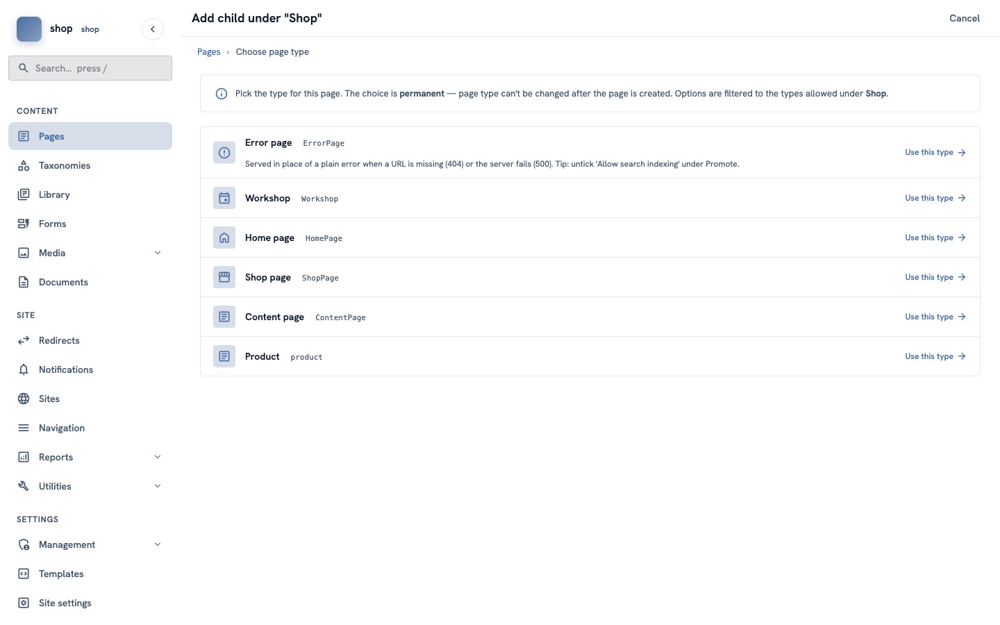
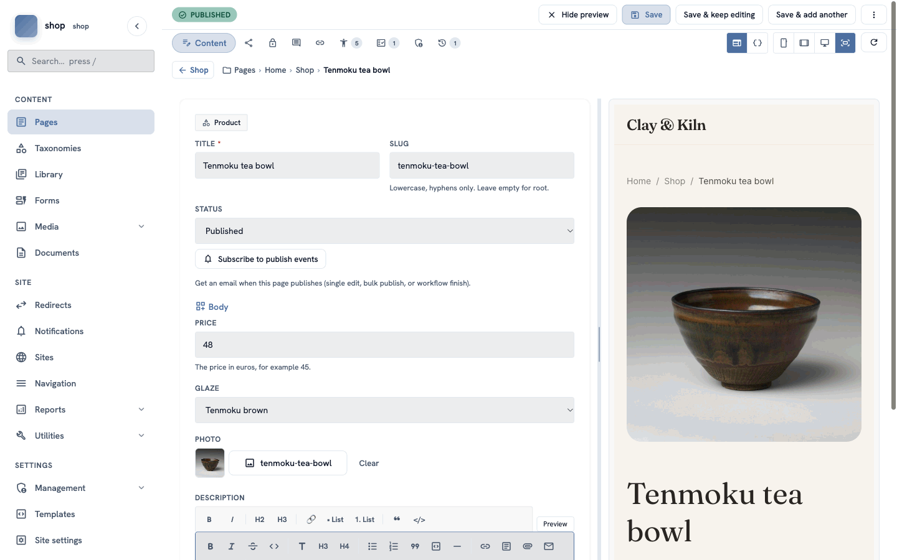
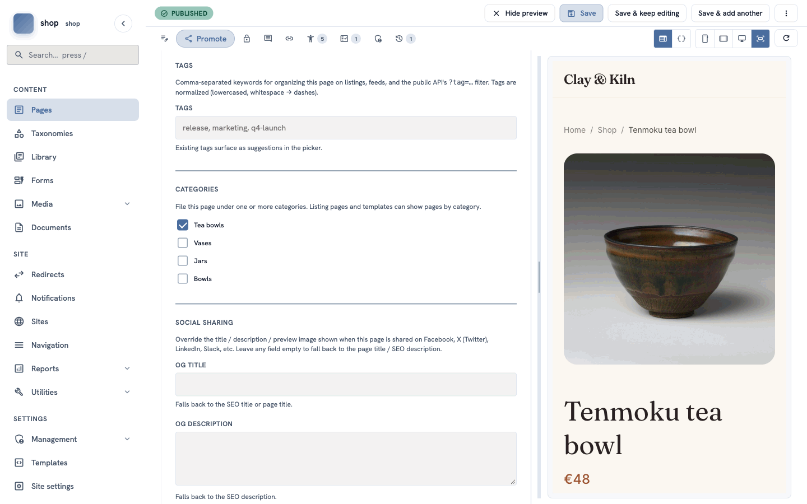
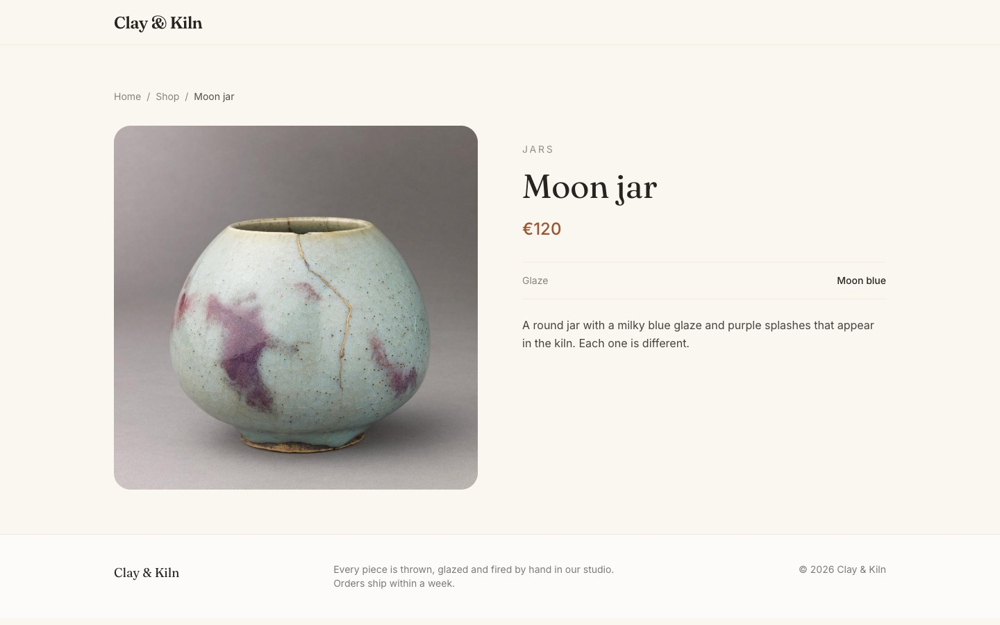

# Add your products

**Goal:** add your products under the shop page, each with a price, a glaze, a photo, a description and a category.

**Who this is for:** shop owners and editors. You do not need any technical knowledge.

**Time:** about 3 minutes for each product.

This is chapter 7 of [Build a ceramics shop, step by step](shop-overview.md).

## Before you start

- You did chapters [1](shop-brand.md) to [6](shop-shop-page.md). You need the **Product** page type (chapter 4), the categories (chapter 5) and the shop page (chapter 6).

## Words you will see

| Word | What it means |
|---|---|
| **Product** | The page type you made in chapter 4. Each product is one page. |
| **Category** | The group of the product, for example **Tea bowls**. You made them in chapter 5. |

## Steps

### 1. Add a page under the shop page

In the menu on the left, click **Pages**. In the row of **Shop**, click the **⋮** button, then **+ Child page**.

Now **Product** is in the list of types. Click **Use this type** in its row.

> **Why is Product only here?** In chapter 4 you allowed products only under the shop page.

### 2. Title and status

1. In **Title**, type the product name, for example `Tenmoku tea bowl`. The slug fills in by itself.
2. In **Status**, choose **Published**.
3. Click **Create & keep editing**.

### 3. Fill in the product boxes

Now you see the boxes from chapter 4, under **Body**:

1. **Price** — type the number only, for example `48`. No € sign.
2. **Glaze** — choose from the list, for example **Tenmoku brown**.
3. **Photo** — click **Choose an image…**, click the photo, then **Choose**.
4. **Description** — write two or three sentences. Use the toolbar for bold text or lists.

The preview on the right shows the product page with the photo and the title.

### 4. Choose the category

Click the **Promote** tab (the share icon next to **Content**). Under **Categories**, tick the group of the product, for example **Tea bowls**.

> **One group per product works best.** The shop page shows each product in the group that is ticked first.

### 5. Save and add the next product

Click **Save & add another** at the top. The product is saved, and you can choose the type for the next product under the same shop page.

Add all products the same way. For the example shop:

| Title | Price | Glaze | Photo | Category |
|---|---|---|---|---|
| Tenmoku tea bowl | 48 | Tenmoku brown | tenmoku-tea-bowl | Tea bowls |
| Carved tea bowl | 52 | Satin white | carved-tea-bowl | Tea bowls |
| Celadon cup and saucer | 58 | Celadon green | celadon-cup-and-saucer | Tea bowls |
| Celadon bud vase | 65 | Celadon green | celadon-bud-vase | Vases |
| Gourd vase | 72 | Celadon green | gourd-vase | Vases |
| Sky blue vase | 45 | Moon blue | sky-blue-vase | Vases |
| Moon jar | 120 | Moon blue | moon-jar | Jars |
| Two-handled jar | 95 | Moon blue | two-handled-jar | Jars |
| Ribbed storage jar | 85 | Tenmoku brown | ribbed-storage-jar | Jars |
| White serving bowl | 55 | Satin white | white-serving-bowl | Bowls |

When you add the last product, click **Save**.

## Check it worked

Open the shop page of your site (`/shop`). You see:

- small buttons with your categories under the introduction — click one to jump to that group,
- one part for each category, with its products,
- a card for each product with the photo, the name, the glaze and the price.

Click a product. Its page shows the photo, the category, the name, the price, the glaze and the description.

## If something goes wrong

| Problem | What to do |
|---|---|
| **Product** is not in the list of types. | Add the page under **Shop**, not under **Home**. If it is still missing, open the Product type and click **Publish** (chapter 4, step 6). |
| A product is not on the shop page. | Its status is **Draft**. Edit it, choose **Published** and save. |
| A product is at the end, without a group. | No category is ticked. Tick one on the **Promote** tab and save. |
| The price shows no number. | Type only the number, for example `48` or `12.50`. |

## Next

[Chapter 8 — The main menu](shop-menu.md)
