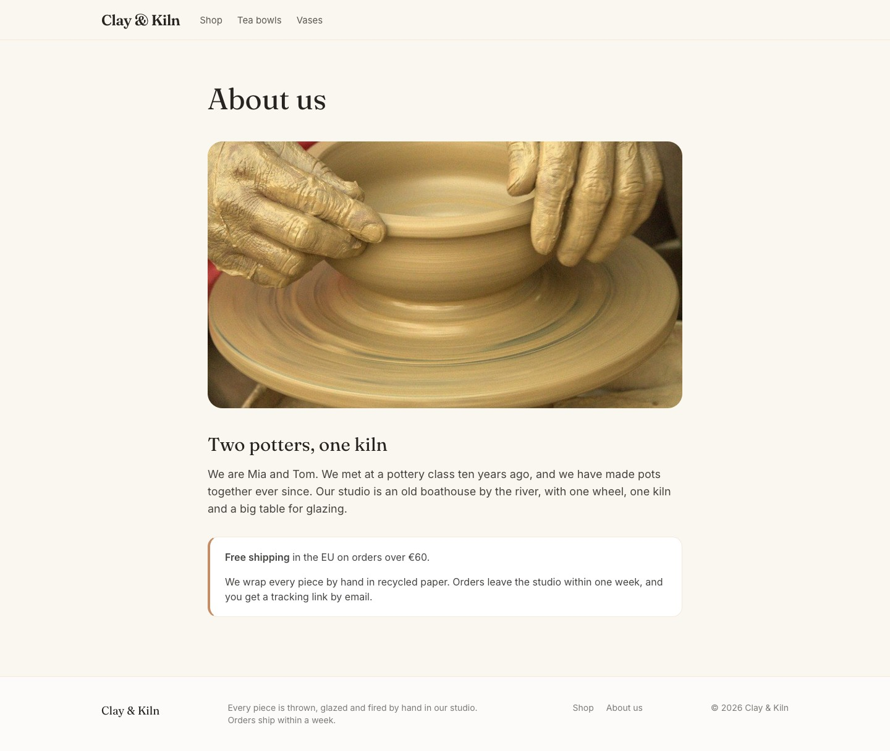
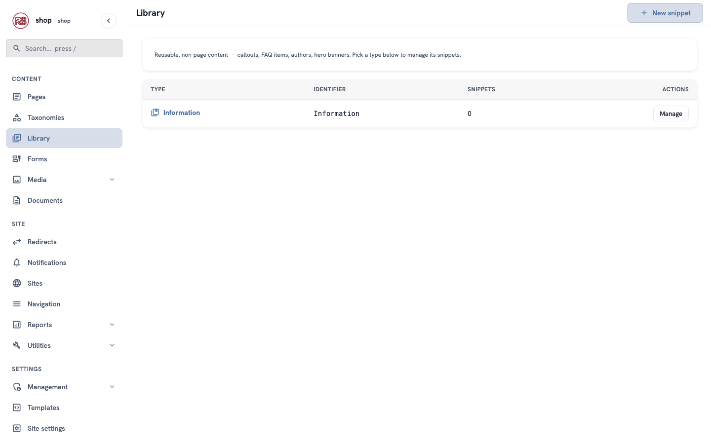
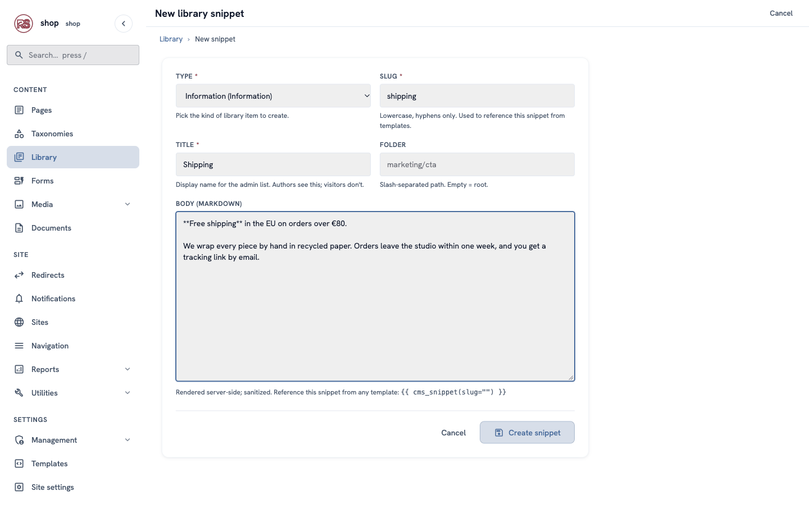
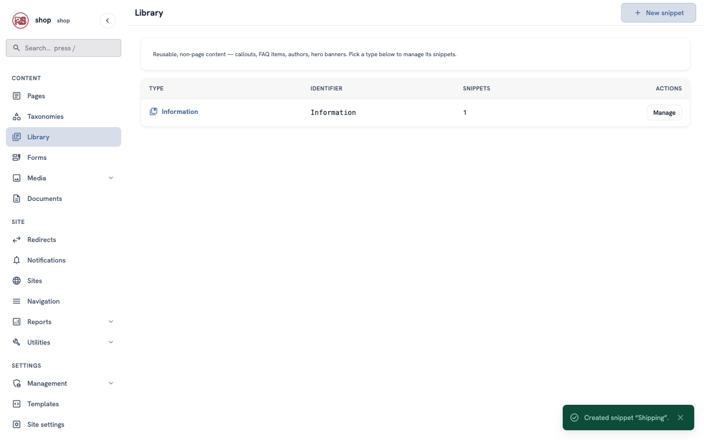
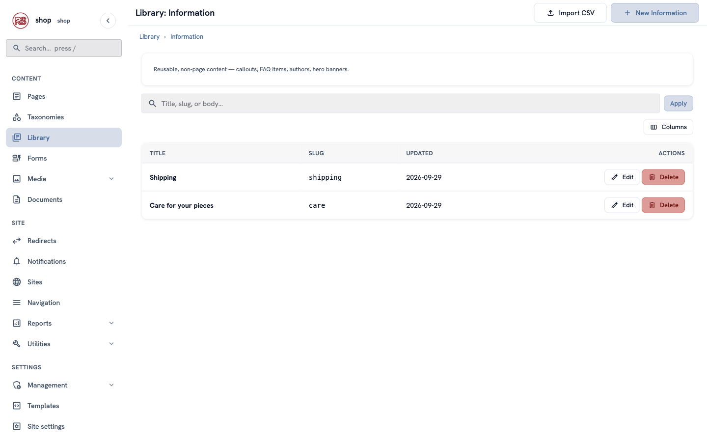
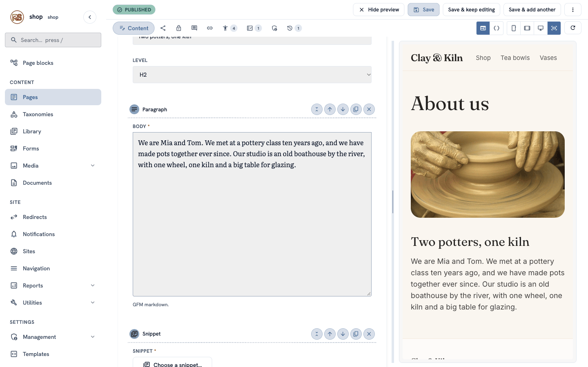
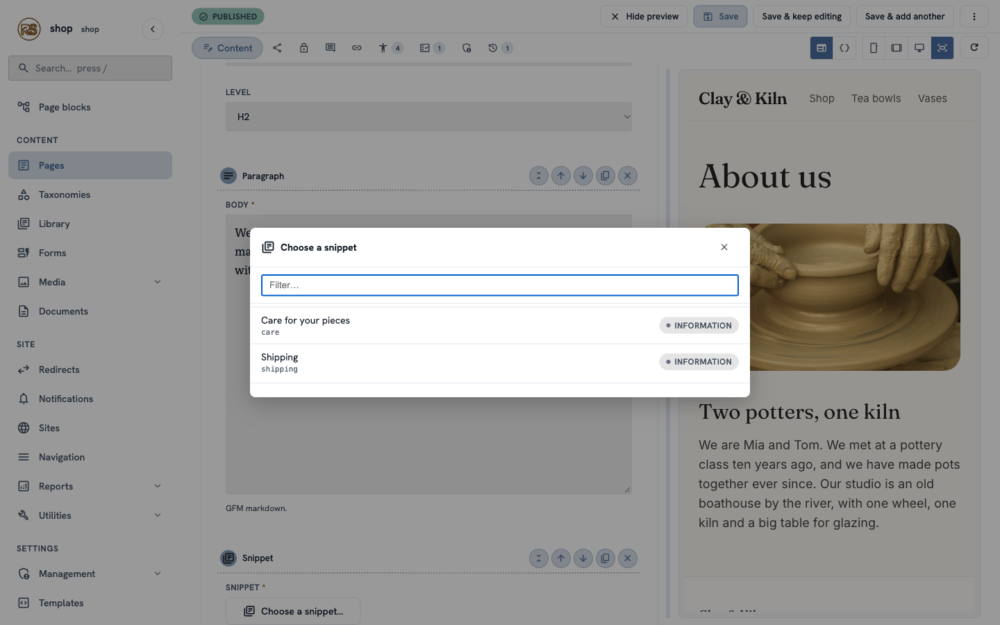
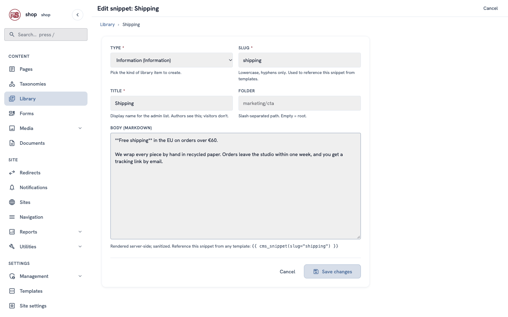
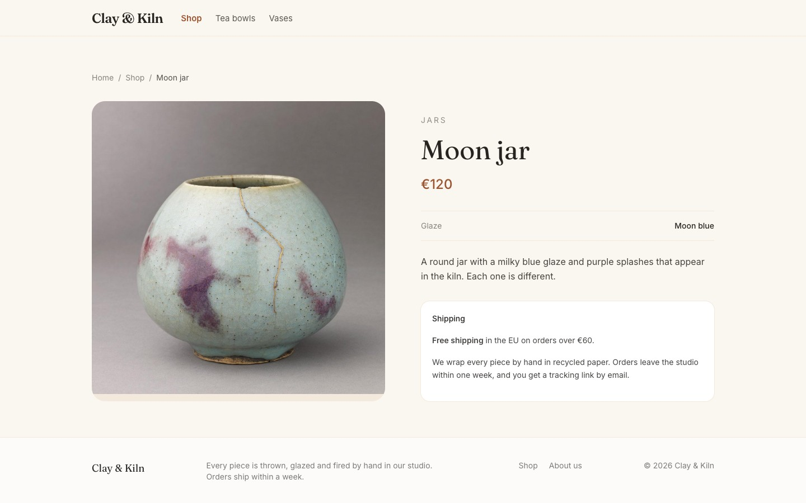

# Reusable text: write it once, show it everywhere

**Goal:** write the shipping information once, show it on the "About us" page and on every product page, and change it in one place.

**Who this is for:** shop owners and editors. You do not need any technical knowledge. One short tip at the end is for developers.

**Time:** about 10 minutes.

This is chapter 9 of [Build a ceramics shop, step by step](shop-overview.md).



## Before you start

- You did chapters [1](shop-brand.md) to [8](shop-menu.md).
- You can see **Library** in the menu on the left. If you cannot see it, ask the person who manages your site.

## Why reusable text?

Some text is the same on many pages: shipping, care instructions, opening hours. If you copy it into every page, you must also change every page when something changes — and it is easy to forget one.

In the **Library** you write the text once. Pages show it from there. When you change it in the Library, every page changes at the same time.

## Words you will see

| Word | What it means |
|---|---|
| **Library** | The place in the admin for content that is not a page and can be used on many pages. |
| **Snippet** (or **Library element**) | One piece of reusable content in the Library, for example "Shipping". |
| **Type** | The kind of snippet. The shop has the type **Information**: a title and a text. |
| **Slug** | The inside name of a snippet, for example `shipping`. Only small letters and `-`. |
| **Snippet block** | The block you add to a page to show a snippet. |

## Steps

### 1. Open the Library

In the menu on the left, click **Library**. You see the snippet types of your site. The shop has one: **Information**, with **0** snippets.



Click **Manage** in the **Information** row, then **+ New Information** at the top right.

### 2. Write the shipping text

Fill in the form:

| Box | What to type |
|---|---|
| **Type** | keep **Information** |
| **Slug** | `shipping` |
| **Title** | `Shipping` — only you see it, in the admin |
| **Folder** | leave empty |
| **Body** | the text visitors will see (example below) |

For the example shop, the body is:

```text
**Free shipping** in the EU on orders over €80.

We wrap every piece by hand in recycled paper. Orders leave the studio within one week, and you get a tracking link by email.
```



> **Tip:** the body uses Markdown. Two stars make **bold text**: `**Free shipping**`. An empty line starts a new paragraph.

Click **Create snippet**. A green message says **Created snippet "Shipping"**.



### 3. Add a second snippet

Click **+ New Information** again and add the care instructions:

- **Slug:** `care`
- **Title:** `Care for your pieces`
- **Body:** `All our pieces are safe for food and for the dishwasher. Glazed stoneware can go in the microwave, too.` and, as a second paragraph, `To keep the glaze bright for many years, wash by hand with a soft cloth.`

Now **Library → Information** shows both snippets.



### 4. Make the "About us" page

1. In the menu on the left, click **Pages**. In the row of **Home**, click **⋮**, then **+ Child page**.
2. Find **Content page** and click **Use this type**.
3. In **Title**, type `About us`. The slug fills in by itself: `about-us`.
4. In **Status**, choose **Published**, then click **Create & keep editing**.
5. Under **Photo**, click **Choose an image…**, choose **potter-hands** and click **Choose**.

### 5. Write the story

Under **Body**, click **+ Add block**:

1. Choose **Heading**. Text: `Two potters, one kiln`. Level: **H2**.
2. Click **+ Add block** again and choose **Paragraph**. Write a few sentences about the studio, for example: `We are Mia and Tom. We met at a pottery class ten years ago, and we have made pots together ever since. Our studio is an old boathouse by the river, with one wheel, one kiln and a big table for glazing.`

The preview on the right shows the photo, the heading and the text.



### 6. Add the shipping snippet

1. Click **+ Add block** and choose **Snippet** ("Pick a reusable snippet from the library").
2. In the new block, click **Choose a snippet…**. A window lists your snippets.
3. Click **Shipping**.



> **Tip:** with many snippets, type a few letters in **Filter…** to find one quickly.

Click **Save** at the top.

## Check it worked

Open the page `/about-us` on your site. Under the story, the shipping text is in a white box.


Look at the footer, too: **About us** is there next to **Shop**. The footer lists all published pages under the home page by itself (see [Show menus and settings in templates](shop-dev-templates.md)).

## Change it once — every page follows

The free-shipping limit goes down from €80 to €60. You change it in **one** place:

1. Go to **Library → Information** and click **Edit** in the **Shipping** row.
2. In **Body**, change `€80` to `€60`.
3. Click **Save changes**.



Now open the About page — and any product page. Both say **€60**. In the example shop, every product page shows the same shipping box under the description.



## If something goes wrong

| Problem | What to do |
|---|---|
| There is no **Snippet** block in the list. | The page type does not allow it. The **Content page** type allows it; others may not. Ask a developer to allow `snippet_chooser` in the type. |
| **Choose a snippet…** shows an empty list. | You have no snippets yet. Create one in the **Library** first (steps 1–2). |
| The page shows old text. | Check that you clicked **Save changes** in the Library. Then reload the page. |
| You deleted a snippet by mistake. | Its Snippet blocks have nothing to show. Create it again with the same slug, then choose it again in each Snippet block. |

## For developers: show a snippet from a template

The product pages show the shipping box without a Snippet block — their template asks for the snippet by its slug:

```jinja


<aside class="shipping">
    <p>Shipping</p>
    {{ shipping | safe }}
</aside>

```

- `cms_snippet(slug="…")` returns the snippet's text as HTML, in a wrapper; add `body=true` for the text alone.
- An unknown slug gives an empty string, so the `` keeps the page tidy while the snippet does not exist yet.

The **Information** type itself is made in code — see [LibraryTypeHandler](shop-dev-helper-traits.md) in The helper traits.

## Next

[Chapter 10 — The order form](shop-order-form.md)
