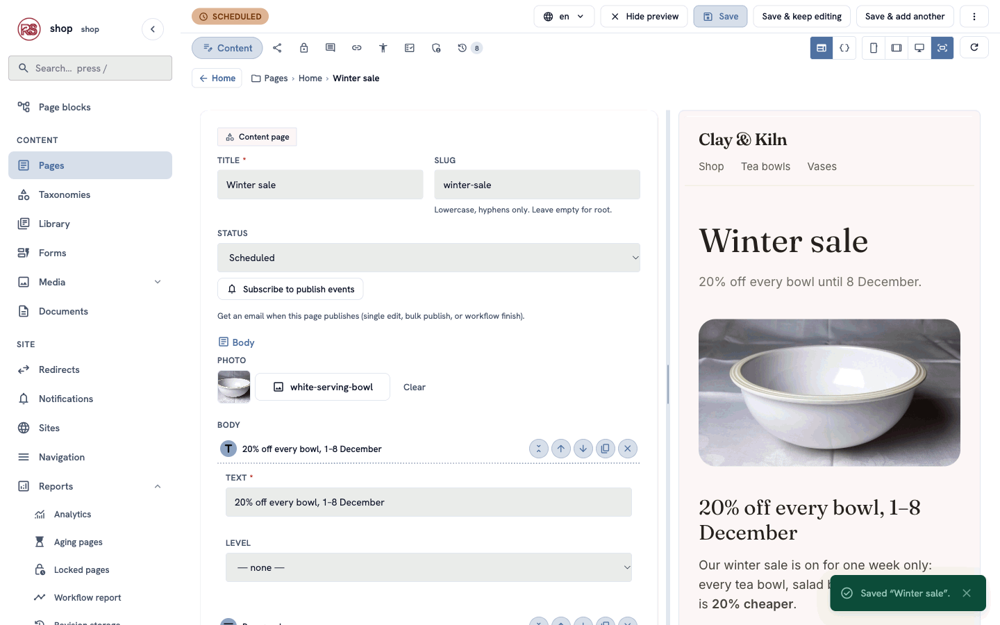
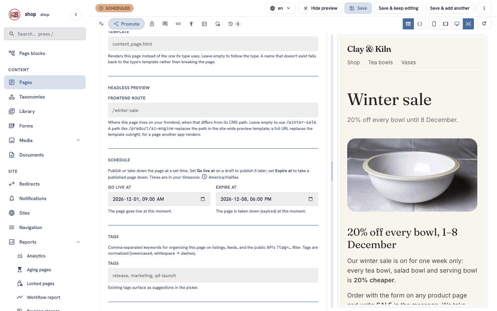
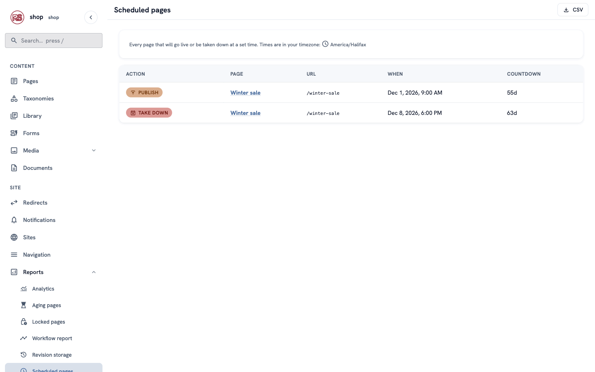
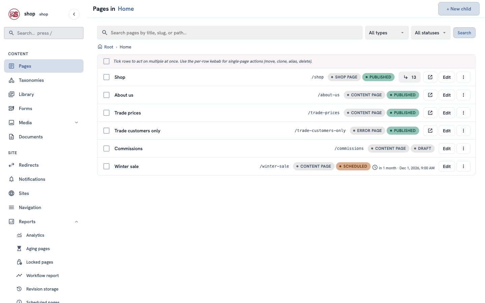
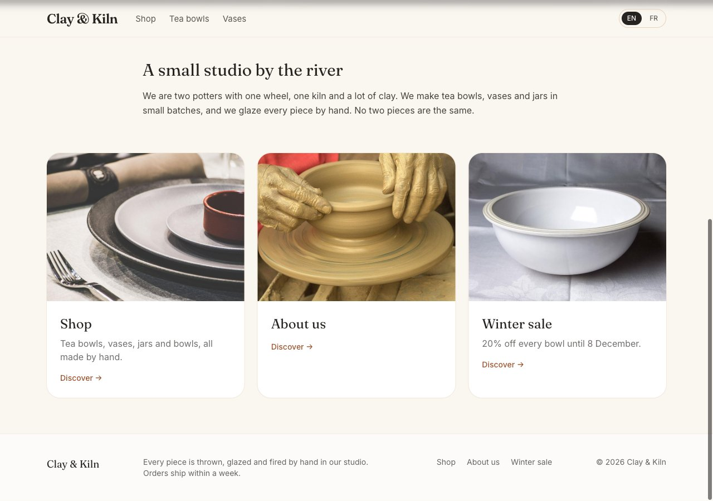
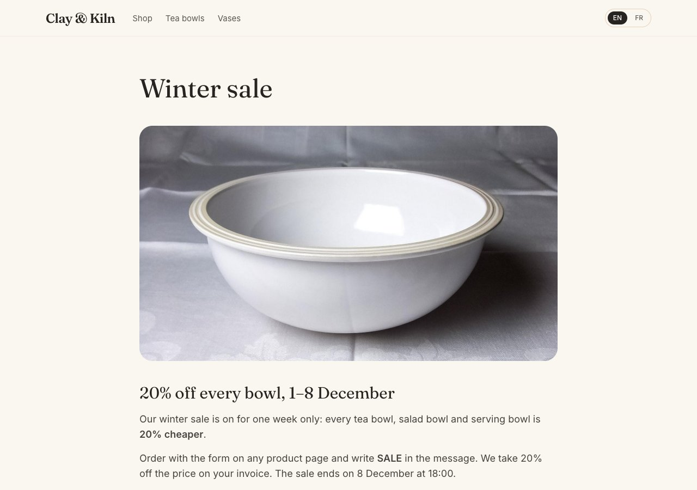
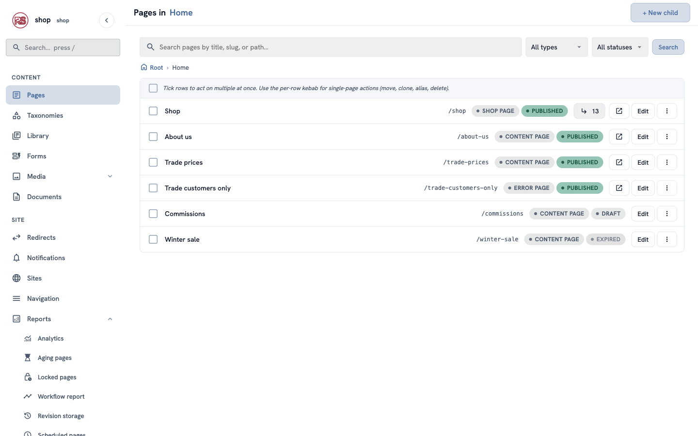

# A sale

**Goal:** prepare a **Winter sale** page now, and let the site publish it on 1 December at 9:00 and take it down on 8 December at 18:00 — without you being there.

**Who this is for:** shop owners and editors. You do not need any technical knowledge.

**Time:** about 15 minutes.

This is chapter 15 of [Build a ceramics shop, step by step](shop-overview.md).

## Before you start

- You did chapters [1](shop-brand.md) to [8](shop-menu.md).

## Words you will see

| Word | What it means |
|---|---|
| **Go live at** | The moment the page appears on the site. |
| **Expire at** | The moment the page disappears from the site again. |
| **Scheduled** | The page is ready and waits for its **Go live at** time. Visitors can't see it yet. |
| **Expired** | The page was taken down at its **Expire at** time. You can still edit it and use it again. |
| **Timezone** | The clock the times are in. The admin shows which one it uses. |

## How it works

1. You write the sale page and save it as a draft.
2. You set **Go live at** and **Expire at**. The page becomes **Scheduled**.
3. At the **Go live at** time the page appears on the site: on its own address, as a card on the home page and in the footer menu.
4. At the **Expire at** time it disappears again. The page stays in the admin, ready for the next sale.

You don't have to be signed in at those times. The site checks the clock by itself.

## Steps

### 1. Write the sale page

1. In the menu on the left, click **Pages**. In the row of **Home**, click **⋮**, then **+ Child page**.
2. Find **Content page** and click **Use this type**. **Title:** `Winter sale`. Click **Create & keep editing**.
3. **Photo:** click **Choose an image…** and choose a photo for the sale (we use the white serving bowl).
4. Under **Body**, add a **Heading** (`20% off every bowl, 1–8 December`) and a **Paragraph** with the details, for example:

```text
Our winter sale is on for one week only: every tea bowl, salad bowl and serving bowl is **20% cheaper**.

Order with the form on any product page and write **SALE** in the message. We take 20% off the price on your invoice. The sale ends on 8 December at 18:00.
```

5. Click the **Promote** tab and type a short **SEO description**: `20% off every bowl until 8 December.` The home page shows it on the sale's card.
6. Leave **Status** as **Draft** and click **Save & keep editing**.



### 2. Set the times

1. Click the **Promote** tab and scroll to **Schedule**.
2. **Go live at:** `1 December 2026, 09:00`.
3. **Expire at:** `8 December 2026, 18:00`.
4. Click **Save & keep editing**.



The status at the top changes to **Scheduled**.

> **Which clock?** Under the **Schedule** heading the admin says which timezone it uses — normally your computer's. If it is wrong (for example, you plan from a holiday abroad), ask the person who manages your site to set **Timezone** on your user (**Management → Users → Edit**).

### 3. Check the plan

Open **Reports → Scheduled pages**. Every page that will go live or be taken down at a set time is listed, with the time and a countdown:



The page list shows it too: **Scheduled**, with "in 1 month · Dec 1, 2026, 9:00 AM":



Before 1 December, a visitor who types `/winter-sale` gets "not found", and the sale is not in any menu or list.

### 4. On 1 December

At 9:00 the sale appears by itself. The home page shows its card, with your SEO description, and the footer menu has a **Winter sale** link:





### 5. After the sale

At 18:00 on 8 December the page disappears from the site again: its address says "not found", and the card and the menu link are gone. In the admin it is **Expired**:



**Next year:** open the page, change the text and the two times, set **Status** to **Draft**, and save. It is **Scheduled** again.

## Check it worked

- After step 2 the page says **Scheduled**, and **Reports → Scheduled pages** lists a **Publish** and a **Take down** row with the times you typed.
- Before the go-live time, `/winter-sale` says "not found".

## If something goes wrong

| Problem | What to do |
|---|---|
| The times in the report are not the ones you typed. | Look at the timezone under **Schedule**. If it is not yours, ask for **Timezone** to be set on your user. |
| The page went live at once. | **Go live at** was empty or already past. Set a future time and save: the page becomes **Scheduled**, whatever status you chose. |
| The page did not appear at the time. | Reload the page — your browser may show an old copy. In the admin, check that it says **Scheduled** with the right time, not **Draft**. |
| You want to end the sale early. | Set **Expire at** to now, or set **Status** to **Draft**, and save. |

## For developers

- **The clock.** A page is public by its dates as soon as they pass, before any background work: the router judges `go_live_at` / `expire_at` itself. A sweep then sets the stored status (`scheduled` → `published` → `expired`); start it with `rustango_cms::spawn_schedule_sweeper(&registry_pool, interval, invalidator)` — the example shop checks every 60 seconds.
- **Cached pages.** Pass your page-cache invalidator to the sweeper, so a page that goes live or expires is purged from the cache at that moment.
- **Times** are stored in UTC. The admin converts to and from the editor's timezone (the user's **Timezone**, else `RCMS_DEFAULT_TIMEZONE`, else the browser's).

## Next

Next chapter: [Let an AI agent help](shop-ai-agent.md) — an AI assistant writes new product pages as drafts, and you publish them.
