# A second language

**Goal:** show the shop in French too: the pages, the menu, the shipping text and the order form.

**Who this is for:** shop owners and editors. You do not need any technical knowledge.

**Time:** about 30 minutes, plus the time to write the translations.

This is chapter 12 of [Build a ceramics shop, step by step](shop-overview.md).

## Before you start

- You did chapters [1](shop-brand.md) to [11](shop-seo.md).
- You have the French texts, or you can write them. The CMS does not translate for you.

## Words you will see

| Word | What it means |
|---|---|
| **Locale** | A language of your site, for example `en` (English) or `fr` (French). |
| **Default language** | The language you write pages in. For Clay & Kiln it is English. |
| **Original** (or **canonical**) | The text in the default language. |
| **Translation** | The same text in another language. If a box has no translation, visitors see the original. |

## How it works

You write every page once, in English. For French, you do **not** make new pages. You open the same page in **translation mode** and type the French text next to the English text.

- The French shop lives at addresses that start with `/fr/`: `/fr/`, `/fr/shop/moon-jar`, …
- The header shows **EN** and **FR** buttons. Visitors click them to change the language.
- Photos, prices and the page tree are the same in every language. You translate only the words.

## Steps

### 1. Add French

1. In the menu on the left, open **Utilities → Locales**.
2. Click **+ Add locale**.
3. **Code:** `fr`. **Display name:** `Français` — write it the way French speakers write it, because visitors see it.
4. Keep **Active** ticked. Do not tick **Default locale** — English stays the default.
5. Click **Create locale**.

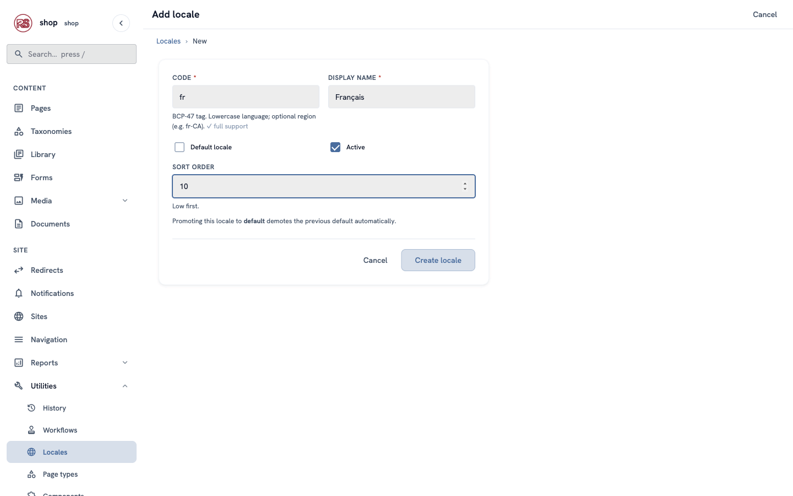

The list now has two languages. The **EN / FR** buttons appear in the shop's header by themselves.

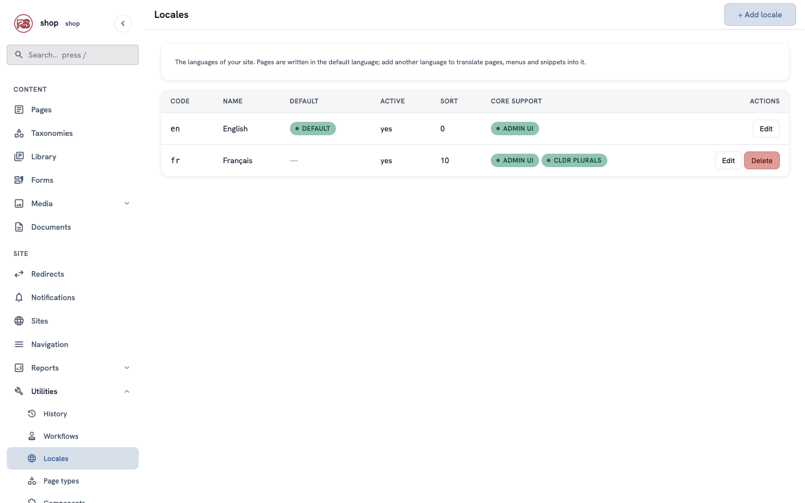

### 2. Translate the home page

1. Open **Pages** and click **Home**.
2. At the top of the editor, click the language button (the globe, **en**) and choose **Français (fr)**.

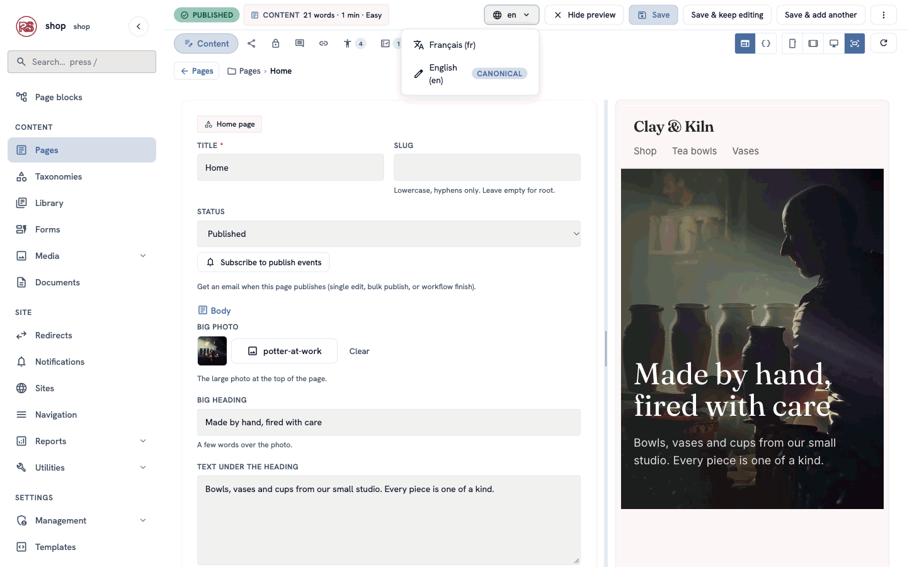

The editor changes to **translation mode**. Each text has two columns: the English original on the left, a box for French on the right.

3. Fill in the **Core fields**:

| Box | French |
|---|---|
| **Title** | `Accueil` |
| **SEO description** | `Bols, vases et tasses faits main dans notre petit atelier. Chaque pièce est unique.` |

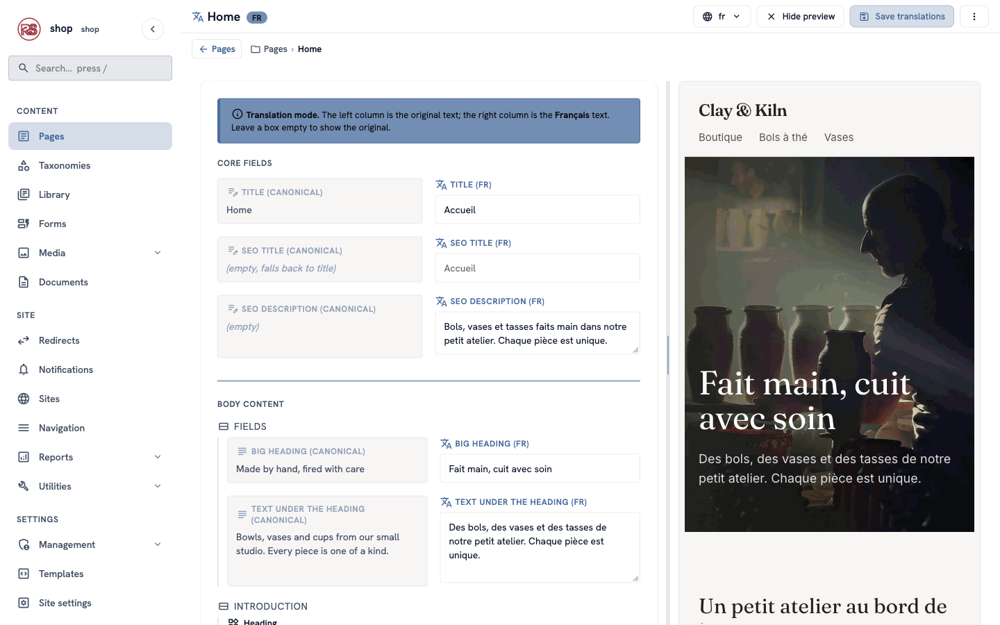

> **SEO title:** the grey text in an empty box is what visitors will see. Home has no SEO title, so it uses the title — and the French title is `Accueil`. You can leave it empty.

4. Scroll down to **Body content** and translate the texts of the page:

| Box | French |
|---|---|
| **Big heading** | `Fait main, cuit avec soin` |
| **Text under the heading** | `Des bols, des vases et des tasses de notre petit atelier. Chaque pièce est unique.` |
| **Introduction → Heading** | `Un petit atelier au bord de la rivière` |
| **Introduction → Paragraph** | Your French paragraph. |

The preview on the right shows the French page while you type.

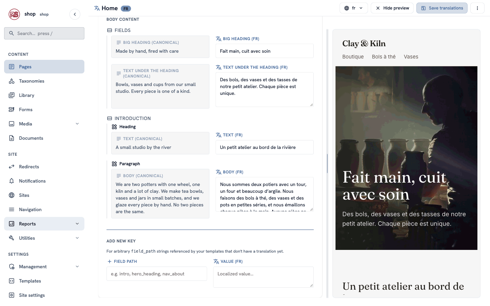

5. Click **Save translations**.

### 3. Translate the products

Do the same for every product. Open **Moon jar**, choose **Français (fr)**, and fill in:

| Box | French |
|---|---|
| **Title** | `Jarre lune` |
| **SEO title** | `Jarre lune — jarre en grès bleu faite main` |
| **Description** (under **Fields → Body**) | `Une jarre ronde à l’émail bleu laiteux, avec des taches violettes qui apparaissent dans le four. Chacune est différente.` |

The description is formatted text, so its French box has the same toolbar as the English one.

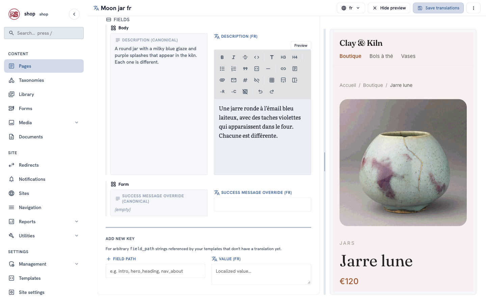

> **Translate the SEO title too.** It is a separate box. If it stays empty, the French page uses the English SEO title, and the browser tab says *Moon jar — handmade blue stoneware jar*.

Translate the **Shop** page as well (title `Boutique`). Its title is shown in the breadcrumbs of every product.

### 4. Translate the menu

1. Open **Navigation** and click **Main menu**.
2. At the top right, click **fr**.
3. A **Translate to Français (fr)** card appears under the menu. Type a French label for each item:

| Original | Label (fr) |
|---|---|
| Shop | `Boutique` |
| Tea bowls | `Bols à thé` |
| Vases | `Vases` |

4. Click **Save translations**.

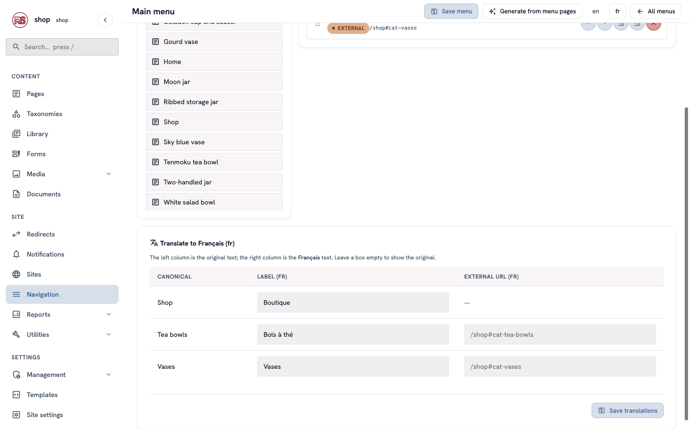

> **Items without a label** use the page title. If you translated the page's title, the menu item is already French.

### 5. Translate the reusable text

The shipping text from [chapter 9](shop-reusable-text.md) is shown on every product. Translate it once:

1. Open **Library** and click **Shipping**.
2. At the top right, click **fr**.
3. **Title (fr):** `Livraison`. **Body (fr):** the French text. Keep the `**…**` marks for bold text.
4. Click **Save translations**.

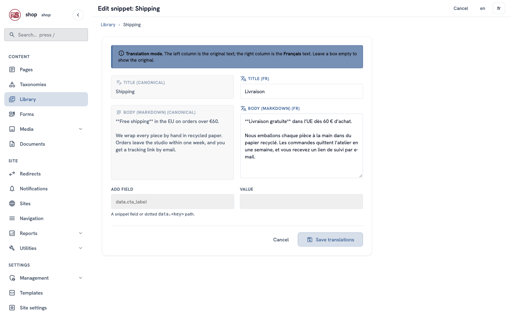

Every French product page now shows the French shipping text.

### 6. Translate the order form

1. Open **Forms** and click **Order a piece**.
2. In the builder, click **Translate** and choose **Français**.
3. The texts are grouped: first the **Form** (the button and the thank-you message), then one group per field. Fill in the French:

| Text | French |
|---|---|
| Submit button label | `Envoyer ma commande` |
| Success message | `Merci ! Nous avons bien reçu votre commande. …` |
| Your name | `Votre nom` |
| Email | `E-mail` — help text: `Nous y envoyons la confirmation de commande.` |
| Phone (optional) | `Téléphone (facultatif)` |
| Delivery address | `Adresse de livraison` |
| Message (optional) | `Message (facultatif)` |

4. Click **Save translations**.

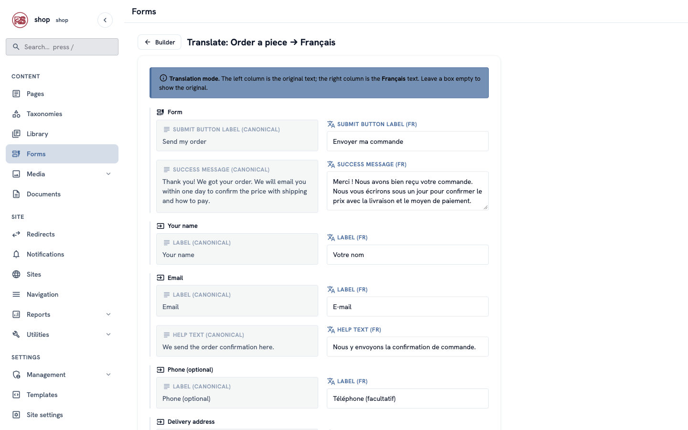

You only translate the words. The fields, their order and the rules (for example, **required**) are the same in every language. The orders from French visitors come to the same **Submissions** list.

### 7. Translate the category names

The category names (**Tea bowls**, **Jars**, …) show on the shop page and above each product's title.

1. Open **Taxonomies → Categories** and click **Edit** next to **Jars**.
2. At the top right, click **fr**.
3. **Name (fr):** `Jarres`. Click **Save translations**.

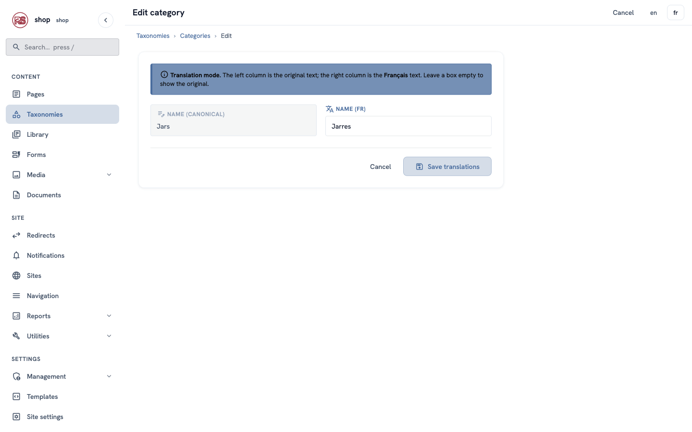

Do the same for the others: `Bols à thé`, `Vases`, `Bols`.

> **The menu links still work.** The shop page's sections have addresses made from the category **slug** (`/shop#cat-tea-bowls`), and the slug is the same in every language.

### 8. Translate the glaze choices

The glaze is a **select** field of the **Product** page type ([chapter 4](shop-product-type.md)), so its options are translated on the page type, once for all products:

1. Open **Utilities → Page types** and click **Build fields** for **Product**.
2. Click **Translate** and choose **Français**.

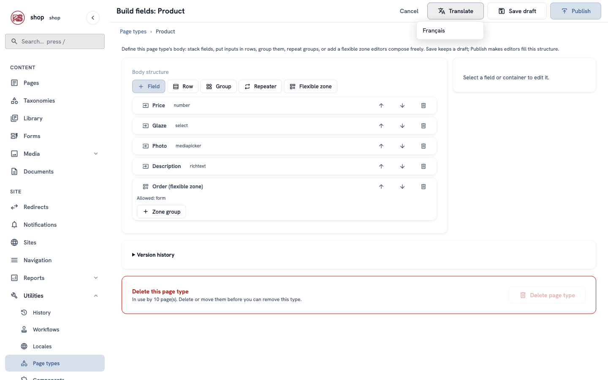

3. Type the French label of each glaze:

| Option | French |
|---|---|
| Celadon green | `Vert céladon` |
| Tenmoku brown | `Brun tenmoku` |
| Moon blue | `Bleu lune` |
| Satin white | `Blanc satiné` |

4. Click **Save translations**.

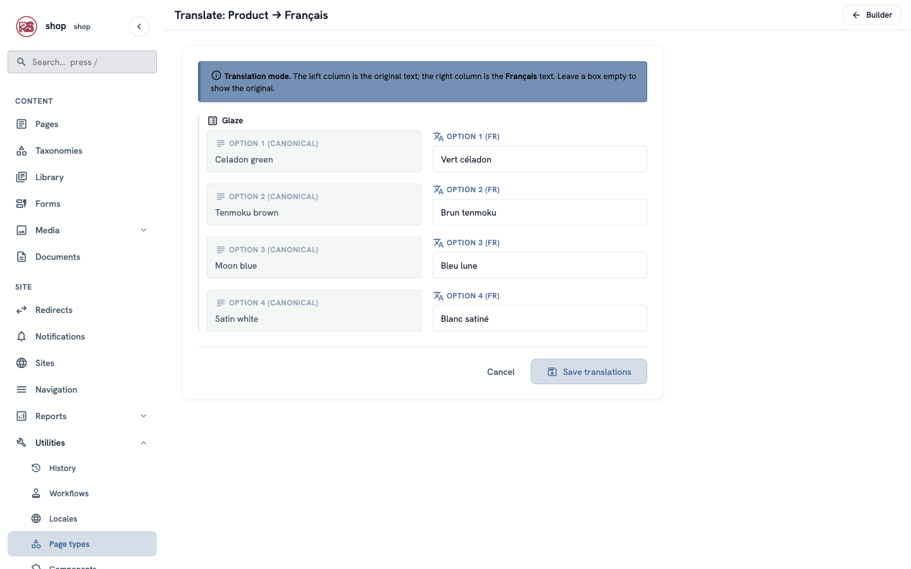

The products keep the glaze you chose; only the words visitors see change.

### 9. Translate the shop's own texts

The tagline and the footer text come from the **Brand** settings ([chapter 1](shop-brand.md)). Translate them there:

1. Open **Site settings**. In the **brand** row, click **Edit** (it said **Configure** before you filled it in).
2. At the top right, click **fr**.
3. Type the French **Tagline** and **Footer text**. Leave **Shop name** empty — the name stays **Clay & Kiln** in every language.
4. Click **Save translations**.

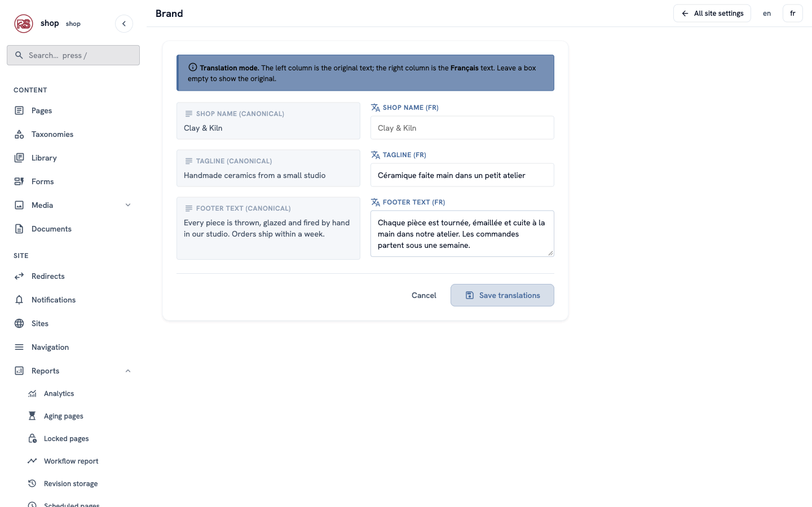

## Check it worked

Open the shop and click **FR** in the header.

- The home page is French: the menu, the big heading and the introduction.

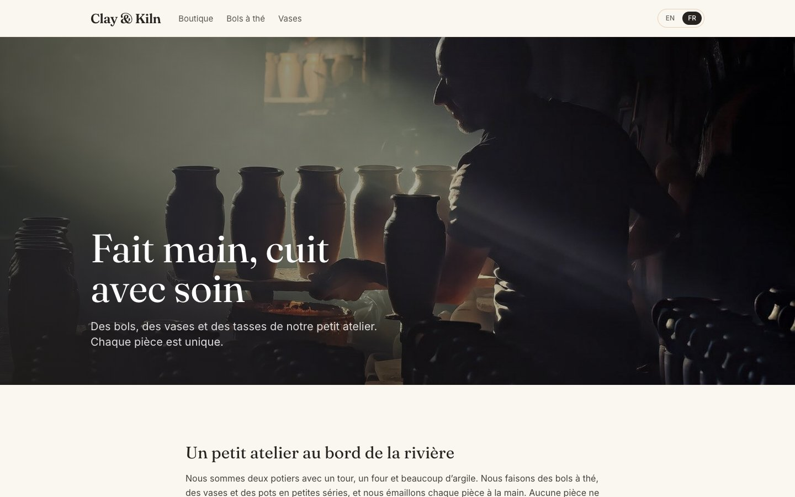

- Open **Boutique**. The category names, the product names and the glazes are French.

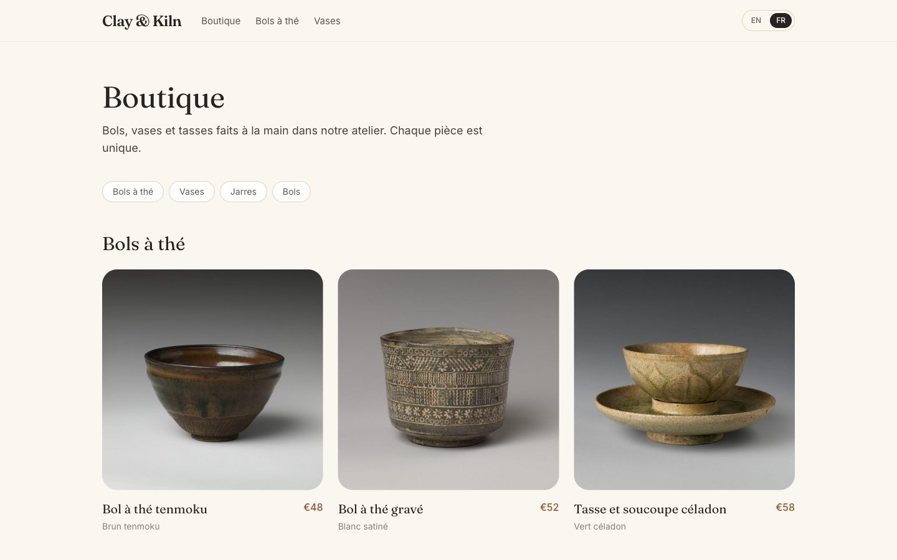

- Open a product. The category, the title, the glaze, the description and the shipping text are French.

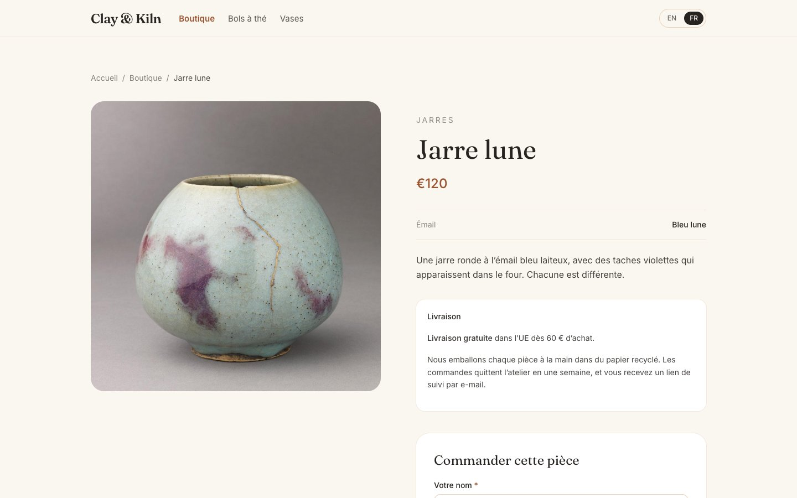

- Scroll down: the order form is French too.

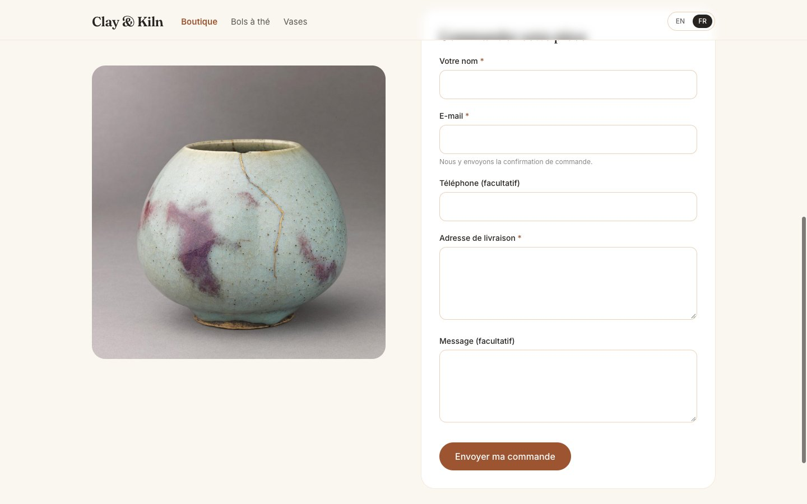

- Scroll to the bottom of the home page: the cards and the footer are French too.

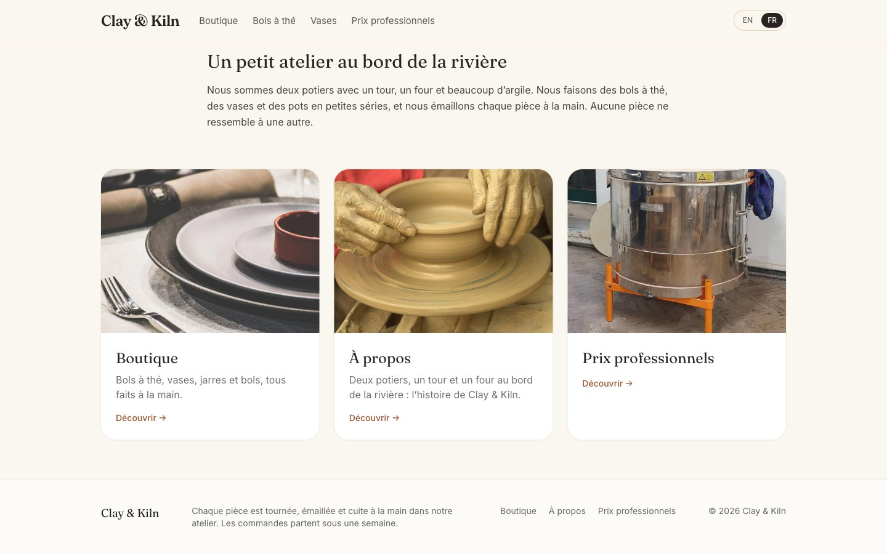

- Click **EN**: everything is English again.

## Words in the templates

A few words are written in the shop's templates, not typed in the admin: **Émail / Glaze**, **Livraison / Shipping**, **Commander cette pièce / Order this piece**. The example shop already has them in French. On your own site, ask your developer to translate them — see below.

## If something goes wrong

| Problem | What to do |
|---|---|
| There are no **EN / FR** buttons in the header. | Check that the locale is **Active** in **Locales**. The template must also show the buttons (see below). |
| A French page shows an English text. | That box has no translation. Open the page in translation mode and fill it in. An empty box always shows the original. |
| I clicked **FR**, and now links without `/fr/` are French too. | That is on purpose: the shop remembers the visitor's language. Click **EN** to change back. |
| I changed the English text. Is the French text changed too? | No. Translations never change by themselves. Update the French text when you change the English. |
| I want to remove a translation. | Empty the box and click **Save translations**. The page shows the original again. |

## For developers: the language in templates

**The EN / FR buttons.** `language_switcher()` returns one item per active language, each with `code`, `url` (this page in that language) and `is_current`:

```jinja


<nav aria-label="Language">
    
    <a href="{{ l.url }}" hreflang="{{ l.code }}" aria-current="true">{{ l.code | upper }}</a>
    
</nav>

```

**Translated content needs no template change.** `page.title`, the builder fields, the stream blocks, `page.categories`, `menu()`, `cms_snippet()`, `site_setting()` and the forms all return the visitor's language already.

**Choice fields.** `builder.glaze` is the stored value (`Moon blue`) in every language. Show `builder_labels.glaze` instead: the option's label in the visitor's language (`Bleu lune`). On a listing, each child has the same pair: `child.builder` and `child.builder_labels` (see [The helper traits](shop-dev-helper-traits.md)).

```jinja
<dd>{{ builder_labels.glaze | default(value=builder.glaze) }}</dd>
```

**Words in your templates.** `LANG` holds the current language code. The shop has only a few such words, so it checks `LANG` directly (`examples/ceramics_shop/templates/product_page.html`):

```jinja
<h2>Commander cette pièceOrder this piece</h2>
```

With more languages or more words, keep them in a [site setting](shop-dev-helper-traits.md) or in Library elements, which editors can translate in the admin.

**`<html lang>`.** Use `LANG` there too, so browsers and screen readers know the language: `<html lang="{{ LANG | default(value="en") }}">`.

## Next

[Chapter 13 — A members area](shop-members-area.md)
