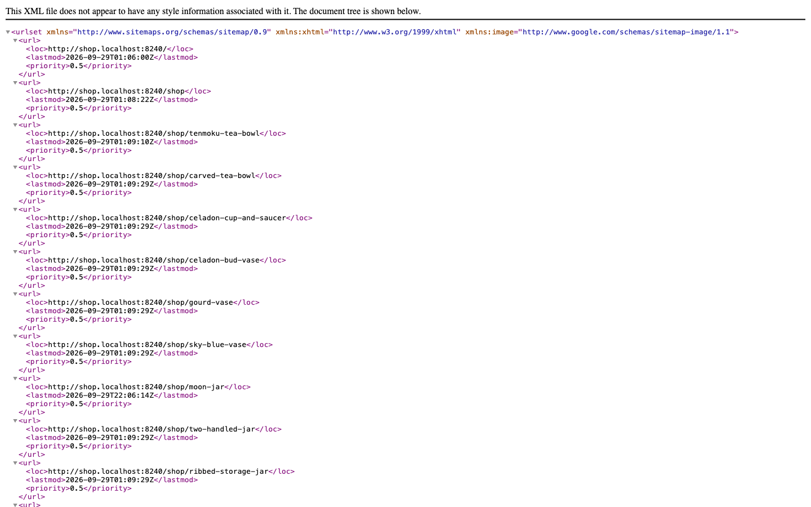
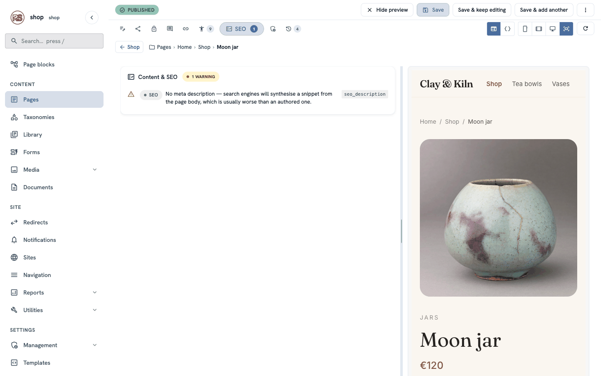
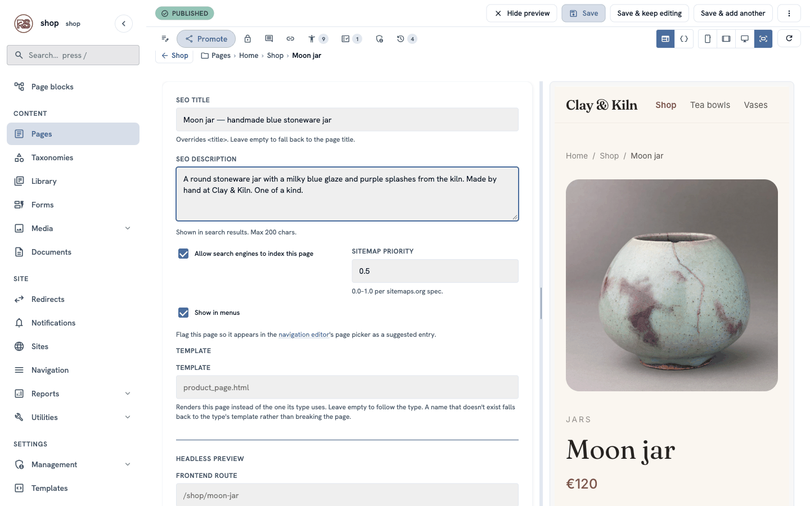
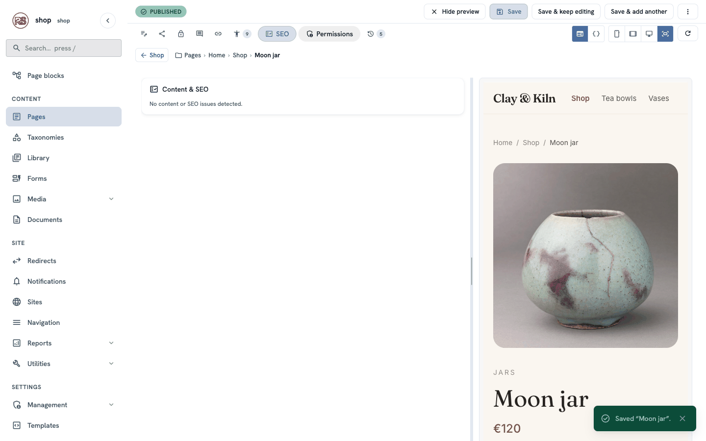
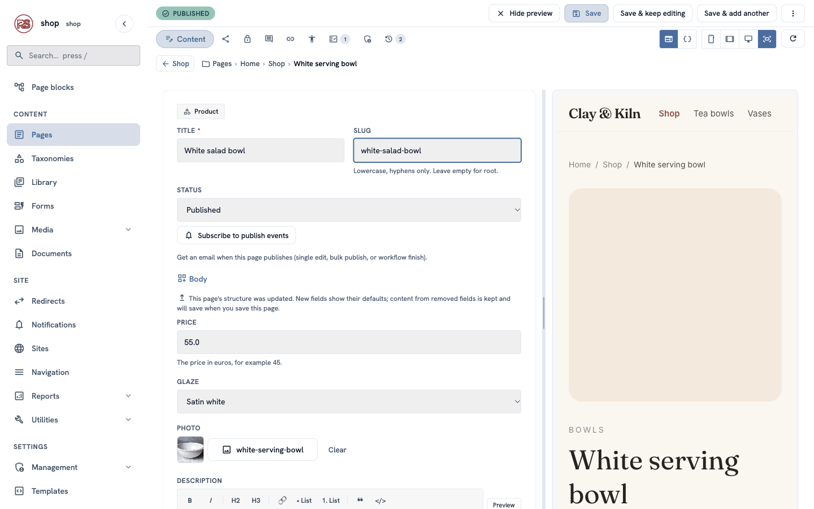
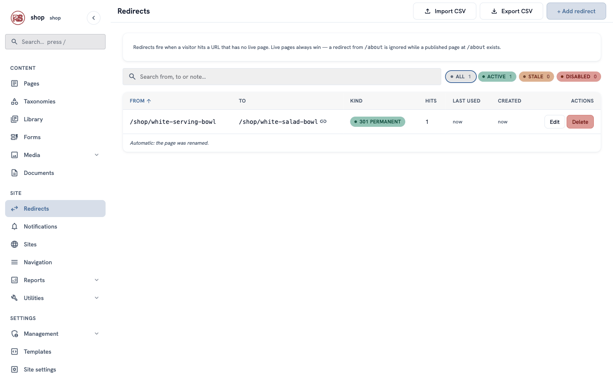
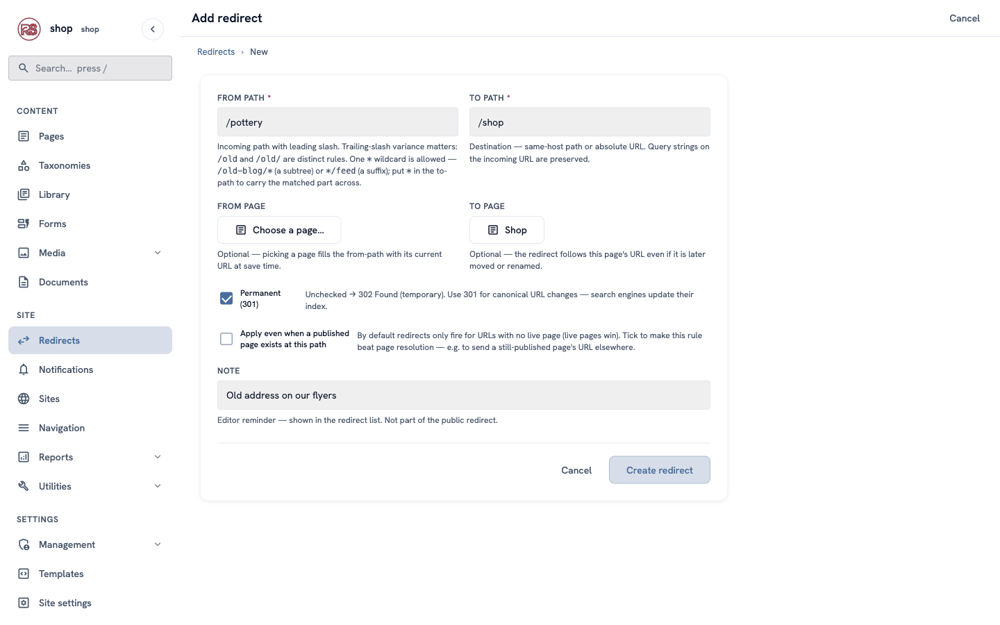

# Be found on Google

**Goal:** help Google and social networks show your shop well: good titles and descriptions, share images, a sitemap, and no broken links after you rename a page.

**Who this is for:** shop owners and editors. You do not need any technical knowledge.

**Time:** about 15 minutes.

This is chapter 11 of [Build a ceramics shop, step by step](shop-overview.md).

## Before you start

- You did chapters [1](shop-brand.md) to [10](shop-order-form.md).

## Words you will see

| Word | What it means |
|---|---|
| **SEO** | "Search engine optimisation" — small things that help Google understand and show your pages. |
| **SEO title** | The title Google shows in its results. It can be longer than the page title. |
| **SEO description** | One or two sentences Google shows under the title. |
| **Share image** | The photo that shows when someone shares the page on social media or in a chat. |
| **Sitemap** | A list of all your pages that Google reads. The CMS makes it for you. |
| **Redirect** | A rule that sends visitors from an old address to a new one. |

## What the CMS already does for you

You do not need to do anything for these:

- **Sitemap** — every published page is listed at `/sitemap.xml`, with its full address and the date it last changed.
- **robots.txt** — at `/robots.txt`, it tells search engines where the sitemap is and keeps them out of the admin.
- **Share images** — when you choose no share image, the page uses its first photo (for a product: its photo; for the home page: the big photo).
- **Page titles** — every page has a `<title>`, from the page title and the shop name.

## Steps

### 1. Look at the SEO checks

Open a product, for example **Moon jar**, and click the **SEO** tab (the icon with a small list, at the top of the editor). The CMS checks the page and lists what to improve.

Here there is one warning: the page has no description, so Google would make one up from the page text.

### 2. Write the SEO title and description

Click the **Promote** tab (the share icon) and fill in:

| Box | Example | Tip |
|---|---|---|
| **SEO title** | `Moon jar — handmade blue stoneware jar` | Say what it is. Keep it under about 60 characters. |
| **SEO description** | `A round stoneware jar with a milky blue glaze and purple splashes from the kiln. Made by hand at Clay & Kiln. One of a kind.` | One or two full sentences. Up to 200 characters; Google shows about 155. |

Below them:

- **Allow search engines to index this page** — keep it ticked. Untick it only for pages Google should not show (a thank-you page, for example).
- **Sitemap priority** — keep `0.5`. It is only a hint.

Click **Save & keep editing**.

### 3. Check again

Click the **SEO** tab again. It says **No content or SEO issues detected.**

The browser tab of the page now shows your SEO title, and Google will use the title and the description the next time it visits.

> **Share image:** this product has no share image chosen, so its photo is used. To use a different photo, choose one under **Social sharing → OG image** on the **Promote** tab (see [The shop page](shop-shop-page.md), step 3).

### 4. Rename a page without breaking links

The shop wants to sell the white bowl as a salad bowl. Changing its address is safe — the CMS keeps the old address working.

1. Open **White serving bowl**.
2. Change **Title** to `White salad bowl` and **Slug** to `white-salad-bowl`.
3. Click **Save**.

Now open the old address, `/shop/white-serving-bowl`. The browser goes to `/shop/white-salad-bowl` by itself.

Go to **Redirects** in the menu on the left. The CMS added a rule: from the old address to the page, **301 PERMANENT**, with the note *Automatic: the page was renamed.* The chain icon means the rule follows the page — if you rename it again, the rule still points to the right place.

> **301 or 302?** A **301 (permanent)** redirect tells Google that the page moved for good, so Google updates its results. Use a **302 (temporary)** only when the old address will come back.

### 5. Add a redirect yourself

Your flyers print the address `clayandkiln.example/pottery`, but the shop is at `/shop`. Send those visitors to the right page:

1. In **Redirects**, click **+ Add redirect**.
2. **From path:** `/pottery`
3. **To page:** click **Choose a page…** and choose **Shop**. The **To path** fills in by itself.
4. Keep **Permanent (301)** ticked. **Note:** `Old address on our flyers`.
5. Click **Create redirect**.

> **To page or To path?** Choose a page when you can: the redirect then follows the page even when it is renamed. Type a **To path** only for addresses that are not pages, or for other websites (`https://…`).

## Check it worked

- The Moon jar page's browser tab says **Moon jar — handmade blue stoneware jar · Clay & Kiln**.
- `/shop/white-serving-bowl` and `/pottery` both go to the right pages.
- `/sitemap.xml` lists **white-salad-bowl**, not the old address.

## If something goes wrong

| Problem | What to do |
|---|---|
| Google still shows the old title. | Google visits pages every few days or weeks. Your change shows after its next visit. |
| A redirect does nothing. | A live page at the **From path** wins over the redirect. Change or unpublish that page, or tick **Apply even when a published page exists at this path**. |
| Two rules for the same old address. | Not possible — each **From path** can have only one rule. Edit the existing one. |
| A share preview shows no picture. | Choose an **OG image** on the **Promote** tab, or give the page a photo. |

## Next

[Chapter 12 — A second language](shop-second-language.md)
