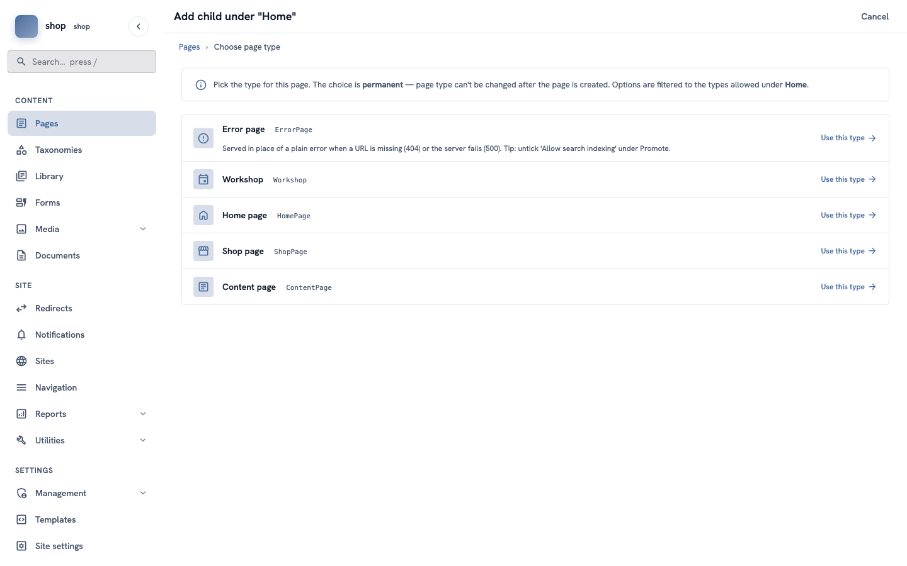
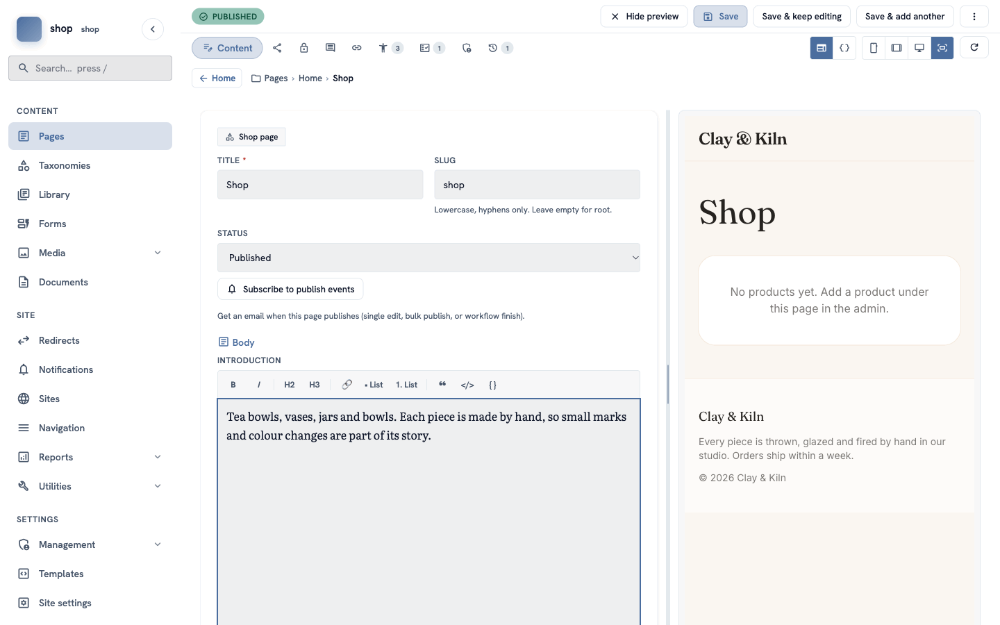
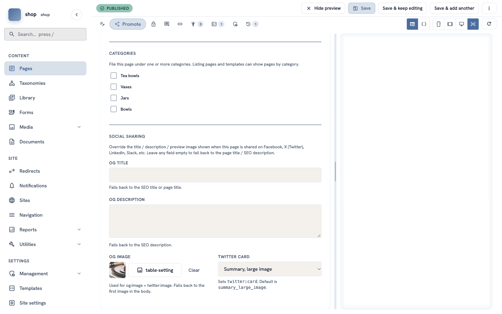
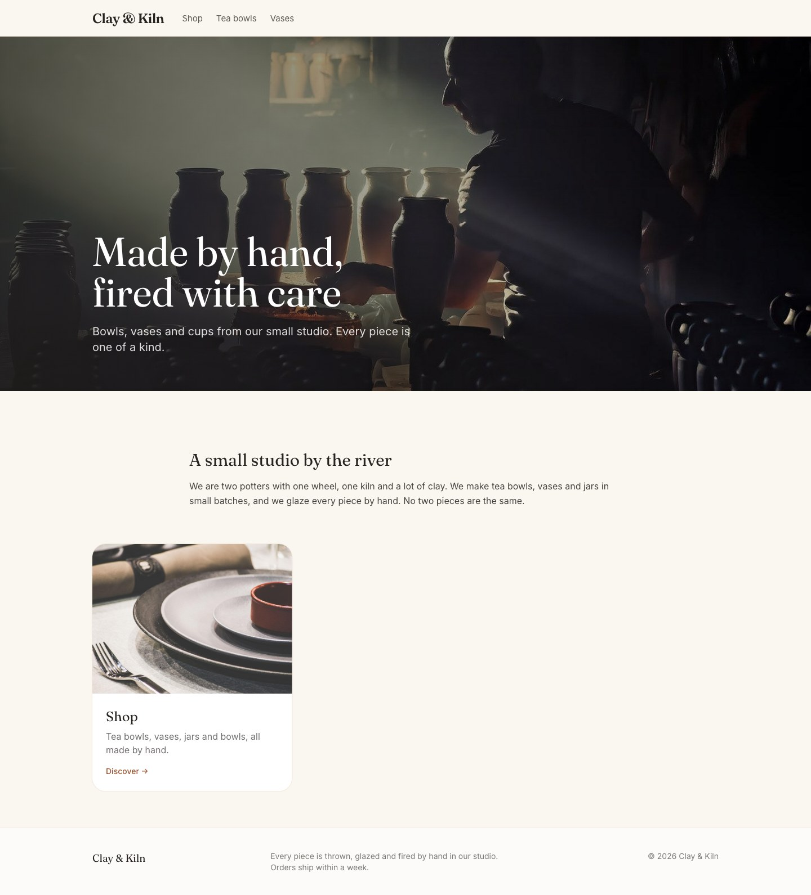

# The shop page

**Goal:** make the page that shows all your products. The products go under this page in the next chapter.

**Who this is for:** shop owners and editors. You do not need any technical knowledge.

**Time:** about 5 minutes.

This is chapter 6 of [Build a ceramics shop, step by step](shop-overview.md).

## Before you start

- You did chapters [1](shop-brand.md) to [5](shop-categories.md).

## Words you will see

| Word | What it means |
|---|---|
| **Child page** | A page inside another page. The shop page is a child of the home page, so its address is `/shop`. |
| **Promote tab** | A part of the editor with settings for Google and for sharing: a short description and a share image. |
| **Share image** | The photo that shows when someone shares the page on social media. The home page also uses it for the card that links to the shop. Without one, the page's first photo is used. |

## Steps

### 1. Add a page under the home page

In the menu on the left, click **Pages**. In the row of **Home**, click the **⋮** button, then **+ Child page**.

Find **Shop page** and click **Use this type**.

### 2. Title and introduction

1. In **Title**, type `Shop`. The **Slug** fills in by itself: `shop`.
2. In **Status**, choose **Published**.
3. Click **Create & keep editing**.
4. In **Introduction**, type a short text, for example: `Tea bowls, vases, jars and bowls. Each piece is made by hand, so small marks and colour changes are part of its story.`

The preview on the right says **No products yet**. That is correct — you add products in the next chapter.

> **Tip:** the toolbar over the introduction has **B** (bold), ***I*** (italic), headings, links and lists.

### 3. The description and the share image

At the top of the editor, click the **Promote** tab (the share icon next to **Content**).

1. In **SEO description**, type one sentence about the shop, for example `Tea bowls, vases, jars and bowls, all made by hand.` Google can show this text in search results.
2. Scroll down to **Social sharing**. Under **OG image**, click **Choose an image…** and choose a photo. The example shop uses **table-setting**.

> The shop page itself does not need a category. Leave the **Categories** boxes empty.

### 4. Save

Click **Save** at the top.

## Check it worked

- Open the home page of your site. Under the welcome text there is now a card **Shop**, with the share image and your SEO description.
- Click the card. The shop page opens with your introduction.

## If something goes wrong

| Problem | What to do |
|---|---|
| **Shop page** is not in the list of types. | You are adding the page in the wrong place. Go back to **Pages** and use the **⋮** button in the row of **Home**. |
| The card on the home page has no photo. | Choose an **OG image** on the **Promote** tab and save. |
| The address is not `/shop`. | Edit the page and type `shop` in **Slug**. |

## Next

[Chapter 7 — Add your products](shop-products.md)
