# Work as a team

**Goal:** let a helper, Mia, add products to the shop, and check each product yourself before visitors see it.

**Who this is for:** shop owners and editors. You do not need any technical knowledge.

**Time:** about 30 minutes.

This is chapter 14 of [Build a ceramics shop, step by step](shop-overview.md).

## Before you start

- You did chapters [1](shop-brand.md) to [8](shop-menu.md). The **Product** page type is from [chapter 5](shop-product-type.md).
- You can see **Management → Users** and **Utilities → Workflows** in the menu on the left. If you cannot, ask the person who manages your site.

## Words you will see

| Word | What it means |
|---|---|
| **Workflow** | The steps a page goes through before it is published. Here there is one step: the owner checks it. |
| **Step** | One check in a workflow. People with the step's **role** can approve or reject the page. |
| **Submit for review** | The author says "the page is ready, please check it". |
| **Reject** | The reviewer sends the page back to the author, with a note that says what to change. |
| **Approve** | The reviewer says "yes". After the last step, the page is published. |

## How it works

1. You make a workflow, **Owner review**, with one step.
2. You connect it to the **Product** page type. From then on, a product goes live only after you approve it.
3. Mia writes a product and clicks **Submit for review**.
4. You approve it — or reject it with a note. Mia fixes it and submits it again.
5. Later, when Mia changes a product that is already live, visitors keep seeing the old version until you approve the change.

## Steps

### 1. Make the workflow

1. In the menu on the left, open **Utilities → Workflows** and click **+ New workflow**.
2. **Name:** `Owner review`.
3. **Description:** `The owner checks every new product before it goes live.`
4. Keep **Active** ticked. Leave **Re-approval on edit** unticked for now — you turn it on in step 7.
5. Click **Create workflow**.

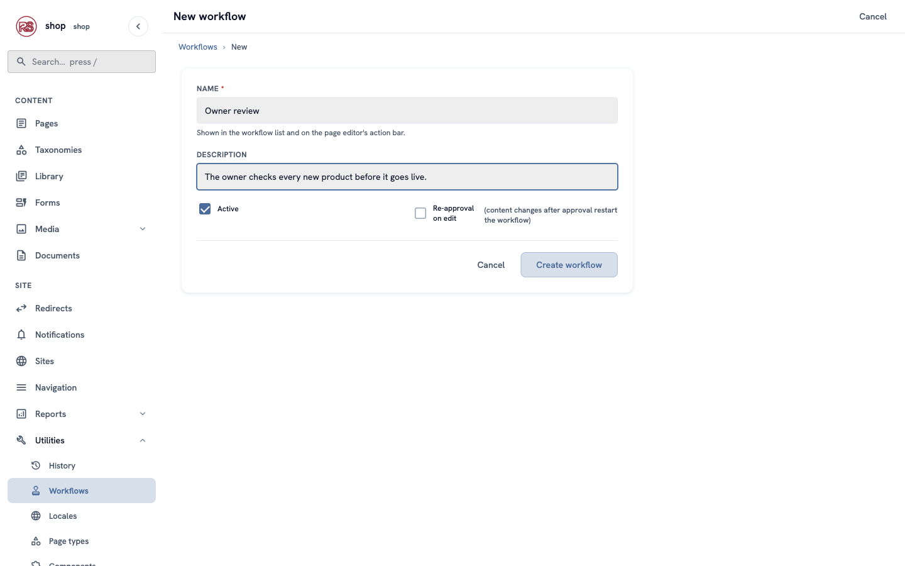

### 2. Add the review step

The workflow opens again, with **Review steps** under it.

1. Under **Add a step**, **Step name:** `Owner checks the product`.
2. **Assignee role:** choose **Administrator**. People with this role can approve. You, as the owner, can always approve.
3. Keep **Kind** as **Group approval** — a person clicks **Approve**.
4. Click **+ Add step**.

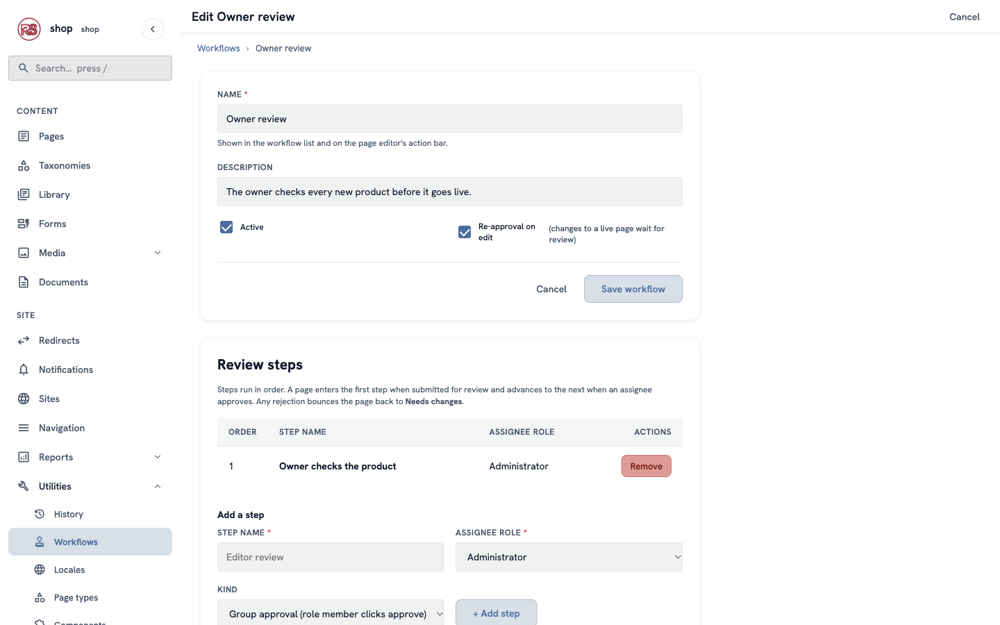

> **More steps?** Add them in the order they happen, for example `Text check` and then `Owner checks the product`. A page goes through them one by one.

### 3. Connect it to the Product page type

1. Open **Utilities → Page types**. In the row of **Product**, click **Settings**.
2. **Workflow:** choose **Owner review**.
3. Click **Save**.

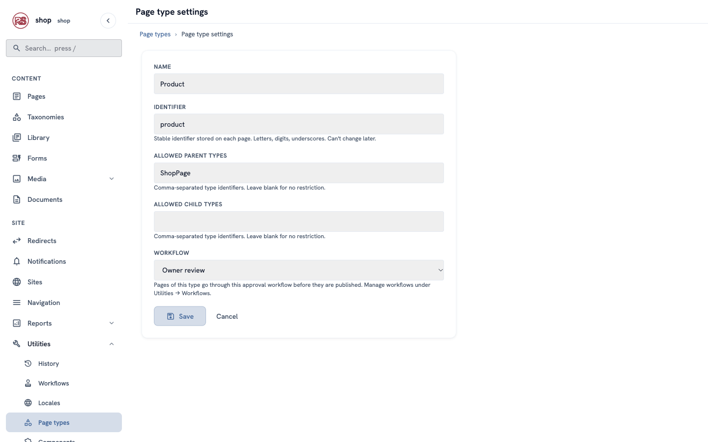

Now a product cannot be published directly — only through the review. (You, as the owner, still can. The rule is for your team.)

### 4. Add Mia

1. Open **Management → Users** and click **+ New user**.
2. **Username:** `mia`. **Email:** her email. **Initial password:** make one and give it to her.
3. Under **Roles**, tick **Editor**. Editors can write pages, but not manage users. Do not tick **Tenant superuser**.
4. Click **Create user**.

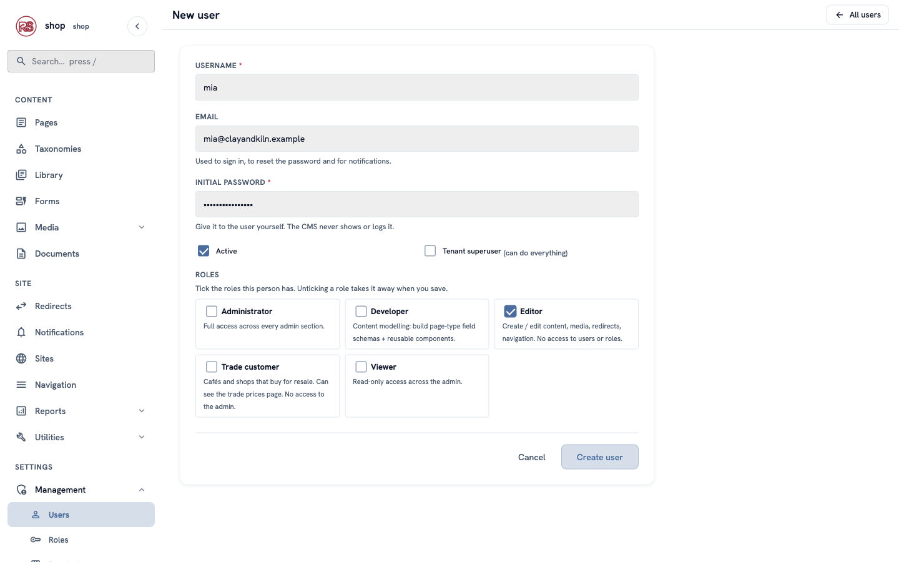

Mia signs in at `/login` with her username and password.

### 5. What Mia does: write a product and submit it

Mia adds a product as in [chapter 7](shop-products.md): **Pages**, **⋮** next to **Shop**, **+ Child page**, **Product**. She fills in **Breakfast set**, the price `85`, the glaze, a photo and a description, and saves.

At the top of the editor she sees the **Owner review** bar. The **Status** list has no **Published**: under the field it says that pages of this type go live after review.

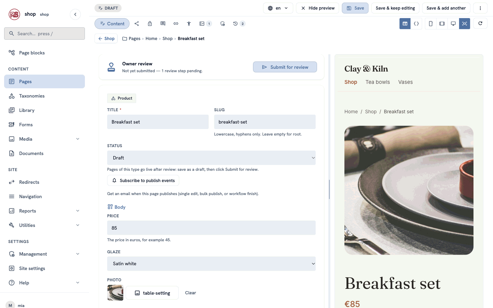

She clicks **Submit for review** and then **Confirm**:

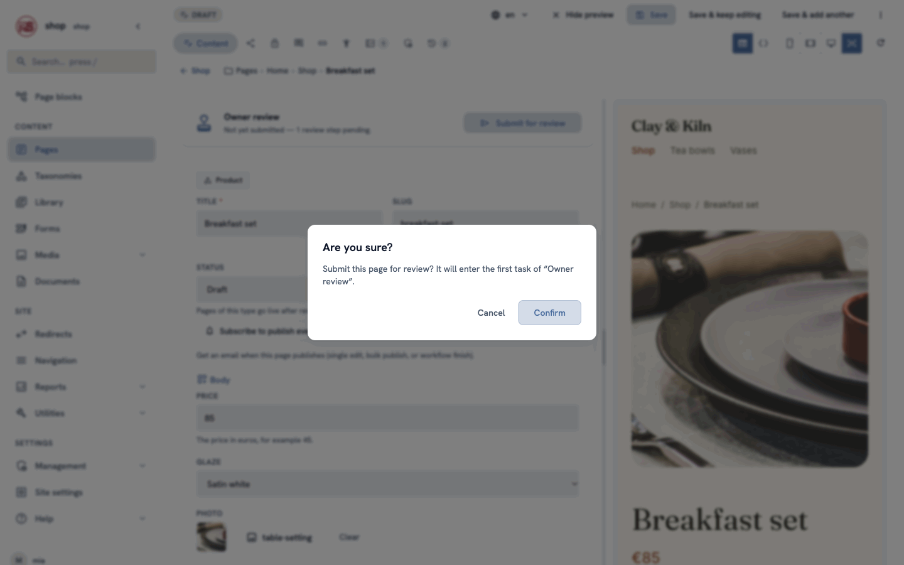

The page is now **In review**. Mia cannot change it while you check it: the save buttons are grey, and a banner says why.

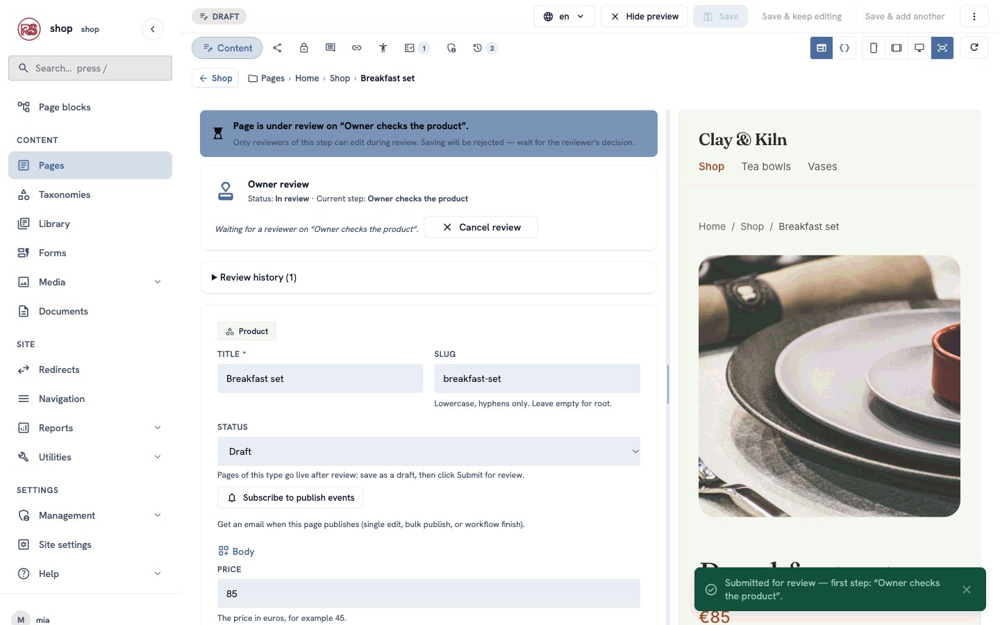

### 6. What you do: check it

Your **Dashboard** shows the pages waiting for your review:

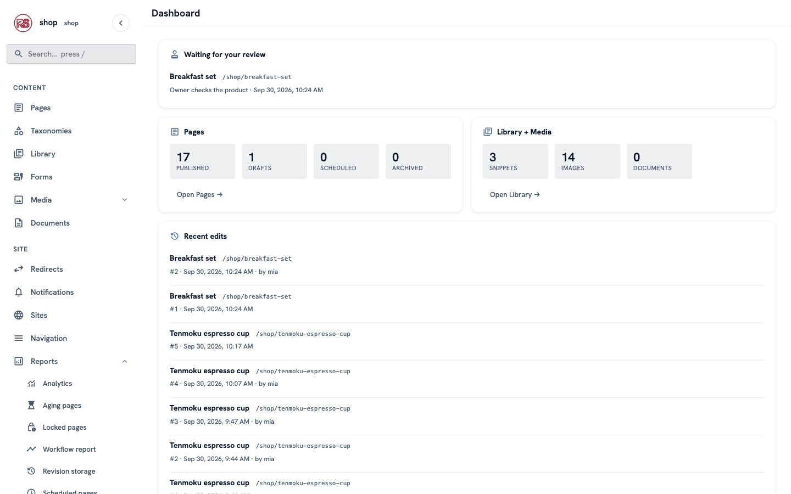

Click **Breakfast set**. The bar has **Approve**, **Reject** and **Cancel review**. The preview on the right shows the page as visitors will see it.

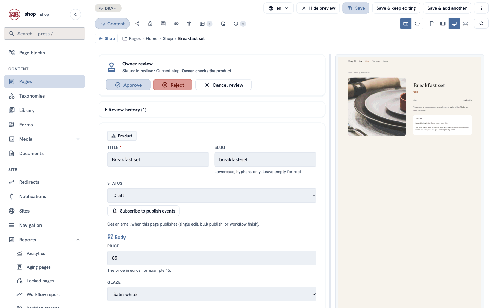

**Something is missing?** Click **Reject**, write what should change, and click **Send back for changes**:

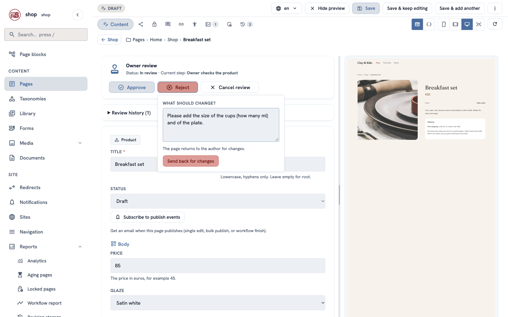

Mia sees **Changes requested** and your note under **Review history**. She fixes the page, saves it and clicks **Resubmit for review**:

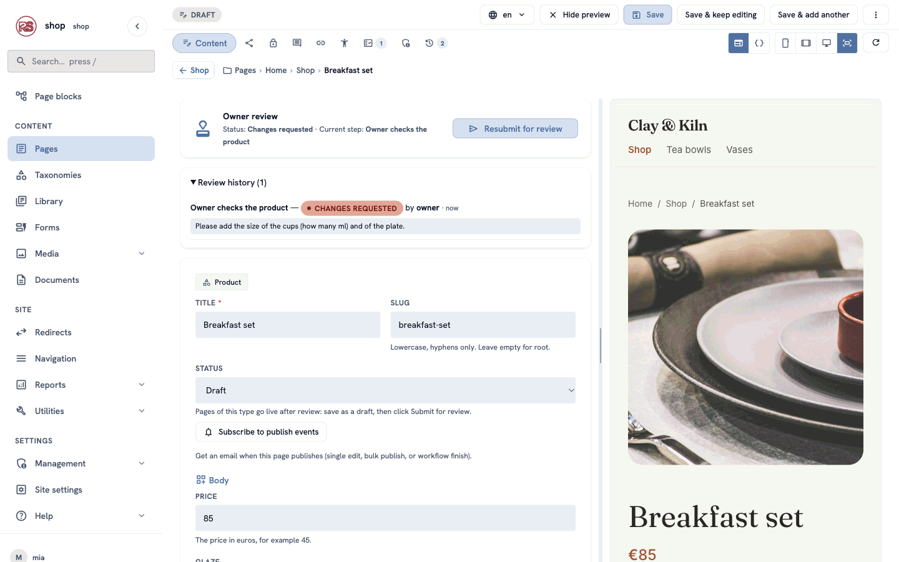

**Everything is fine?** Click **Approve** and **Confirm**. The page is published at once, and the history shows each round:

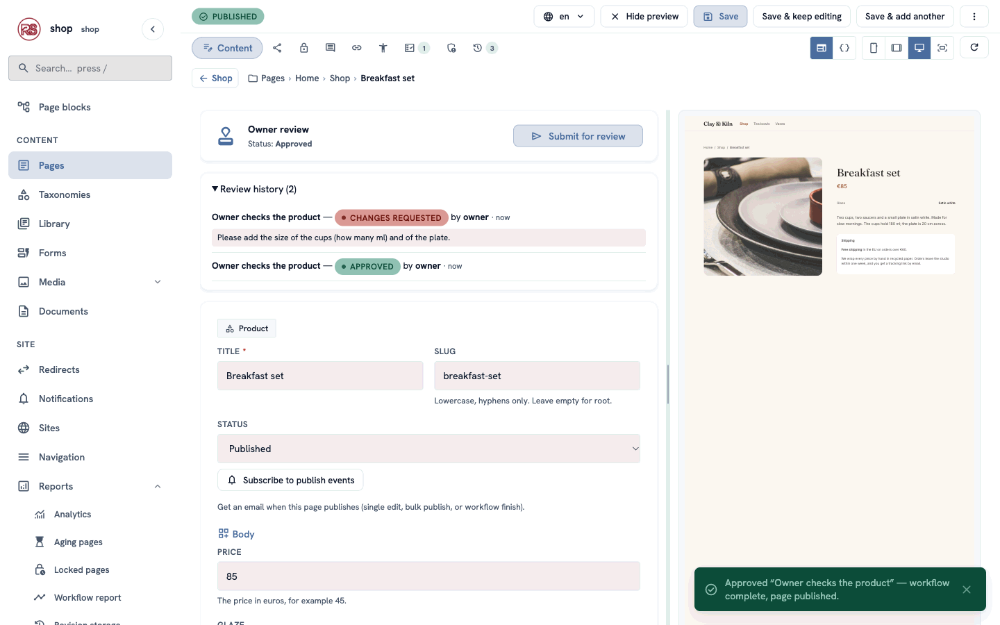

### 7. Check changes to live products too

A product is live. Mia wants to change the price. Should the new price go live at once? If you want to check changes too:

1. Open **Utilities → Workflows → Owner review**.
2. Tick **Re-approval on edit** and click **Save workflow**.

Now, when Mia saves a live product, the change **waits**. Visitors still see the old version. The review starts by itself:

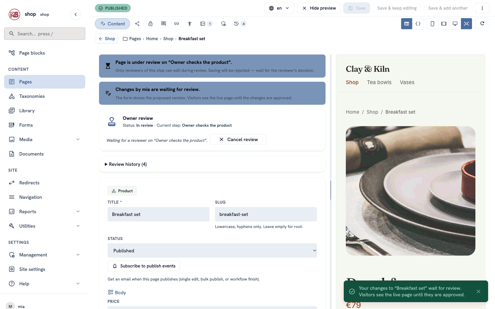

When you open the product, a banner says whose changes wait. The form shows the **new** version (here the price 79); the preview still shows the live page (€85):

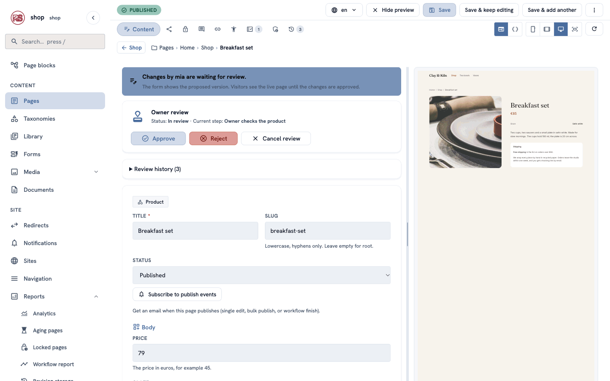

- **Approve** puts the change live.
- **Reject** sends it back to Mia, with your note. The live page does not change.
- **Cancel review** throws the change away. The live page does not change.

## Check it worked

- Signed in as Mia, a new product has no **Published** in the **Status** list, and it goes live only after you approve it.
- Your dashboard lists the pages waiting for your review.
- With **Re-approval on edit** on, Mia's change to a live product does not show on the site until you approve it.

## If something goes wrong

| Problem | What to do |
|---|---|
| Mia can still publish directly. | Open **Utilities → Page types → Product → Settings**: **Workflow** must be **Owner review**. Check that the workflow is **Active** and has a step. And check that Mia is not a **Tenant superuser**. |
| "Couldn't save — page is under review". | The page waits for a reviewer. Wait for the decision, or ask the reviewer to click **Reject** or **Cancel review**. |
| Nobody sees **Approve**. | Only people with the step's role (here **Administrator**) and superusers can approve. Give the role to the reviewer under **Management → Users**. |
| **Reject** does nothing. | Write a note first: the reviewer must say what should change. |
| You cannot delete a workflow. | A page type still uses it. Choose another workflow (or none) in the page type's **Settings** first. |

## For developers

- **Page types from code** name their workflow with `#[page_type(workflow = "Owner review")]` on the struct (or `workflow_slug()` in `PageTypeOverrides`). Page types made in the admin choose it on their **Settings** screen, as in step 3.
- **One write path.** The admin, autosave and the MCP tools all save through the same code, so none of them can publish around the review. An MCP `update_page` on a live page with re-approval returns `"held_for_review": true`.
- **Held changes** are stored in `cms_page_pending_change` (one row per page) until the review ends. Templates always render the live page.

## Next

[A sale](shop-sale.md): publish a sale page at a set time and take it down again, without being there.
